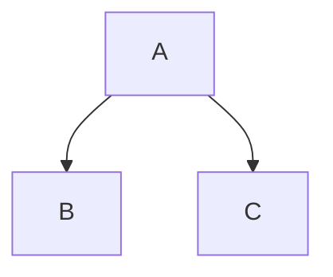

Three backticks, a newline, your code, three more backticks. That is a fenced code block, and it is
the piece of Markdown that most often comes out of a converter looking nothing like what you typed:
a language hint that produced no colour, a backtick you cannot print, a block that lost its fence
markers inside a list. Each has a cause you can see.

### TL;DR

A Markdown converter does exactly one thing with your fence: it emits `<pre><code class="language-x">`
with the contents escaped as literal text. It does not colour anything. Colour is a second program —
Shiki, Pygments, Chroma or Rouge while the HTML is built, highlight.js or Prism in the reader's
browser after it loads — and if you never arranged one, a perfectly correct language hint still
renders grey. Everything else you can write on the fence line, line numbers and filenames and
highlighted ranges, is one tool's invention and inert text in every other.

The failures all look the same in the source, which is why people blame the converter. A block that
came out plain, a block that came out as a paragraph full of backticks, and a block that came out
showing `&lt;div&gt;` are three different problems at three different layers: your indentation, the
converter's parser, and whatever ran after it.

None of them are hard once you know which layer you are standing on. What follows is the whole path,
in order: how a fence is recognised, where lists and blockquotes change the rules, what the converter
emits, who colours it, what the rest of the info string means, and what the block does on the page
after all of that is settled.

## Fences, indentation, and counting backticks

Markdown has two ways to mark code as code. The older one indents every line by four spaces. The
newer one wraps the lines in a fence — three or more backticks, or three or more tildes, on their
own line above and below.

```js
const total = items.reduce((sum, item) => sum + item.price, 0);
```

Indented blocks still work, but they have no slot for a language and they fight with list
indentation constantly. The original Markdown had only that form, which is why a very old renderer
may print your triple backticks literally instead of a `<pre>` —
[which flavour a tool speaks](/blog/commonmark-gfm-and-the-flavours) decides more than this one
feature.

Four rules govern the fence itself, all four of them from the specification (checked on
spec.commonmark.org, 9 September 2026), and every one of them a failure somebody has reported as a
converter bug:

- **The closing fence must be at least as long as the opening one.** The specification is blunt
  about it: "The closing code fence must be at least as long as the opening fence." Open with four
  backticks, close with three, and the block never ends.
- **The closing fence cannot carry an info string.** "Closing code fences cannot have info strings."
  A word after the closing backticks makes that line content rather than a fence.
- **The opening fence may be indented up to three spaces, and that indentation is stripped.** "If
  the opening fence is indented, content lines will have equivalent opening indentation removed, if
  present." Four spaces is not an indented fence: it is an indented code block that happens to
  contain backticks.
- **An unclosed fence runs to the end of its container.** Forget the closing fence and the rest of
  the document is code. This is the one that turns a whole page grey below the halfway mark.

Backtick fences and tilde fences differ in one useful way. "Info strings for backtick code blocks
cannot contain backticks", while "Info strings for tilde code blocks can contain backticks and
tildes" (checked on spec.commonmark.org, 9 September 2026). That is why every example in this
article that itself contains a fence is wrapped in tildes.

### Inline code, and how to print a backtick

One backtick each side gives you inline code: `npm run dev`. The trouble starts when the code
itself contains a backtick.

A backslash does not help. Outside a code span, `` \` `` escapes a backtick; inside one, backslash
escapes are switched off, so you would get a literal backslash in your output. The real rule is
about length: the delimiter has to be a run of backticks longer than any run inside the content.

~~~markdown
`code`        one backtick each side
``a ` b``     two, because the content holds one
`` ` ``       a lone backtick, padded with spaces
~~~

Those spaces are not decoration. CommonMark strips one leading and one trailing space from a code
span when both are there, so they hold the content apart from the delimiters and then disappear.
That is the answer to escaping a backtick in Markdown: you do not escape it, you out-count it.

Two smaller things follow from the same rule. A code span cannot cross a blank line, because a blank
line ends the paragraph the span lives in — a long shell command needs a fence, not a span. And a
code span collapses internal newlines into single spaces, so a span is genuinely for a word or a
phrase and never for a listing.

### Putting a fence inside a fence

Same rule, one level up. A closing fence has to be at least as long as the one that opened the
block, and a shorter run is just content. So to show triple backticks — a Markdown snippet inside
documentation about Markdown, for instance — open with four.

~~~markdown
````markdown
```bash
npm install
```
````
~~~

The counting gets silly quickly. A tilde fence sidesteps it: `~~~` opens and closes a block, and no
number of backticks inside can close it. Every example here that contains a fence is wrapped in one.
If you write documentation about Markdown regularly, standardising on tildes for the outer fence and
backticks for the inner one removes an entire category of mistake from the file.

## Lists, blockquotes and the column that decides

This is the failure that sends people looking for a converter bug. Inside a list item the content
column is set by the marker: `- ` puts it at three, `1. ` at four. A fence has to start at that
column, or within three spaces of it. Four spaces past it and the fence stops being a fence — it
turns into an indented code block, and your backticks show up as literal text. Start it at column
one and you end the list item, splitting one list into two with a code block wedged between.

Broken, then fixed:

~~~markdown
1. Run the install:

```bash
npm install
```

2. Then start it.
~~~

~~~markdown
1. Run the install:

   ```bash
   npm install
   ```

2. Then start it.
~~~

Three spaces for `1. `, two for `- `, and the block belongs to the item. Watch the second list in the
broken version: because the code block ended the first list, the `2.` starts a fresh one, and most
renderers restart the numbering at one. The same arithmetic governs nested lists and hard line
breaks, which is [its own small subject](/blog/markdown-line-breaks-and-lists).

Ordered lists longer than nine items add a column at ten, because `10. ` is one character wider than
`9. `. A block indented to match the earlier items sits one space short from item ten onwards. The
safe habit is to indent everything inside a list item by four spaces and stop thinking about it:
four is within three of the content column for both markers, so the fence is still a fence, and the
extra space is stripped.

Blockquotes are stricter. The `> ` marker has to appear on every line of the block, including the
fence lines and any blank lines inside it. Drop it on one line and the quote ends there, taking the
rest of the block with it.

~~~markdown
> Run this first:
>
> ```bash
> npm install
> ```
>
> Then start it.
~~~

Combine the two — a fence inside a list item inside a blockquote — and the prefixes stack: the `> `
first, then the item's indentation, then the fence. Editors that reformat Markdown on save get this
wrong often enough that it is worth reading the output rather than trusting the file.

## What the language hint actually does

The word after the opening fence is the info string. A converter does exactly one thing with it: it
puts it on the `<code>` tag as a class.

```html
<pre><code class="language-js">const total = items.reduce(...)
</code></pre>
```

That is the whole feature, and it is a convention rather than a requirement: "The first word of the
info string is typically used to specify the language of the code block. In HTML output, the
language is normally indicated by adding a class to the `code` element consisting of `language-`
followed by the language name" (checked on spec.commonmark.org, 9 September 2026). Nothing parses
your JavaScript, and nothing checks that the word is a real language — write `jvascript` and you get
`class="language-jvascript"`, which no highlighter recognises, so the block renders plain.

| What you write | What the converter emits |
| --- | --- |
| A bare fence | `<pre><code>` |
| A fence marked `json` | `<pre><code class="language-json">` |
| Four spaces of indent | `<pre><code>` |
| A tilde fence marked `bash` | `<pre><code class="language-bash">` |
| A fence marked `jvascript` | `<pre><code class="language-jvascript">` |
| A fence marked `js {1,3-4}` | `<pre><code class="language-js">`, the rest usually dropped |

Note the last row. The class is built from the first word alone. What happens to the remainder is
not specified anywhere, and different tools keep it, drop it or act on it, which is a section of its
own further down.

### The alias problem

The language name is not standardised. Each highlighting engine ships its own list of names and
aliases, and the lists overlap without matching. `js` and `javascript` both work almost everywhere.
`sh`, `bash` and `shell` are three separate lexers in some engines and aliases of one another in
others. `yml` and `yaml` mean the same thing to every tool worth using. And `console` means shell
output complete with prompts, rather than a shell script, which is why a block of commands mixed
with their output looks wrong when you mark it `bash`.

| Language | Aliases you will see in the wild |
| --- | --- |
| JavaScript | `js`, `javascript`, `node`, `jsx`, `mjs`, `cjs` |
| TypeScript | `ts`, `typescript`, `tsx` |
| Shell script | `sh`, `bash`, `zsh`, `shell` |
| Shell session, with prompts and output | `console`, `shell-session`, `shellsession` |
| YAML | `yml`, `yaml` |
| Python | `py`, `python`, `python3` |
| Ruby | `rb`, `ruby` |
| Markdown | `md`, `markdown`, `mdown` |
| HTML | `html`, `htm`, `xhtml` |
| C++ | `cpp`, `c++`, `cxx` |
| C# | `cs`, `csharp`, `c#` |
| Go | `go`, `golang` |
| Rust | `rs`, `rust` |
| PowerShell | `ps1`, `powershell`, `pwsh` |
| No highlighting wanted | `text`, `txt`, `plaintext`, `plain`, `none`, `nohighlight` |

The practical rule is to write the full name rather than the short one — `javascript`, `python`,
`yaml` — because the short aliases are the ones that vary between engines. The cost of being wrong
is not an error message. In most engines an unknown hint does nothing at all.

| Engine | What an unknown or unloaded language does |
| --- | --- |
| highlight.js | Leaves the block unhighlighted. `plaintext` styles it without highlighting, `nohighlight` skips it entirely (checked on github.com/highlightjs/highlight.js, 9 September 2026) |
| Prism | No grammar means no tokens, so the block comes out plain |
| Shiki | Throws. Since v1.0 "it requires all themes and languages to be loaded explicitly" (checked on shiki.style, 9 September 2026) |
| Pygments, Chroma, Rouge | Depends on how the generator calls them: a build error, or a silent fall back to plain text |

That difference matters more than it sounds. A browser highlighter fails silently, so a typo in one
fence out of two hundred is invisible until a reader mentions it. A build-time highlighter that
throws tells you the moment you introduce the typo, which is the behaviour you want on a
documentation site with hundreds of blocks in it.

### Escaping, and why the output says `&lt;`

The content of a fence is "treated as literal text, not parsed as inlines" (checked on
spec.commonmark.org, 9 September 2026). To honour that in HTML, a converter must escape at minimum
`<` as `&lt;` and `&` as `&amp;` before the code reaches the page; most also escape `>` as `&gt;`
and `"` as `&quot;`, which is unnecessary in text content and harmless. Without that step, a block
displaying a `<script>` tag would stop displaying a script and start being one.

So the fence is a boundary on purpose, and only because the converter does that work. Raw HTML
written *outside* a fence is an entirely different matter, and
[whether your converter sanitises it](/blog/sanitising-markdown-safely) is worth settling before you
convert a file you did not write.

Which brings us to the symptom people actually search for: a block that reads `&lt;div&gt;` in
visible text instead of showing the tag. That is double escaping. Something turned `<` into `&lt;`,
then something else turned the `&` of `&lt;` into `&amp;lt;`, and the browser rendered the result
faithfully. The usual causes, in rough order of frequency:

- You pasted already-escaped HTML into the fence. The source really does contain `&lt;div&gt;`, and
  the converter escaped the ampersand exactly as it should have.
- Two escaping steps ran. A converter emitted correct HTML, and a template engine escaped that
  output again on the way into the page.
- A highlighter was handed HTML rather than source text. Some integrations pass the already-escaped
  contents of `<code>` to a highlighter that escapes again on the way out.

The fix is always to remove one of the two steps, never to add an unescaping step at the end. If you
are building the pipeline yourself, hold the code as plain text for as long as possible and escape
exactly once, at the point where it becomes HTML.

## Where the highlighting actually happens

This is the part almost nothing explains. The converter emits `<pre><code class="language-x">` and
stops. Something else reads that class, splits the code into tokens, wraps each token in a `<span>`
and gives it a colour. That second program is not part of Markdown, it is not part of your
converter, and you have to choose it.

There are only two places it can run. **At build time**, while the HTML is being generated: the
colours are baked into the file and the reader downloads no extra code. **In the browser**, after
the page loads: the reader downloads a script and a stylesheet, and the script walks every code
block on the page. Everything else is a detail of which engine you pick.

| Engine | Written in | Where it runs | What the page needs | What it costs the page | Licence |
| --- | --- | --- | --- | --- | --- |
| Shiki | TypeScript | Build time | Nothing: the colours are already in the HTML | An inline `style` attribute on every token, so the HTML itself grows | MIT |
| Pygments | Python | Build time, or any Python process | A stylesheet, unless the styles are inlined | One `<span class>` per token, plus the stylesheet | BSD 2-clause |
| Chroma | Go | Build time; Hugo runs it for you | A stylesheet, or nothing if styles are inlined | The same shape as Pygments | MIT |
| Rouge | Ruby | Build time; Jekyll's default | A Pygments-compatible stylesheet | Spans plus the stylesheet | MIT |
| highlight.js | JavaScript | The reader's browser, after load | The script, a theme stylesheet, and a call | A script download and a pass over every block | BSD 3-clause |
| Prism | JavaScript | The reader's browser, after load | Core, each language, a theme, any plugins | Core 2KB minified and gzipped, 0.3-0.5KB per language, around 1KB per theme | MIT |
| Nothing at all | — | Nowhere | Nothing | Nothing | — |

Every licence and size in that table was checked against the project's own documentation on
9 September 2026. All six engines are free and open source; the differences that will decide it for
you are in the last two columns.

### Shiki — colours baked in, no script shipped

Shiki is "a beautiful yet powerful syntax highlighter" that is "TextMate grammar powered, same
engine as your VS Code", and its headline property is "Zero Runtime": it "runs ahead of time, ship
zero JavaScript while getting the perfect syntax highlighting" (checked on shiki.style, 9 September
2026). Because it uses the same grammars as an editor, a block coloured by Shiki looks like the same
file open in VS Code, which is a real advantage in documentation about code.

- Output carries colour in inline `style` attributes rather than class names, so no stylesheet is
  needed at all.
- Dual themes work through CSS variables: a token comes out as
  `style="color:#1976D2;--shiki-dark:#D8DEE9"`, and a rule under `prefers-color-scheme: dark` reads
  the variable (checked on shiki.style, 9 September 2026).
- A transformers package adds line and word highlighting, diff notation, focus, and error, warning
  and info levels, all written as comments in the code (checked on shiki.style, 9 September 2026).
- Languages and themes must be loaded explicitly, which is what the throw described earlier
  enforces: a fence nobody configured is a build failure, not a grey block.

**Price:** free, MIT licensed.

**Who should use it?** Anyone building a site with a JavaScript toolchain who wants exact colours
and no client-side cost. The trade is HTML size, because the colour of every token is written into
the file.

### Pygments — the one everything else copied

Pygments is "a generic syntax highlighter suitable for use in code hosting, forums, wikis or other
applications that need to prettify source code", supporting "a wide range of 602 languages and other
text formats" and writing "HTML, RTF, LaTeX and ANSI sequences" (checked on pygments.org,
9 September 2026). It is a Python library and a command line tool at once, and it sits underneath a
great deal of documentation tooling — Material for MkDocs highlights with it at build time unless you
turn that off in favour of a browser highlighter (checked on squidfunk.github.io, 9 September 2026).

- The HTML formatter emits CSS classes by default, and `get_style_defs()` returns the matching
  stylesheet.
- `noclasses` inlines the styles instead, which the documentation warns is "not recommended for
  larger pieces of code since it increases output size by quite a bit" (checked on pygments.org,
  9 September 2026).
- `linenos` renders line numbers, either inside the `<pre>` or as a two-cell table.
- `hl_lines` takes a list of lines to emphasise, numbered from the start of the input.

**Price:** free, BSD 2-clause licensed.

**Who should use it?** Python build pipelines, MkDocs sites, and anybody who needs an output format
other than HTML out of the same highlighter.

### Chroma — Pygments, in Go, inside Hugo

Chroma is "a general purpose syntax highlighter in pure Go" that "converts source code and other
structured text into syntax highlighted HTML, ANSI-coloured text, etc." It is explicit about its
ancestry: "Chroma is based heavily on Pygments, and includes translators for Pygments lexers and
styles" (checked on github.com/alecthomas/chroma, 9 September 2026), which means Pygments
stylesheets mostly work unchanged.

- The HTML formatter can emit classes via `WithClasses()`, or inline style attributes instead.
- Terminal output comes "in 8 colour, 256 colour, and true-colour" (checked on
  github.com/alecthomas/chroma, 9 September 2026).
- A command line interface ships with it, and `chroma --list` prints the authoritative lexer list.
- Hugo highlights fenced blocks with it at build time, in its default configuration (checked on
  gohugo.io, 9 September 2026).

**Price:** free, MIT licensed.

**Who should use it?** Go programmes, and every Hugo site, whether or not the author knows it is
there.

### Rouge — Jekyll's default

Rouge is "a pure Ruby syntax highlighter" that "can highlight over 200 different languages, and
output HTML or ANSI 256-color text". Two facts about it matter. "Its HTML output is compatible with
stylesheets designed for Pygments", so themes are portable between the two, and "Rouge is Jekyll's
default syntax highlighter" (checked on github.com/rouge-ruby/rouge, 9 September 2026).

**Price:** free, MIT licensed.

**Who should use it?** Jekyll sites, which is to say a large share of the documentation published
straight from a repository. If your blocks are already coloured and you never configured anything,
this is usually the reason.

### highlight.js — the browser default, with detection

highlight.js describes itself as "the Internet's favorite JavaScript syntax highlighter supporting
Node.js and the web", claiming "193 languages and 516 themes" and "zero dependencies" (checked on
highlightjs.org, 9 September 2026). Its distinguishing feature is automatic language detection: it
will "find and highlight code inside `<pre><code>` tags; it tries to detect the language
automatically" (checked on highlightjs.org, 9 September 2026).

- Runs in the reader's browser or in Node; the browser build is normally loaded from a CDN.
- Reads `class="language-html"` when you want to override detection.
- `plaintext` styles a block without highlighting it, and `nohighlight` skips it (checked on
  github.com/highlightjs/highlight.js, 9 September 2026).
- Its own documentation notes that "importing all our languages will increase the size of your
  bundle" (checked on highlightjs.org, 9 September 2026), so a real deployment loads a subset.

**Price:** free, BSD 3-clause licensed.

**Who should use it?** Pages where you cannot control the info strings — a comment system, a wiki, a
forum — because detection is the only thing here that copes with unlabelled blocks. Anywhere you do
control the fence, write the language on it rather than leaving the guess to the script.

### Prism — a small core, everything else a plugin

Prism is "a lightweight, extensible syntax highlighter, built with modern web standards in mind".
Its size claim is unusually specific: "The core is 2KB minified & gzipped. Languages add 0.3-0.5KB
each, themes are around 1KB" (checked on prismjs.com, 9 September 2026). It reads `language-xxxx`
and "also supports a shorter version: `lang-xxxx`".

- No automatic detection: an unlabelled block stays plain.
- Plugins cover line numbers, line highlighting, showing the language and copy to clipboard, each
  its own script and stylesheet.
- The line-highlight plugin is configured from HTML rather than from the fence: `data-line` on the
  `<pre>`, accepting single numbers, ranges with a hyphen, and comma-separated combinations (checked
  on prismjs.com, 9 September 2026).
- Runs in the browser, and "can be used with Node.js as well" if you would rather pre-render
  (checked on prismjs.com, 9 September 2026).

**Price:** free, MIT licensed.

**Who should use it?** Sites that want the plugin behaviours — a copy button, line numbers, a
language label — without building them, and that can afford the extra requests.

### Nothing at all — a plain, styled block

The fourth option is to skip the second program. The converter's `<pre><code>` with a monospaced
font, a background, some padding and a border is perfectly legible, and the difference between that
and a coloured block is aesthetic rather than functional.

This is the trade a portable file makes. TransformPipe converts fenced code as part of GitHub
Flavored Markdown, and the `.html` it hands back is self-contained: inline styles, no scripts, no
network requests. Code arrives as styled monospaced text in a `<pre>` rather than coloured tokens,
because [nothing is left in the file to do the colouring](/blog/self-contained-html-explained). If
colour is the point, reach for a site generator that runs Shiki or Chroma at build time, or for
[Pandoc](/blog/pandoc-alternatives-for-markdown-to-html), which highlights as it converts. If the
point is a portable file you can hand to someone, the plain block is the better trade.

## The rest of the info string belongs to the tool

Markdown specifies the first word of the info string and says nothing whatever about the rest. Every
convention you have seen — `{1,3-4}`, `title="app.js"`, `showLineNumbers`, `linenums="1"` — was
invented by one tool, and no other tool is obliged to understand it. This is the single biggest
source of "it renders differently on GitHub" reports.

| Tool | What it reads after the language | Example info string |
| --- | --- | --- |
| Shiki, with transformers | Line ranges and words to highlight | `js {1,3-4}`, `js /Hello/` |
| Hugo, via Chroma | Attributes in braces | `go {linenos=inline hl_lines=[3,"6-8"]}` |
| Material for MkDocs, via Pygments | Named options | `py title="bubble_sort.py" linenums="1" hl_lines="2 3"` |
| Docusaurus, via Prism React Renderer | Ranges, a title, line numbers | `jsx {1,4-6} title="/src/App.js" showLineNumbers` |
| Prism in the page | Nothing: its options are HTML attributes on the `<pre>` | `js`, plus `data-line="1,4-6"` in the HTML |
| GitHub | Nothing beyond the language | `mermaid`, `geojson`, `topojson`, `stl` |
| A plain CommonMark converter | Nothing: the remainder is metadata it may simply drop | `js {1,3-4}` |

Every row there was checked against the tool's own documentation on 9 September 2026. Read the table
as a warning rather than as a menu. A fence written for Docusaurus renders in Hugo as a code block
whose language is `jsx` and whose remaining words vanish, and the same fence on GitHub is a block of
JavaScript with no title and no highlighted lines. Nothing errors anywhere along the way. You simply
lose the annotation, silently, in a diff nobody reads.

Some tools moved the annotation into the code itself, as comments, which travels better in one
respect and worse in another. Shiki's transformers read `// [!code highlight]`, `// [!code ++]` and
`// [!code focus]`; Docusaurus reads `// highlight-next-line` (checked on shiki.style and
docusaurus.io, 9 September 2026). Paste one of those blocks anywhere else and the annotation is
still present — as a visible comment in the middle of your sample, which readers will copy along
with everything else.

### `diff` and `mermaid` are not highlighting

Two info strings behave unlike all the others, and both are worth knowing about.

`diff` is a real language to a highlighter. It colours lines beginning with `+` and `-` green and
red, which is why a patch pasted into a fence marked `diff` looks like a code review. But the `+`
and `-` characters are part of the code, so anyone who copies the block copies them too. That is the
correct behaviour for a patch somebody is meant to apply, and the wrong behaviour for "here is the
line to change", where a highlighted line range is what you actually wanted.

~~~markdown
```diff
- const total = items.reduce((s, i) => s + i.price, 0);
+ const total = items.reduce((s, i) => s + i.price * i.qty, 0);
```
~~~

`mermaid` is not highlighting at all. It is a signal to replace the block with a picture. GitHub
does this for four fence languages: "You can create diagrams in Markdown using four different
syntaxes: mermaid, geoJSON, topoJSON, and ASCII STL" (checked on docs.github.com, 9 September 2026).

~~~markdown

~~~

Take that same file anywhere without a Mermaid renderer and you get exactly what the Markdown says
you should: a code block containing the text `graph TD;`. It is not broken and there is nothing to
fix in the source — the diagram was never in the file, only the instructions for drawing one.

## The output side: overflow, tabs and copy buttons

Everything above happens before the page exists. The next set of problems arrives afterwards, and
none of them are Markdown's doing.

**Long lines overflow.** A `<pre>` defaults to `white-space: pre`, which means no wrapping at all. A
120-character line inside a 360-pixel phone viewport pushes the whole page sideways unless something
stops it. The fix belongs on the block, not on the body:

```css
pre {
  overflow-x: auto;
}
```

`white-space: pre-wrap` is the other option, and it is a genuine choice rather than a better answer.
Wrapping keeps everything visible and destroys the column alignment that makes code readable; a
wrapped line also looks like two lines, which is confusing in a sample where indentation carries
meaning. Soft wrapping inserts no newlines, so copied code is correct either way.

**Tabs are not four spaces.** A tab character inside a code block stays a tab character in the HTML,
and CSS renders it at `tab-size`, whose initial value is 8 (checked on developer.mozilla.org,
9 September 2026). A Go source file or a Makefile indented
with tabs therefore looks twice as deep on the page as it does in your editor. Set `tab-size` on the
`pre` to match the file, or convert tabs to spaces before conversion and stop thinking about it.

**Trailing whitespace survives.** Converters keep a block's contents byte for byte, so trailing
spaces at the end of a line are still there, and a blank line before the closing fence becomes a
blank last line inside the `<pre>`. Neither is visible until somebody copies the block into a
terminal. HTML parsers drop a single newline immediately after the `<pre>` tag, which is why the
first line looks right and the last one does not.

**Copy buttons are not part of any of this.** No converter emits one, because a copy button is a
script: it needs a click handler and the clipboard API. Prism has a plugin for it, most
documentation themes build their own, and a self-contained HTML file with no scripts in it cannot
have one at all. If a copy button matters, it is a requirement on the page, not on the conversion.

**Line numbers are a copying hazard.** Rendered as real text inside the block, they get selected and
copied along with the code, and the reader pastes `1 npm install` into a terminal. The two ways
around it are CSS counters, which are not text, and a two-column table — which is exactly what
Pygments' table mode produces, "a table with two cells, one containing the line numbers, the other
the whole code" (checked on pygments.org, 9 September 2026).

**Code inside a table cell is limited to spans.** A GFM table cell is an inline context: a code span
works, a fenced block does not. Worse, a pipe character inside the cell ends the cell, so a pipe
inside a code span has to be escaped with a backslash even though backslash escapes are otherwise
switched off inside a span. If a sample needs more than a phrase, put it under the table rather than
in it — [the wider problem of tables surviving conversion](/blog/markdown-tables-that-survive-conversion)
has more of these.

## What syntax highlighting costs

The honest section, because none of this appears on a highlighter's home page.

**It costs bytes, and the cost lands in different places.** In the browser you pay in requests: a
core script, a file for every language you load, a theme, and another script for each plugin, which
is why highlight.js warns against importing every language it ships. At build time you pay in
HTML instead. Shiki writes a `style` attribute on every token, and a dual-theme setup writes two
colour values per token; Pygments warns the same way about inlining its styles rather than shipping
a stylesheet. A page carrying a dozen large code blocks can easily hold more markup for colour than
it does for prose.

**A browser highlighter repaints in front of the reader.** It runs after the HTML is parsed, so the
block arrives plain and turns coloured a moment later. On a fast connection this is invisible. On a
slow one, or with scripts blocked, the plain block is what the reader gets — which is a fair
argument for making the plain block look deliberate rather than unfinished.

**Low-contrast themes fail an accessibility requirement.** WCAG success criterion 1.4.3 is a Level
AA requirement for "a contrast ratio of at least 4.5:1" for normal text, and 3:1 for large text
(checked on w3.org, 9 September 2026). A great many popular editor themes were designed for a dark
editor at a comfortable font size, not for a web page: comments in mid-grey against a dark
background and strings in low-saturation pastel are the two that fail most often. Nothing warns you.
The block looks fine to the person who chose the theme, and is unreadable to a reader with low
vision or a laptop screen in daylight.

**Colour carries no information the text does not.** That is the saving grace, and also the argument
for restraint: nothing in a highlighted block is conveyed by colour alone, so a reader who cannot
distinguish the colours loses comfort and nothing else. It also means the return on all those bytes
is comfort — worth paying for on a documentation site somebody reads daily, hard to justify on a
document you email once.

**Automatic detection guesses wrong on short blocks.** Three lines of shell and three lines of Ruby
look alike to a detector. A block coloured as the wrong language is worse than a plain one, because
it is confidently wrong: keywords that are not keywords, strings that are not strings. Label your
fences and detection never has to run.

**And the cost that is easiest to miss is maintenance.** A browser highlighter loaded from a CDN is a
third-party script on every page of your site, with a version to keep current and a supply chain to
trust. A build-time highlighter is a build dependency carrying the same obligation. Neither is free.
The plain `<pre>` has no version at all.

## How to choose, and how to check

1. **Decide whether the file has to travel before you choose a highlighter.** A browser-side engine
   turns a document into a page that needs two more downloads to look right, so anything you email
   or archive should be highlighted at build time or not at all.
2. **Pick build time for anything you publish repeatedly.** The reader downloads no extra code, the
   colours cannot fail to arrive, and a broken language name becomes a build error rather than a
   silent grey block somebody notices six months later.
3. **Write the full language name, not the alias.** `javascript` and `python` are recognised by every
   engine in this article; `js` almost always is; the short forms of less common languages are
   exactly where the lists diverge and your block quietly loses its colour.
4. **Treat everything after the language as tool-specific.** If the content might move — from
   Docusaurus to Hugo, from a wiki into a repository — the line ranges and titles will not move with
   it, and you will be reading a diff of two hundred fences to work out what was lost.
5. **Check the theme's contrast against the block background, not against white.** A theme that
   fails 4.5:1 on comments makes the one part of your sample written for humans the hardest part to
   read, and nothing in your pipeline will mention it.
6. **Test the longest line you have at phone width.** Overflow is the failure that survives every
   review, because the person reviewing has a wide screen and never sees it.
7. **Read the HTML, not the preview.** Every editor previews Markdown with its own settings, so a
   block that looks right in yours proves little about the file somebody else opens. The HTML
   settles it: a fence that worked shows `<pre><code>`, and one that did not shows a paragraph with
   backticks in it — that is your indentation or your fence length.

## Conclusion

A code block is three separate things wearing one name: a parsing rule that decides whether your
backticks are a fence, a class name the converter writes and nothing more, and a colouring program
you either chose or did not. Keep the three apart in your head and every symptom becomes
diagnosable — plain text means no highlighter, literal backticks mean indentation, `&lt;` on screen
means two escaping steps where there should be one. When you want to see which layer failed, convert
the file and read the source: [TransformPipe's Markdown to HTML conversion](/) runs in the browser,
shows you the HTML it produced, and hands back a self-contained file with the block styled rather
than coloured. The API, the CLI and the GitHub Action run the same conversion, and
[the docs](/docs) cover all three.

## FAQ

### Why is my Markdown code block not highlighted?

Because a Markdown converter never highlights anything: it writes `class="language-x"` on the
`<code>` tag and stops. Something else has to read that class — Shiki or Chroma while the page is
built, highlight.js or Prism in the browser — and if nothing does, the block renders as plain
monospaced text no matter how correct the fence is.

### Does Markdown support syntax highlighting?

No. Markdown supports a language *hint*, which is the first word after the opening fence, plus the
convention that it becomes a `language-` class in the HTML. Highlighting is a separate program, and
which one you have depends on your site generator, your theme, or the script somebody loaded.

### What language names can I use after the backticks?

Whatever your highlighter recognises, which is not standardised. Full names like `javascript`,
`python`, `yaml` and `bash` work in every engine here; short aliases like `js`, `py` and `yml` work
almost everywhere; unusual abbreviations are where engines diverge. An unrecognised name is not an
error in most tools — the block simply comes out plain.

### How do I escape a backtick in Markdown?

You do not escape it, you out-count it. A backslash has no effect inside a code span, so use a
delimiter longer than any run of backticks in the content: two backticks around content holding one,
and a space either side if the content starts or ends with a backtick. CommonMark strips one leading
and one trailing space, so the padding disappears from the output.

### How do I add line numbers to a Markdown code block?

Not in Markdown — the syntax has no such feature. Line numbers come from whatever renders the block:
`linenums="1"` in Material for MkDocs, `linenos` in Hugo, `showLineNumbers` in Docusaurus, or a
plugin and a class in Prism. Move the file to a different tool and the numbers go away without
comment.

### Why does my code block show `&lt;` instead of `<`?

Something escaped the code twice. Either the source already contained HTML entities, or a template
escaped the converter's output a second time on the way into the page. Fix it by removing one
escaping step rather than by unescaping at the end, and hold the code as plain text until the last
possible moment.

### Why does my code block break inside a numbered list?

Because the fence has to start at the item's content column, or within three spaces of it. `1. `
puts that column at four, so a fence at column one ends the list, and a fence four spaces past the
column becomes an indented code block full of literal backticks. Indent the fence and the code by
the width of the marker and the block belongs to the item again.
