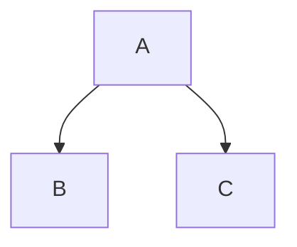

Drei Backticks, ein Zeilenumbruch, Ihr Code, drei weitere Backticks. Das ist ein eingezäunter Codeblock, und es ist das Stück Markdown, das am häufigsten so aus einem Konverter kommt, dass es nichts mehr mit dem Getippten zu tun hat: ein Sprachhinweis, der keine Farbe erzeugt hat, ein Backtick, den Sie nicht drucken können, ein Block, der in einer Liste seine Zaunmarkierungen verloren hat. Jeder dieser Fälle hat eine Ursache, die man sehen kann.

### Kurzfassung

Ein Markdown-Konverter tut mit Ihrem Zaun genau eine Sache: Er gibt `<pre><code class="language-x">` aus, mit dem Inhalt als wörtlichen Text maskiert. Er färbt nichts ein. Farbe ist ein zweites Programm — Shiki, Pygments, Chroma oder Rouge, während das HTML gebaut wird, highlight.js oder Prism im Browser des Lesers nach dem Laden — und wenn Sie nie eines eingerichtet haben, wird ein völlig korrekter Sprachhinweis trotzdem grau dargestellt. Alles andere, was Sie in die Zaunzeile schreiben können, Zeilennummern und Dateinamen und hervorgehobene Bereiche, ist die Erfindung eines einzigen Werkzeugs und in jedem anderen träger Text.

Die Fehlschläge sehen in der Quelle alle gleich aus, weshalb die Leute den Konverter verantwortlich machen. Ein Block, der einfach herauskam, ein Block, der als Absatz voller Backticks herauskam, und ein Block, der `&lt;div&gt;` zeigt, sind drei verschiedene Probleme auf drei Schichten: Ihre Einrückung, der Parser des Konverters und was auch immer danach lief.

Keines davon ist schwierig, sobald Sie wissen, auf welcher Schicht Sie stehen. Was folgt, ist der ganze Weg, der Reihe nach: wie ein Zaun erkannt wird, wo Listen und Blockzitate die Regeln ändern, was der Konverter ausgibt, wer es einfärbt, was der Rest des Info-Strings bedeutet, und was der Block auf der Seite tut, wenn all das geklärt ist.

## Zäune, Einrückung und das Zählen von Backticks

Markdown hat zwei Wege, Code als Code zu markieren. Der ältere rückt jede Zeile um vier Leerzeichen ein. Der neuere umschließt die Zeilen mit einem Zaun — drei oder mehr Backticks, oder drei oder mehr Tilden, in einer eigenen Zeile darüber und darunter.

```js
const total = items.reduce((sum, item) => sum + item.price, 0);
```

Eingerückte Blöcke funktionieren weiterhin, aber sie haben keinen Platz für eine Sprache und geraten dauernd mit der Listeneinrückung in Konflikt. Das ursprüngliche Markdown hatte nur diese Form, weshalb ein sehr alter Renderer Ihre drei Backticks wörtlich ausgeben kann statt eines `<pre>` — [welchen Dialekt ein Werkzeug spricht](/blog/commonmark-gfm-and-the-flavours) entscheidet mehr als dieses eine Merkmal.

Vier Regeln bestimmen den Zaun selbst, alle vier aus der Spezifikation (geprüft auf spec.commonmark.org, 9. September 2026), und jede einzelne davon ein Fehlschlag, den irgendwer als Konverter-Fehler gemeldet hat:

- **Der schließende Zaun muss mindestens so lang sein wie der öffnende.** Die Spezifikation ist deutlich: „Der schließende Code-Zaun muss mindestens so lang sein wie der öffnende Zaun.“ Öffnen Sie mit vier Backticks und schließen mit drei, dann endet der Block nie.
- **Der schließende Zaun darf keinen Info-String tragen.** „Schließende Code-Zäune können keine Info-Strings haben.“ Ein Wort nach den schließenden Backticks macht diese Zeile zu Inhalt statt zu einem Zaun.
- **Der öffnende Zaun darf bis zu drei Leerzeichen eingerückt sein, und diese Einrückung wird entfernt.** „Ist der öffnende Zaun eingerückt, wird bei den Inhaltszeilen die entsprechende Einrückung am Anfang entfernt, sofern vorhanden.“ Vier Leerzeichen sind kein eingerückter Zaun: Sie sind ein eingerückter Codeblock, der zufällig Backticks enthält.
- **Ein nicht geschlossener Zaun läuft bis zum Ende seines Behälters.** Vergessen Sie den schließenden Zaun, und der Rest des Dokuments ist Code. Das ist der Fall, der eine ganze Seite unterhalb der Mitte grau werden lässt.

Backtick-Zäune und Tilden-Zäune unterscheiden sich in einer nützlichen Hinsicht. „Info-Strings für Backtick-Codeblöcke können keine Backticks enthalten“, während „Info-Strings für Tilden-Codeblöcke Backticks und Tilden enthalten können“ (geprüft auf spec.commonmark.org, 9. September 2026). Deshalb ist jedes Beispiel in diesem Artikel, das selbst einen Zaun enthält, in Tilden eingepackt.

### Inline-Code, und wie man einen Backtick druckt

Ein Backtick auf jeder Seite ergibt Inline-Code: `npm run dev`. Der Ärger beginnt, wenn der Code selbst einen Backtick enthält.

Ein Backslash hilft nicht. Außerhalb einer Code-Spanne maskiert `` \` `` einen Backtick; innerhalb einer solchen sind Backslash-Maskierungen abgeschaltet, Sie bekämen also einen wörtlichen Backslash in Ihre Ausgabe. Die eigentliche Regel handelt von Länge: Das Begrenzungszeichen muss ein Lauf von Backticks sein, der länger ist als jeder Lauf im Inhalt.

~~~markdown
`code`        ein Backtick auf jeder Seite
``a ` b``     zwei, weil der Inhalt einen enthält
`` ` ``       ein einzelner Backtick, mit Leerzeichen gepolstert
~~~

Diese Leerzeichen sind keine Dekoration. CommonMark entfernt aus einer Code-Spanne je ein Leerzeichen am Anfang und am Ende, wenn beide vorhanden sind; sie halten also den Inhalt von den Begrenzungszeichen fern und verschwinden danach. Das ist die Antwort darauf, wie man in Markdown einen Backtick maskiert: Sie maskieren ihn nicht, Sie überzählen ihn.

Zwei kleinere Dinge folgen aus derselben Regel. Eine Code-Spanne kann keine Leerzeile überqueren, weil eine Leerzeile den Absatz beendet, in dem die Spanne lebt — ein langer Shell-Befehl braucht einen Zaun, keine Spanne. Und eine Code-Spanne fasst innere Zeilenumbrüche zu einzelnen Leerzeichen zusammen, eine Spanne ist also wirklich für ein Wort oder eine Wendung gedacht und niemals für ein Listing.

### Einen Zaun in einen Zaun setzen

Dieselbe Regel, eine Ebene höher. Ein schließender Zaun muss mindestens so lang sein wie der, der den Block geöffnet hat, und ein kürzerer Lauf ist bloß Inhalt. Um also drei Backticks zu zeigen — etwa einen Markdown-Schnipsel in einer Dokumentation über Markdown — öffnen Sie mit vier.

~~~markdown
````markdown
```bash
npm install
```
````
~~~

Das Zählen wird schnell albern. Ein Tilden-Zaun umgeht es: `~~~` öffnet und schließt einen Block, und keine Anzahl von Backticks darin kann ihn schließen. Jedes Beispiel hier, das einen Zaun enthält, ist in einen solchen eingepackt. Wenn Sie regelmäßig Dokumentation über Markdown schreiben, entfernt es eine ganze Fehlerkategorie aus der Datei, sich auf Tilden für den äußeren und Backticks für den inneren Zaun festzulegen.

## Listen, Blockzitate und die Spalte, die entscheidet

Das ist der Fehlschlag, der Leute nach einem Konverter-Fehler suchen lässt. In einem Listenpunkt wird die Inhaltsspalte von der Markierung festgelegt: `- ` setzt sie auf drei, `1. ` auf vier. Ein Zaun muss in dieser Spalte beginnen, oder innerhalb von drei Leerzeichen davon. Vier Leerzeichen weiter, und der Zaun ist kein Zaun mehr — er wird zu einem eingerückten Codeblock, und Ihre Backticks erscheinen als wörtlicher Text. Beginnen Sie ihn in Spalte eins, dann beenden Sie den Listenpunkt und zerlegen eine Liste in zwei, mit einem dazwischengeklemmten Codeblock.

Kaputt, dann repariert:

~~~markdown
1. Die Installation ausführen:

```bash
npm install
```

2. Dann starten.
~~~

~~~markdown
1. Die Installation ausführen:

   ```bash
   npm install
   ```

2. Dann starten.
~~~

Drei Leerzeichen für `1. `, zwei für `- `, und der Block gehört zum Punkt. Achten Sie in der kaputten Fassung auf die zweite Liste: Weil der Codeblock die erste Liste beendet hat, beginnt die `2.` eine neue, und die meisten Renderer setzen die Nummerierung wieder bei eins an. Dieselbe Rechnung gilt für verschachtelte Listen und harte Zeilenumbrüche, was [ein eigenes kleines Thema ist](/blog/markdown-line-breaks-and-lists).

Geordnete Listen mit mehr als neun Punkten bekommen bei zehn eine Spalte dazu, denn `10. ` ist ein Zeichen breiter als `9. `. Ein Block, der zu den früheren Punkten passend eingerückt ist, sitzt ab Punkt zehn ein Leerzeichen zu weit links. Die sichere Gewohnheit ist, alles innerhalb eines Listenpunkts um vier Leerzeichen einzurücken und nicht weiter darüber nachzudenken: Vier liegt bei beiden Markierungen innerhalb von drei Leerzeichen zur Inhaltsspalte, der Zaun bleibt also ein Zaun, und das zusätzliche Leerzeichen wird entfernt.

Blockzitate sind strenger. Die Markierung `> ` muss in jeder Zeile des Blocks stehen, einschließlich der Zaunzeilen und aller Leerzeilen darin. Lassen Sie sie in einer Zeile weg, und das Zitat endet dort und nimmt den Rest des Blocks mit.

~~~markdown
> Führen Sie das zuerst aus:
>
> ```bash
> npm install
> ```
>
> Dann starten Sie es.
~~~

Kombinieren Sie beides — ein Zaun in einem Listenpunkt in einem Blockzitat — und die Präfixe stapeln sich: zuerst das `> `, dann die Einrückung des Punkts, dann der Zaun. Editoren, die Markdown beim Speichern neu formatieren, machen das oft genug falsch, dass es sich lohnt, die Ausgabe zu lesen statt der Datei zu vertrauen.

## Was der Sprachhinweis tatsächlich tut

Das Wort nach dem öffnenden Zaun ist der Info-String. Ein Konverter tut damit genau eine Sache: Er setzt es als Klasse auf das `<code>`-Tag.

```html
<pre><code class="language-js">const total = items.reduce(...)
</code></pre>
```

Das ist das ganze Merkmal, und es ist eine Konvention, keine Vorschrift: „Das erste Wort des Info-Strings wird typischerweise verwendet, um die Sprache des Codeblocks anzugeben. In HTML-Ausgabe wird die Sprache normalerweise dadurch angezeigt, dass dem `code`-Element eine Klasse hinzugefügt wird, die aus `language-` gefolgt vom Sprachnamen besteht“ (geprüft auf spec.commonmark.org, 9. September 2026). Nichts parst Ihr JavaScript, und nichts prüft, ob das Wort eine echte Sprache ist — schreiben Sie `jvascript`, und Sie bekommen `class="language-jvascript"`, was kein Highlighter erkennt, der Block wird also ohne Farbe dargestellt.

| Was Sie schreiben | Was der Konverter ausgibt |
| --- | --- |
| Ein nackter Zaun | `<pre><code>` |
| Ein mit `json` markierter Zaun | `<pre><code class="language-json">` |
| Vier Leerzeichen Einrückung | `<pre><code>` |
| Ein mit `bash` markierter Tilden-Zaun | `<pre><code class="language-bash">` |
| Ein mit `jvascript` markierter Zaun | `<pre><code class="language-jvascript">` |
| Ein mit `js {1,3-4}` markierter Zaun | `<pre><code class="language-js">`, der Rest meist verworfen |

Beachten Sie die letzte Zeile. Die Klasse wird allein aus dem ersten Wort gebaut. Was mit dem Rest geschieht, ist nirgends festgelegt, und verschiedene Werkzeuge behalten ihn, verwerfen ihn oder handeln danach, was weiter unten ein eigener Abschnitt ist.

### Das Alias-Problem

Der Sprachname ist nicht standardisiert. Jede Hervorhebungs-Engine bringt ihre eigene Liste von Namen und Aliassen mit, und die Listen überschneiden sich, ohne übereinzustimmen. `js` und `javascript` funktionieren fast überall. `sh`, `bash` und `shell` sind in manchen Engines drei getrennte Lexer und in anderen Aliasse voneinander. `yml` und `yaml` bedeuten für jedes brauchbare Werkzeug dasselbe. Und `console` bedeutet Shell-Ausgabe samt Eingabeaufforderungen statt eines Shell-Skripts, weshalb ein Block aus Befehlen gemischt mit ihrer Ausgabe falsch aussieht, wenn Sie ihn mit `bash` markieren.

| Sprache | Aliasse, die in der Praxis vorkommen |
| --- | --- |
| JavaScript | `js`, `javascript`, `node`, `jsx`, `mjs`, `cjs` |
| TypeScript | `ts`, `typescript`, `tsx` |
| Shell-Skript | `sh`, `bash`, `zsh`, `shell` |
| Shell-Sitzung, mit Eingabeaufforderungen und Ausgabe | `console`, `shell-session`, `shellsession` |
| YAML | `yml`, `yaml` |
| Python | `py`, `python`, `python3` |
| Ruby | `rb`, `ruby` |
| Markdown | `md`, `markdown`, `mdown` |
| HTML | `html`, `htm`, `xhtml` |
| C++ | `cpp`, `c++`, `cxx` |
| C# | `cs`, `csharp`, `c#` |
| Go | `go`, `golang` |
| Rust | `rs`, `rust` |
| PowerShell | `ps1`, `powershell`, `pwsh` |
| Keine Hervorhebung gewünscht | `text`, `txt`, `plaintext`, `plain`, `none`, `nohighlight` |

Die praktische Regel ist, den vollen Namen statt des kurzen zu schreiben — `javascript`, `python`, `yaml` —, denn die kurzen Aliasse sind die, die zwischen den Engines schwanken. Der Preis für einen Fehler ist keine Fehlermeldung. In den meisten Engines bewirkt ein unbekannter Hinweis überhaupt nichts.

| Engine | Was eine unbekannte oder nicht geladene Sprache bewirkt |
| --- | --- |
| highlight.js | Lässt den Block ohne Hervorhebung. `plaintext` gestaltet ihn ohne Hervorhebung, `nohighlight` überspringt ihn ganz (geprüft auf github.com/highlightjs/highlight.js, 9. September 2026) |
| Prism | Keine Grammatik heißt keine Token, der Block kommt also ohne Farbe heraus |
| Shiki | Wirft einen Fehler. Seit v1.0 „erfordert es, dass alle Themes und Sprachen ausdrücklich geladen werden“ (geprüft auf shiki.style, 9. September 2026) |
| Pygments, Chroma, Rouge | Hängt davon ab, wie der Generator sie aufruft: ein Build-Fehler oder ein stiller Rückfall auf einfachen Text |

Dieser Unterschied wiegt schwerer, als er klingt. Ein Browser-Highlighter scheitert stillschweigend, ein Tippfehler in einem Zaun von zweihundert ist also unsichtbar, bis ein Leser ihn erwähnt. Ein Highlighter zur Build-Zeit, der einen Fehler wirft, sagt es Ihnen in dem Moment, in dem Sie den Tippfehler einführen, und das ist das Verhalten, das Sie auf einer Dokumentationsseite mit hunderten Blöcken wollen.

### Maskierung, und warum in der Ausgabe `&lt;` steht

Der Inhalt eines Zauns wird „als wörtlicher Text behandelt, nicht als Inline-Elemente geparst“ (geprüft auf spec.commonmark.org, 9. September 2026). Um das in HTML einzuhalten, muss ein Konverter mindestens `<` als `&lt;` und `&` als `&amp;` maskieren, bevor der Code die Seite erreicht; die meisten maskieren auch `>` als `&gt;` und `"` als `&quot;`, was in Textinhalt unnötig und harmlos ist. Ohne diesen Schritt würde ein Block, der ein `<script>`-Tag zeigt, aufhören, ein Skript zu zeigen, und anfangen, eines zu sein.

Der Zaun ist also mit Absicht eine Grenze, und nur deshalb, weil der Konverter diese Arbeit tut. Rohes HTML *außerhalb* eines Zauns ist eine völlig andere Angelegenheit, und [ob Ihr Konverter es bereinigt](/blog/sanitising-markdown-safely) ist eine Frage, die Sie klären sollten, bevor Sie eine Datei konvertieren, die Sie nicht selbst geschrieben haben.

Damit kommen wir zu dem Symptom, nach dem Leute wirklich suchen: ein Block, in dem `&lt;div&gt;` als sichtbarer Text steht, statt dass das Tag gezeigt wird. Das ist doppelte Maskierung. Etwas hat `<` in `&lt;` verwandelt, dann hat etwas anderes das `&` von `&lt;` in `&amp;lt;` verwandelt, und der Browser hat das Ergebnis brav dargestellt. Die üblichen Ursachen, grob nach Häufigkeit:

- Sie haben bereits maskiertes HTML in den Zaun eingefügt. Die Quelle enthält wirklich `&lt;div&gt;`, und der Konverter hat das Ampersand genau so maskiert, wie er sollte.
- Es sind zwei Maskierungsschritte gelaufen. Ein Konverter gab korrektes HTML aus, und eine Template-Engine hat diese Ausgabe auf dem Weg in die Seite noch einmal maskiert.
- Einem Highlighter wurde HTML statt Quelltext übergeben. Manche Anbindungen geben den bereits maskierten Inhalt von `<code>` an einen Highlighter, der auf dem Weg hinaus noch einmal maskiert.

Die Behebung besteht immer darin, einen der beiden Schritte zu entfernen, niemals darin, am Ende einen Entmaskierungsschritt anzuhängen. Wenn Sie die Pipeline selbst bauen, halten Sie den Code so lange wie möglich als einfachen Text und maskieren genau einmal, an dem Punkt, an dem er zu HTML wird.

## Wo die Hervorhebung tatsächlich stattfindet

Das ist der Teil, den fast nichts erklärt. Der Konverter gibt `<pre><code class="language-x">` aus und hört auf. Etwas anderes liest diese Klasse, zerlegt den Code in Token, packt jedes Token in ein `<span>` und gibt ihm eine Farbe. Dieses zweite Programm ist nicht Teil von Markdown, es ist nicht Teil Ihres Konverters, und Sie müssen es auswählen.

Es gibt nur zwei Orte, an denen es laufen kann. **Zur Build-Zeit**, während das HTML erzeugt wird: Die Farben sind in die Datei eingebacken, und der Leser lädt keinen zusätzlichen Code. **Im Browser**, nachdem die Seite geladen ist: Der Leser lädt ein Skript und ein Stylesheet, und das Skript läuft über jeden Codeblock der Seite. Alles andere ist eine Einzelheit der Engine, für die Sie sich entscheiden.

| Engine | Geschrieben in | Wo sie läuft | Was die Seite braucht | Was es die Seite kostet | Lizenz |
| --- | --- | --- | --- | --- | --- |
| Shiki | TypeScript | Build-Zeit | Nichts: die Farben stehen schon im HTML | Ein Inline-`style`-Attribut an jedem Token, das HTML selbst wächst also | MIT |
| Pygments | Python | Build-Zeit oder jeder Python-Prozess | Ein Stylesheet, sofern die Stile nicht eingebettet sind | Ein `<span class>` pro Token, plus das Stylesheet | BSD mit zwei Klauseln |
| Chroma | Go | Build-Zeit; Hugo ruft sie für Sie auf | Ein Stylesheet, oder nichts, wenn die Stile eingebettet sind | Dieselbe Form wie bei Pygments | MIT |
| Rouge | Ruby | Build-Zeit; die Voreinstellung von Jekyll | Ein Pygments-kompatibles Stylesheet | Spans plus das Stylesheet | MIT |
| highlight.js | JavaScript | Im Browser des Lesers, nach dem Laden | Das Skript, ein Theme-Stylesheet und einen Aufruf | Ein Skript-Download und ein Durchgang über jeden Block | BSD mit drei Klauseln |
| Prism | JavaScript | Im Browser des Lesers, nach dem Laden | Kern, jede Sprache, ein Theme, etwaige Plugins | Kern 2 KB minifiziert und gzip-komprimiert, 0,3–0,5 KB pro Sprache, rund 1 KB pro Theme | MIT |
| Gar nichts | — | Nirgends | Nichts | Nichts | — |

Jede Lizenz und jede Größe in dieser Tabelle wurde am 9. September 2026 gegen die eigene Dokumentation des Projekts geprüft. Alle sechs Engines sind kostenlos und Open Source; die Unterschiede, die es für Sie entscheiden, stehen in den letzten zwei Spalten.

### Shiki — Farben eingebacken, kein Skript ausgeliefert

Shiki ist „ein schöner und zugleich mächtiger Syntax-Highlighter“, der „von TextMate-Grammatiken angetrieben wird, derselben Engine wie Ihr VS Code“, und seine Kerneigenschaft ist „Zero Runtime“: Es „läuft im Voraus, liefert null JavaScript aus und bekommt dabei die perfekte Syntaxhervorhebung“ (geprüft auf shiki.style, 9. September 2026). Weil es dieselben Grammatiken verwendet wie ein Editor, sieht ein von Shiki eingefärbter Block aus wie dieselbe Datei offen in VS Code, was in Dokumentation über Code ein echter Vorteil ist.

- Die Ausgabe trägt Farbe in Inline-`style`-Attributen statt in Klassennamen, es wird also gar kein Stylesheet gebraucht.
- Doppelte Themes funktionieren über CSS-Variablen: Ein Token kommt als
  `style="color:#1976D2;--shiki-dark:#D8DEE9"` heraus, und eine Regel unter `prefers-color-scheme: dark` liest die Variable (geprüft auf shiki.style, 9. September 2026).
- Ein Transformers-Paket ergänzt Zeilen- und Worthervorhebung, Diff-Notation, Fokus sowie Fehler-, Warn- und Info-Ebenen, alle als Kommentare im Code geschrieben (geprüft auf shiki.style, 9. September 2026).
- Sprachen und Themes müssen ausdrücklich geladen werden, und genau das erzwingt der weiter oben beschriebene Fehler: Ein Zaun, den niemand konfiguriert hat, ist ein Build-Fehlschlag, kein grauer Block.

**Preis:** kostenlos, MIT-lizenziert.

**Wer sollte es verwenden?** Alle, die eine Seite mit einer JavaScript-Werkzeugkette bauen und exakte Farben ohne Kosten im Client wollen. Der Tausch ist HTML-Größe, denn die Farbe jedes Tokens wird in die Datei geschrieben.

### Pygments — das, von dem alles andere abgeschrieben hat

Pygments ist „ein allgemeiner Syntax-Highlighter, geeignet für den Einsatz in Code-Hosting, Foren, Wikis oder anderen Anwendungen, die Quellcode verschönern müssen“, unterstützt „eine große Bandbreite von 602 Sprachen und anderen Textformaten“ und schreibt „HTML, RTF, LaTeX und ANSI-Sequenzen“ (geprüft auf pygments.org, 9. September 2026). Es ist Python-Bibliothek und Kommandozeilenwerkzeug in einem, und es liegt unter einer Menge Dokumentationswerkzeug — Material for MkDocs hebt damit zur Build-Zeit hervor, sofern Sie das nicht zugunsten eines Browser-Highlighters abschalten (geprüft auf squidfunk.github.io, 9. September 2026).

- Der HTML-Formatter gibt standardmäßig CSS-Klassen aus, und `get_style_defs()` liefert das passende Stylesheet.
- `noclasses` bettet die Stile stattdessen ein, was die Dokumentation als „nicht empfohlen für größere Codestücke, da es die Ausgabegröße merklich vergrößert“ bezeichnet (geprüft auf pygments.org, 9. September 2026).
- `linenos` stellt Zeilennummern dar, entweder innerhalb des `<pre>` oder als zweizellige Tabelle.
- `hl_lines` nimmt eine Liste von Zeilen, die betont werden sollen, gezählt ab dem Anfang der Eingabe.

**Preis:** kostenlos, BSD-lizenziert mit zwei Klauseln.

**Wer sollte es verwenden?** Python-Build-Pipelines, MkDocs-Seiten und alle, die aus demselben Highlighter ein anderes Ausgabeformat als HTML brauchen.

### Chroma — Pygments, in Go, in Hugo

Chroma ist „ein Allzweck-Syntax-Highlighter in reinem Go“, der „Quellcode und anderen strukturierten Text in syntaxhervorgehobenes HTML, ANSI-gefärbten Text usw. umwandelt“. Zur eigenen Abstammung ist es deutlich: „Chroma beruht stark auf Pygments und enthält Übersetzer für Pygments-Lexer und -Stile“ (geprüft auf github.com/alecthomas/chroma, 9. September 2026), was heißt, dass Pygments-Stylesheets meist unverändert funktionieren.

- Der HTML-Formatter kann über `WithClasses()` Klassen ausgeben oder stattdessen Inline-Style-Attribute.
- Terminal-Ausgabe kommt „in 8 Farben, 256 Farben und True Color“ (geprüft auf github.com/alecthomas/chroma, 9. September 2026).
- Eine Kommandozeilenschnittstelle wird mitgeliefert, und `chroma --list` gibt die maßgebliche Lexer-Liste aus.
- Hugo hebt eingezäunte Blöcke damit zur Build-Zeit hervor, in seiner Standardkonfiguration (geprüft auf gohugo.io, 9. September 2026).

**Preis:** kostenlos, MIT-lizenziert.

**Wer sollte es verwenden?** Go-Programme und jede Hugo-Seite, ob der Autor weiß, dass es da ist, oder nicht.

### Rouge — die Voreinstellung von Jekyll

Rouge ist „ein Syntax-Highlighter in reinem Ruby“, der „über 200 verschiedene Sprachen hervorheben und HTML oder ANSI-256-Farb-Text ausgeben kann“. Zwei Tatsachen darüber zählen. „Seine HTML-Ausgabe ist mit Stylesheets kompatibel, die für Pygments entworfen wurden“, Themes sind also zwischen beiden portabel, und „Rouge ist Jekylls voreingestellter Syntax-Highlighter“ (geprüft auf github.com/rouge-ruby/rouge, 9. September 2026).

**Preis:** kostenlos, MIT-lizenziert.

**Wer sollte es verwenden?** Jekyll-Seiten, also einen großen Teil der Dokumentation, die direkt aus einem Repository veröffentlicht wird. Wenn Ihre Blöcke schon eingefärbt sind und Sie nie etwas konfiguriert haben, ist das meist der Grund.

### highlight.js — die Browser-Voreinstellung, mit Erkennung

highlight.js beschreibt sich als „des Internets liebster JavaScript-Syntax-Highlighter mit Unterstützung für Node.js und das Web“ und beansprucht „193 Sprachen und 516 Themes“ sowie „null Abhängigkeiten“ (geprüft auf highlightjs.org, 9. September 2026). Sein unterscheidendes Merkmal ist die automatische Spracherkennung: Es wird „Code innerhalb von `<pre><code>`-Tags finden und hervorheben; es versucht, die Sprache automatisch zu erkennen“ (geprüft auf highlightjs.org, 9. September 2026).

- Läuft im Browser des Lesers oder in Node; der Browser-Build wird normalerweise von einem CDN geladen.
- Liest `class="language-html"`, wenn Sie die Erkennung übersteuern wollen.
- `plaintext` gestaltet einen Block, ohne ihn hervorzuheben, und `nohighlight` überspringt ihn (geprüft auf github.com/highlightjs/highlight.js, 9. September 2026).
- Seine eigene Dokumentation vermerkt, dass „das Importieren aller unserer Sprachen die Größe Ihres Bundles vergrößert“ (geprüft auf highlightjs.org, 9. September 2026), eine echte Auslieferung lädt also eine Teilmenge.

**Preis:** kostenlos, BSD-lizenziert mit drei Klauseln.

**Wer sollte es verwenden?** Seiten, auf denen Sie die Info-Strings nicht bestimmen können — ein Kommentarsystem, ein Wiki, ein Forum —, denn die Erkennung ist das Einzige hier, das mit unbeschrifteten Blöcken zurechtkommt. Überall, wo Sie den Zaun bestimmen, schreiben Sie die Sprache darauf, statt das Raten dem Skript zu überlassen.

### Prism — ein kleiner Kern, alles andere ein Plugin

Prism ist „ein leichtgewichtiger, erweiterbarer Syntax-Highlighter, gebaut mit modernen Web-Standards im Sinn“. Seine Größenangabe ist ungewöhnlich genau: „Der Kern ist 2 KB minifiziert und gzip-komprimiert. Sprachen fügen je 0,3–0,5 KB hinzu, Themes liegen bei rund 1 KB“ (geprüft auf prismjs.com, 9. September 2026). Es liest `language-xxxx` und „unterstützt außerdem eine kürzere Fassung: `lang-xxxx`“.

- Keine automatische Erkennung: Ein unbeschrifteter Block bleibt ohne Farbe.
- Plugins decken Zeilennummern, Zeilenhervorhebung, das Anzeigen der Sprache und Kopieren in die Zwischenablage ab, jedes mit eigenem Skript und Stylesheet.
- Das Line-Highlight-Plugin wird aus dem HTML statt aus dem Zaun konfiguriert: `data-line` am `<pre>`, das einzelne Nummern, Bereiche mit Bindestrich und kommagetrennte Kombinationen annimmt (geprüft auf prismjs.com, 9. September 2026).
- Läuft im Browser und „kann ebenso mit Node.js verwendet werden“, falls Sie lieber vorab darstellen (geprüft auf prismjs.com, 9. September 2026).

**Preis:** kostenlos, MIT-lizenziert.

**Wer sollte es verwenden?** Seiten, die die Verhaltensweisen der Plugins wollen — einen Kopierknopf, Zeilennummern, eine Sprachbeschriftung — ohne sie zu bauen, und die sich die zusätzlichen Anfragen leisten können.

### Gar nichts — ein einfacher, gestalteter Block

Die vierte Möglichkeit ist, das zweite Programm wegzulassen. Das `<pre><code>` des Konverters mit einer Festbreitenschrift, einem Hintergrund, etwas Innenabstand und einem Rahmen ist völlig lesbar, und der Unterschied zwischen dem und einem eingefärbten Block ist ästhetisch statt funktional.

Das ist der Tausch, den eine portable Datei macht. TransformPipe konvertiert eingezäunten Code als Teil von GitHub Flavored Markdown, und das `.html`, das es zurückgibt, ist eigenständig: Inline-Stile, keine Skripte, keine Netzwerkanfragen. Code kommt als gestalteter Text in Festbreitenschrift in einem `<pre>` an statt als eingefärbte Token, weil [nichts in der Datei zurückbleibt, was das Einfärben tun könnte](/blog/self-contained-html-explained). Ist Farbe der Punkt, greifen Sie zu einem Seitengenerator, der Shiki oder Chroma zur Build-Zeit laufen lässt, oder zu [Pandoc](/blog/pandoc-alternatives-for-markdown-to-html), das beim Konvertieren hervorhebt. Ist eine portable Datei der Punkt, die Sie jemandem geben können, ist der einfache Block der bessere Tausch.

## Der Rest des Info-Strings gehört dem Werkzeug

Markdown legt das erste Wort des Info-Strings fest und sagt über den Rest überhaupt nichts. Jede Konvention, die Sie gesehen haben — `{1,3-4}`, `title="app.js"`, `showLineNumbers`, `linenums="1"` —, wurde von einem einzigen Werkzeug erfunden, und kein anderes Werkzeug ist verpflichtet, sie zu verstehen. Das ist die mit Abstand größte Quelle von Meldungen der Art „auf GitHub wird es anders dargestellt“.

| Werkzeug | Was es nach der Sprache liest | Beispiel-Info-String |
| --- | --- | --- |
| Shiki, mit Transformers | Zeilenbereiche und hervorzuhebende Wörter | `js {1,3-4}`, `js /Hello/` |
| Hugo, über Chroma | Attribute in geschweiften Klammern | `go {linenos=inline hl_lines=[3,"6-8"]}` |
| Material for MkDocs, über Pygments | Benannte Optionen | `py title="bubble_sort.py" linenums="1" hl_lines="2 3"` |
| Docusaurus, über Prism React Renderer | Bereiche, einen Titel, Zeilennummern | `jsx {1,4-6} title="/src/App.js" showLineNumbers` |
| Prism in der Seite | Nichts: seine Optionen sind HTML-Attribute am `<pre>` | `js`, plus `data-line="1,4-6"` im HTML |
| GitHub | Nichts über die Sprache hinaus | `mermaid`, `geojson`, `topojson`, `stl` |
| Ein einfacher CommonMark-Konverter | Nichts: der Rest sind Metadaten, die er einfach verwerfen darf | `js {1,3-4}` |

Jede Zeile dort wurde am 9. September 2026 gegen die eigene Dokumentation des Werkzeugs geprüft. Lesen Sie die Tabelle als Warnung, nicht als Speisekarte. Ein für Docusaurus geschriebener Zaun wird in Hugo als Codeblock dargestellt, dessen Sprache `jsx` ist und dessen übrige Wörter verschwinden, und derselbe Zaun ist auf GitHub ein Block JavaScript ohne Titel und ohne hervorgehobene Zeilen. Nirgends auf dem Weg gibt es einen Fehler. Sie verlieren einfach die Anmerkung, stillschweigend, in einem Diff, den niemand liest.

Manche Werkzeuge haben die Anmerkung in den Code selbst verlegt, als Kommentare, was in einer Hinsicht besser reist und in einer anderen schlechter. Shikis Transformers lesen `// [!code highlight]`, `// [!code ++]` und `// [!code focus]`; Docusaurus liest `// highlight-next-line` (geprüft auf shiki.style und docusaurus.io, 9. September 2026). Fügen Sie einen dieser Blöcke irgendwo anders ein, und die Anmerkung ist weiterhin da — als sichtbarer Kommentar mitten in Ihrem Beispiel, den Leser mit allem anderen mitkopieren werden.

### `diff` und `mermaid` sind keine Hervorhebung

Zwei Info-Strings verhalten sich anders als alle übrigen, und beide sind es wert, gekannt zu werden.

`diff` ist für einen Highlighter eine echte Sprache. Er färbt Zeilen, die mit `+` und `-` beginnen, grün und rot, weshalb ein in einen mit `diff` markierten Zaun eingefügter Patch wie ein Code-Review aussieht. Aber die Zeichen `+` und `-` sind Teil des Codes, wer den Block also kopiert, kopiert sie mit. Das ist das richtige Verhalten für einen Patch, den jemand anwenden soll, und das falsche Verhalten für „hier ist die Zeile, die zu ändern ist“, wo ein hervorgehobener Zeilenbereich das ist, was Sie eigentlich wollten.

~~~markdown
```diff
- const total = items.reduce((s, i) => s + i.price, 0);
+ const total = items.reduce((s, i) => s + i.price * i.qty, 0);
```
~~~

`mermaid` ist überhaupt keine Hervorhebung. Es ist ein Signal, den Block durch ein Bild zu ersetzen. GitHub tut das für vier Zaunsprachen: „Sie können Diagramme in Markdown mit vier verschiedenen Syntaxen erstellen: mermaid, geoJSON, topoJSON und ASCII STL“ (geprüft auf docs.github.com, 9. September 2026).

~~~markdown

~~~

Nehmen Sie dieselbe Datei irgendwohin ohne Mermaid-Renderer, und Sie bekommen genau das, was das Markdown sagt: einen Codeblock, der den Text `graph TD;` enthält. Es ist nicht kaputt, und in der Quelle gibt es nichts zu reparieren — das Diagramm war nie in der Datei, nur die Anweisungen, eines zu zeichnen.

## Die Ausgabeseite: Überlauf, Tabulatoren und Kopierknöpfe

Alles oben Beschriebene geschieht, bevor die Seite existiert. Die nächste Reihe von Problemen kommt danach, und keines davon ist Markdowns Schuld.

**Lange Zeilen laufen über.** Ein `<pre>` hat standardmäßig `white-space: pre`, was gar keinen Umbruch bedeutet. Eine Zeile mit 120 Zeichen in einem 360 Pixel breiten Telefon-Viewport schiebt die ganze Seite zur Seite, wenn nichts das aufhält. Die Behebung gehört an den Block, nicht an den Body:

```css
pre {
  overflow-x: auto;
}
```

`white-space: pre-wrap` ist die andere Möglichkeit, und es ist eine echte Wahl statt einer besseren Antwort. Umbrechen hält alles sichtbar und zerstört die Spaltenausrichtung, die Code lesbar macht; eine umgebrochene Zeile sieht außerdem wie zwei Zeilen aus, was in einem Beispiel verwirrend ist, in dem Einrückung Bedeutung trägt. Sanftes Umbrechen fügt keine Zeilenumbrüche ein, kopierter Code ist also in beiden Fällen richtig.

**Tabulatoren sind nicht vier Leerzeichen.** Ein Tabulatorzeichen in einem Codeblock bleibt im HTML ein Tabulatorzeichen, und CSS stellt es mit `tab-size` dar, dessen Anfangswert 8 ist (geprüft auf developer.mozilla.org, 9. September 2026). Eine mit Tabulatoren eingerückte Go-Quelldatei oder ein Makefile sieht auf der Seite daher doppelt so tief eingerückt aus wie in Ihrem Editor. Setzen Sie `tab-size` am `pre` passend zur Datei, oder wandeln Sie Tabulatoren vor der Konvertierung in Leerzeichen um und denken nicht mehr darüber nach.

**Abschließende Leerzeichen überleben.** Konverter behalten den Inhalt eines Blocks Byte für Byte, abschließende Leerzeichen am Zeilenende sind also noch da, und eine Leerzeile vor dem schließenden Zaun wird zu einer leeren letzten Zeile innerhalb des `<pre>`. Keines von beidem ist sichtbar, bis jemand den Block in ein Terminal kopiert. HTML-Parser verwerfen einen einzelnen Zeilenumbruch direkt nach dem `<pre>`-Tag, weshalb die erste Zeile richtig aussieht und die letzte nicht.

**Kopierknöpfe sind von all dem kein Teil.** Kein Konverter gibt einen aus, denn ein Kopierknopf ist ein Skript: Er braucht einen Klick-Handler und die Clipboard-API. Prism hat ein Plugin dafür, die meisten Dokumentations-Themes bauen ihren eigenen, und eine eigenständige HTML-Datei ohne Skripte darin kann überhaupt keinen haben. Wenn ein Kopierknopf zählt, ist er eine Anforderung an die Seite, nicht an die Konvertierung.

**Zeilennummern sind eine Kopiergefahr.** Als echter Text im Block dargestellt, werden sie mit dem Code ausgewählt und mitkopiert, und der Leser fügt `1 npm install` in ein Terminal ein. Die zwei Auswege sind CSS-Zähler, die kein Text sind, und eine zweispaltige Tabelle — was genau das ist, was der Tabellenmodus von Pygments erzeugt, „eine Tabelle mit zwei Zellen, von denen eine die Zeilennummern enthält und die andere den ganzen Code“ (geprüft auf pygments.org, 9. September 2026).

**Code in einer Tabellenzelle ist auf Spannen beschränkt.** Eine GFM-Tabellenzelle ist ein Inline-Zusammenhang: Eine Code-Spanne funktioniert, ein eingezäunter Block nicht. Schlimmer noch, eine Pipe innerhalb der Zelle beendet die Zelle, eine Pipe in einer Code-Spanne muss also mit einem Backslash maskiert werden, obwohl Backslash-Maskierungen innerhalb einer Spanne sonst abgeschaltet sind. Braucht ein Beispiel mehr als eine Wendung, setzen Sie es unter die Tabelle statt hinein — [das weitere Problem, Tabellen durch eine Konvertierung zu bringen](/blog/markdown-tables-that-survive-conversion) hat mehr davon.

## Was Syntaxhervorhebung kostet

Der ehrliche Abschnitt, denn nichts davon steht auf der Startseite eines Highlighters.

**Es kostet Bytes, und die Kosten fallen an verschiedenen Stellen an.** Im Browser bezahlen Sie mit Anfragen: ein Kern-Skript, eine Datei für jede geladene Sprache, ein Theme und ein weiteres Skript für jedes Plugin, weshalb highlight.js davor warnt, jede mitgelieferte Sprache zu importieren. Zur Build-Zeit bezahlen Sie stattdessen mit HTML. Shiki schreibt an jedes Token ein `style`-Attribut, und eine Einrichtung mit zwei Themes schreibt zwei Farbwerte pro Token; Pygments warnt genauso davor, seine Stile einzubetten statt ein Stylesheet auszuliefern. Eine Seite mit einem Dutzend großer Codeblöcke kann leicht mehr Markup für Farbe tragen als für Prosa.

**Ein Browser-Highlighter zeichnet vor den Augen des Lesers neu.** Er läuft, nachdem das HTML geparst ist, der Block kommt also ohne Farbe an und wird einen Moment später farbig. Bei einer schnellen Verbindung ist das unsichtbar. Bei einer langsamen, oder mit blockierten Skripten, ist der einfache Block das, was der Leser bekommt — was ein faires Argument dafür ist, den einfachen Block absichtlich statt unfertig aussehen zu lassen.

**Themes mit geringem Kontrast erfüllen eine Barrierefreiheitsanforderung nicht.** WCAG-Erfolgskriterium 1.4.3 ist eine Anforderung der Stufe AA für „ein Kontrastverhältnis von mindestens 4,5:1“ bei normalem Text und 3:1 bei großem Text (geprüft auf w3.org, 9. September 2026). Sehr viele beliebte Editor-Themes wurden für einen dunklen Editor in einer bequemen Schriftgröße entworfen, nicht für eine Webseite: Kommentare in Mittelgrau auf dunklem Hintergrund und Zeichenketten in schwach gesättigtem Pastell sind die zwei, die am häufigsten durchfallen. Nichts warnt Sie. Der Block sieht für die Person gut aus, die das Theme gewählt hat, und ist für einen Leser mit Sehbeeinträchtigung oder einem Laptop-Bildschirm im Tageslicht unlesbar.

**Farbe trägt keine Information, die der Text nicht trägt.** Das ist der rettende Umstand und gleichzeitig das Argument für Zurückhaltung: Nichts in einem hervorgehobenen Block wird allein durch Farbe vermittelt, ein Leser, der die Farben nicht unterscheiden kann, verliert also Bequemlichkeit und nichts weiter. Es heißt auch, dass der Ertrag all dieser Bytes Bequemlichkeit ist — auf einer Dokumentationsseite, die jemand täglich liest, ist sie das Geld wert, bei einem Dokument, das Sie einmal mailen, schwer zu rechtfertigen.

**Automatische Erkennung rät bei kurzen Blöcken falsch.** Drei Zeilen Shell und drei Zeilen Ruby sehen für einen Erkenner gleich aus. Ein als falsche Sprache eingefärbter Block ist schlechter als ein einfacher, denn er irrt selbstsicher: Schlüsselwörter, die keine sind, Zeichenketten, die keine sind. Beschriften Sie Ihre Zäune, und die Erkennung muss nie laufen.

**Und die Kosten, die am leichtesten zu übersehen sind, sind die Pflege.** Ein von einem CDN geladener Browser-Highlighter ist ein Skript eines Dritten auf jeder Seite Ihrer Website, mit einer Version, die aktuell zu halten ist, und einer Lieferkette, der zu vertrauen ist. Ein Highlighter zur Build-Zeit ist eine Build-Abhängigkeit mit derselben Verpflichtung. Keiner von beiden ist umsonst. Das einfache `<pre>` hat überhaupt keine Version.

## Wie man wählt, und wie man prüft

1. **Entscheiden Sie, ob die Datei reisen muss, bevor Sie einen Highlighter wählen.** Eine Engine auf Browser-Seite macht aus einem Dokument eine Seite, die zwei weitere Downloads braucht, um richtig auszusehen; alles, was Sie mailen oder archivieren, sollte also zur Build-Zeit oder gar nicht hervorgehoben werden.
2. **Nehmen Sie die Build-Zeit für alles, was Sie wiederholt veröffentlichen.** Der Leser lädt keinen zusätzlichen Code, die Farben können nicht ausbleiben, und ein kaputter Sprachname wird zu einem Build-Fehler statt zu einem stillen grauen Block, den jemand sechs Monate später bemerkt.
3. **Schreiben Sie den vollen Sprachnamen, nicht den Alias.** `javascript` und `python` werden von jeder Engine in diesem Artikel erkannt; `js` fast immer; die Kurzformen weniger verbreiteter Sprachen sind genau dort, wo die Listen auseinandergehen und Ihr Block leise seine Farbe verliert.
4. **Behandeln Sie alles nach der Sprache als werkzeugspezifisch.** Falls der Inhalt umziehen könnte — von Docusaurus zu Hugo, von einem Wiki in ein Repository —, ziehen die Zeilenbereiche und Titel nicht mit um, und Sie werden ein Diff von zweihundert Zäunen lesen, um herauszufinden, was verloren ging.
5. **Prüfen Sie den Kontrast des Themes gegen den Blockhintergrund, nicht gegen Weiß.** Ein Theme, das bei Kommentaren an 4,5:1 scheitert, macht den einen Teil Ihres Beispiels, der für Menschen geschrieben ist, zum am schwersten lesbaren, und nichts in Ihrer Pipeline wird es erwähnen.
6. **Testen Sie Ihre längste Zeile in Telefonbreite.** Überlauf ist der Fehlschlag, der jede Durchsicht übersteht, weil die durchsehende Person einen breiten Bildschirm hat und ihn nie sieht.
7. **Lesen Sie das HTML, nicht die Vorschau.** Jeder Editor zeigt Markdown mit seinen eigenen Einstellungen an, ein Block, der in Ihrem richtig aussieht, beweist also wenig über die Datei, die jemand anders öffnet. Das HTML entscheidet es: Ein Zaun, der funktioniert hat, zeigt `<pre><code>`, und einer, der es nicht tat, zeigt einen Absatz mit Backticks darin — das ist Ihre Einrückung oder Ihre Zaunlänge.

## Fazit

Ein Codeblock ist drei getrennte Dinge unter einem Namen: eine Parsing-Regel, die entscheidet, ob Ihre Backticks ein Zaun sind, ein Klassenname, den der Konverter schreibt und nichts weiter, und ein Einfärbungsprogramm, das Sie entweder gewählt haben oder nicht. Halten Sie die drei im Kopf auseinander, und jedes Symptom wird diagnostizierbar — einfacher Text heißt kein Highlighter, wörtliche Backticks heißen Einrückung, `&lt;` auf dem Bildschirm heißt zwei Maskierungsschritte, wo einer sein sollte. Wenn Sie sehen wollen, welche Schicht versagt hat, konvertieren Sie die Datei und lesen die Quelle: [die Markdown-zu-HTML-Konvertierung von TransformPipe](/) läuft im Browser, zeigt Ihnen das erzeugte HTML und gibt eine eigenständige Datei zurück, in der der Block gestaltet statt eingefärbt ist. Die API, das CLI und die GitHub Action führen dieselbe Konvertierung aus, und [die Dokumentation](/docs) behandelt alle drei.

## FAQ

### Warum ist mein Markdown-Codeblock nicht hervorgehoben?

Weil ein Markdown-Konverter nie etwas hervorhebt: Er schreibt `class="language-x"` auf das `<code>`-Tag und hört auf. Etwas anderes muss diese Klasse lesen — Shiki oder Chroma, während die Seite gebaut wird, highlight.js oder Prism im Browser — und wenn es nichts tut, wird der Block als einfacher Text in Festbreitenschrift dargestellt, so korrekt der Zaun auch ist.

### Unterstützt Markdown Syntaxhervorhebung?

Nein. Markdown unterstützt einen Sprach*hinweis*, also das erste Wort nach dem öffnenden Zaun, plus die Konvention, dass daraus im HTML eine `language-`-Klasse wird. Hervorhebung ist ein eigenes Programm, und welches Sie haben, hängt von Ihrem Seitengenerator, Ihrem Theme oder dem Skript ab, das jemand geladen hat.

### Welche Sprachnamen kann ich nach den Backticks verwenden?

Was auch immer Ihr Highlighter erkennt, und das ist nicht standardisiert. Volle Namen wie `javascript`, `python`, `yaml` und `bash` funktionieren in jeder Engine hier; kurze Aliasse wie `js`, `py` und `yml` fast überall; bei ungewöhnlichen Abkürzungen gehen die Engines auseinander. Ein nicht erkannter Name ist in den meisten Werkzeugen kein Fehler — der Block kommt einfach ohne Farbe heraus.

### Wie maskiere ich einen Backtick in Markdown?

Sie maskieren ihn nicht, Sie überzählen ihn. Ein Backslash hat innerhalb einer Code-Spanne keine Wirkung, nehmen Sie also ein Begrenzungszeichen, das länger ist als jeder Backtick-Lauf im Inhalt: zwei Backticks um einen Inhalt, der einen enthält, und ein Leerzeichen auf jeder Seite, wenn der Inhalt mit einem Backtick beginnt oder endet. CommonMark entfernt je ein Leerzeichen am Anfang und am Ende, die Polsterung verschwindet also aus der Ausgabe.

### Wie füge ich einem Markdown-Codeblock Zeilennummern hinzu?

Nicht in Markdown — die Syntax hat kein solches Merkmal. Zeilennummern kommen von dem, was den Block darstellt: `linenums="1"` in Material for MkDocs, `linenos` in Hugo, `showLineNumbers` in Docusaurus, oder ein Plugin und eine Klasse in Prism. Bringen Sie die Datei in ein anderes Werkzeug, und die Nummern verschwinden ohne Kommentar.

### Warum zeigt mein Codeblock `&lt;` statt `<`?

Etwas hat den Code zweimal maskiert. Entweder enthielt die Quelle bereits HTML-Zeichenreferenzen, oder ein Template hat die Ausgabe des Konverters auf dem Weg in die Seite ein zweites Mal maskiert. Beheben Sie es, indem Sie einen Maskierungsschritt entfernen, statt am Ende zu entmaskieren, und halten Sie den Code bis zum letztmöglichen Moment als einfachen Text.

### Warum bricht mein Codeblock in einer nummerierten Liste?

Weil der Zaun in der Inhaltsspalte des Punkts beginnen muss, oder innerhalb von drei Leerzeichen davon. `1. ` legt diese Spalte auf vier, ein Zaun in Spalte eins beendet also die Liste, und ein Zaun vier Leerzeichen hinter der Spalte wird zu einem eingerückten Codeblock voller wörtlicher Backticks. Rücken Sie den Zaun und den Code um die Breite der Markierung ein, und der Block gehört wieder zum Punkt.
