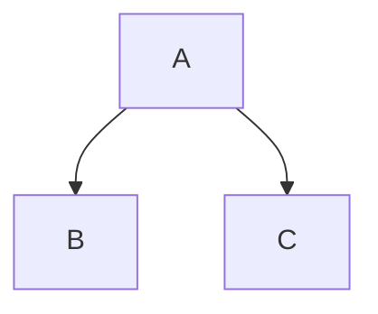

Tres comillas invertidas, un salto de línea, tu código, tres comillas invertidas más. Eso es un
bloque de código delimitado por cercas, y es el fragmento de Markdown que con más frecuencia sale
de un conversor sin parecerse a lo que escribiste: una pista de lenguaje que no produjo ningún
color, una comilla invertida que no puedes imprimir, un bloque que perdió sus marcas de cerca
dentro de una lista. Cada uno de estos casos tiene una causa que se puede ver.

### Resumen

Un conversor de Markdown hace exactamente una cosa con tu cerca: emite
`<pre><code class="language-x">` con el contenido escapado como texto literal. No colorea nada. El
color es un segundo programa —Shiki, Pygments, Chroma o Rouge mientras se construye el HTML,
highlight.js o Prism en el navegador del lector después de cargar la página— y si nunca
configuraste uno, una pista de lenguaje perfectamente correcta se sigue mostrando en gris. Todo lo
demás que se puede escribir en la línea de la cerca —números de línea, nombres de archivo, rangos
resaltados— es una invención de una sola herramienta y texto inerte en cualquier otra.

Los fallos se ven todos igual en el origen, por eso la gente culpa al conversor. Un bloque que salió
sin color, un bloque que salió como un párrafo lleno de comillas invertidas, y un bloque que muestra
`&lt;div&gt;` son tres problemas distintos en tres capas distintas: tu sangría, el analizador del
conversor y lo que sea que se ejecutó después.

Ninguno es difícil una vez que sabes en qué capa estás. Lo que sigue es el camino completo, en
orden: cómo se reconoce una cerca, dónde las listas y las citas cambian las reglas, qué emite el
conversor, quién lo colorea, qué significa el resto de la cadena de información, y qué hace el
bloque en la página una vez resuelto todo eso.

## Cercas, sangría y el recuento de comillas invertidas

Markdown tiene dos formas de marcar código como código. La más antigua sangra cada línea cuatro
espacios. La más nueva envuelve las líneas en una cerca —tres o más comillas invertidas, o tres o
más virgulillas, en su propia línea por encima y por debajo.

```js
const total = items.reduce((sum, item) => sum + item.price, 0);
```

Los bloques con sangría siguen funcionando, pero no tienen hueco para un lenguaje y chocan
constantemente con la sangría de las listas. El Markdown original solo tenía esa forma, por lo que
un renderizador muy antiguo puede imprimir tus tres comillas invertidas de forma literal en vez de
un `<pre>` — [qué dialecto habla una herramienta](/blog/commonmark-gfm-and-the-flavours) decide más
que esta sola característica.

Cuatro reglas gobiernan la cerca en sí, las cuatro procedentes de la especificación (comprobado en
spec.commonmark.org, el 9 de septiembre de 2026), y cada una de ellas un fallo que alguien ha
reportado como error del conversor:

- **La cerca de cierre debe ser al menos tan larga como la de apertura.** La especificación es
  tajante: «La cerca de código de cierre debe tener al menos la misma longitud que la cerca de
  apertura». Abre con cuatro comillas invertidas, cierra con tres, y el bloque nunca termina.
- **La cerca de cierre no puede llevar cadena de información.** «Las cercas de código de cierre no
  pueden tener cadenas de información». Una palabra después de las comillas invertidas de cierre
  convierte esa línea en contenido en lugar de en una cerca.
- **La cerca de apertura puede sangrarse hasta tres espacios, y esa sangría se elimina.** «Si la
  cerca de apertura está sangrada, a las líneas de contenido se les quita la sangría de apertura
  equivalente, si la tienen». Cuatro espacios no son una cerca sangrada: son un bloque de código con
  sangría que da la casualidad de que contiene comillas invertidas.
- **Una cerca que no se cierra corre hasta el final de su contenedor.** Olvida la cerca de cierre y
  el resto del documento es código. Este es el fallo que vuelve gris toda una página a partir de la
  mitad.

Las cercas de comillas invertidas y las de virgulilla se diferencian en un detalle útil. «Las
cadenas de información de los bloques de código con comillas invertidas no pueden contener comillas
invertidas», mientras que «las cadenas de información de los bloques de código con virgulilla
pueden contener comillas invertidas y virgulillas» (comprobado en spec.commonmark.org, el 9 de
septiembre de 2026). Por eso cada ejemplo de este artículo que a su vez contiene una cerca está
envuelto en virgulillas.

### Código en línea, y cómo imprimir una comilla invertida

Una comilla invertida en cada lado da código en línea: `npm run dev`. El problema empieza cuando el
código en sí contiene una comilla invertida.

Una barra invertida no ayuda. Fuera de un tramo de código, `` \` `` escapa una comilla invertida;
dentro de uno, los escapes con barra invertida están desactivados, así que obtendrías una barra
invertida literal en tu salida. La regla real tiene que ver con la longitud: el delimitador tiene
que ser una serie de comillas invertidas más larga que cualquier serie dentro del contenido.

~~~markdown
`code`        una comilla invertida en cada lado
``a ` b``     dos, porque el contenido tiene una
`` ` ``       una comilla invertida sola, rellenada con espacios
~~~

Esos espacios no son decoración. CommonMark elimina un espacio inicial y uno final de un tramo de
código cuando ambos están presentes, así que mantienen el contenido separado de los delimitadores y
luego desaparecen. Esa es la respuesta a cómo escapar una comilla invertida en Markdown: no la
escapas, la superas en número.

De la misma regla se siguen otras dos cosas menores. Un tramo de código no puede cruzar una línea en
blanco, porque una línea en blanco termina el párrafo en el que vive el tramo — un comando de shell
largo necesita una cerca, no un tramo. Y un tramo de código convierte los saltos de línea internos en
espacios simples, así que un tramo sirve de verdad para una palabra o una frase y nunca para un
listado.

### Poner una cerca dentro de una cerca

La misma regla, un nivel más arriba. Una cerca de cierre tiene que ser al menos tan larga como la
que abrió el bloque, y una serie más corta es simplemente contenido. Así que para mostrar tres
comillas invertidas —un fragmento de Markdown dentro de documentación sobre Markdown, por
ejemplo— abre con cuatro.

~~~markdown
````markdown
```bash
npm install
```
````
~~~

El recuento se vuelve absurdo enseguida. Una cerca de virgulilla lo evita: `~~~` abre y cierra un
bloque, y ninguna cantidad de comillas invertidas dentro puede cerrarlo. Cada ejemplo de aquí que
contiene una cerca está envuelto en una. Si escribes documentación sobre Markdown con regularidad,
fijar la virgulilla para la cerca exterior y la comilla invertida para la interior elimina de la
práctica toda una categoría de error.

## Listas, citas y la columna que decide

Este es el fallo que hace que la gente busque un error del conversor. Dentro de un elemento de
lista, la columna de contenido la fija la marca: `- ` la pone en tres, `1. ` en cuatro. Una cerca
tiene que empezar en esa columna, o dentro de tres espacios de ella. Cuatro espacios de más, y la
cerca deja de ser una cerca — se convierte en un bloque de código con sangría, y tus comillas
invertidas aparecen como texto literal. Empiézala en la columna uno y terminas el elemento de lista,
partiendo una lista en dos con un bloque de código encajado en medio.

Roto, y luego arreglado:

~~~markdown
1. Ejecuta la instalación:

```bash
npm install
```

2. Luego arráncalo.
~~~

~~~markdown
1. Ejecuta la instalación:

   ```bash
   npm install
   ```

2. Luego arráncalo.
~~~

Tres espacios para `1. `, dos para `- `, y el bloque pertenece al elemento. Fíjate en la segunda
lista de la versión rota: porque el bloque de código terminó la primera lista, el `2.` empieza una
nueva, y la mayoría de los renderizadores reinician la numeración en uno. La misma aritmética
gobierna las listas anidadas y los saltos de línea forzados, que es
[un pequeño tema propio](/blog/markdown-line-breaks-and-lists).

Las listas ordenadas de más de nueve elementos añaden una columna a partir de diez, porque `10. ` es
un carácter más ancho que `9. `. Un bloque sangrado para coincidir con los elementos anteriores
queda un espacio corto a partir del elemento diez. La costumbre segura es sangrar todo lo que hay
dentro de un elemento de lista cuatro espacios y no pensar más en ello: cuatro está dentro de los
tres espacios de la columna de contenido para ambas marcas, así que la cerca sigue siendo una cerca,
y el espacio extra se elimina.

Las citas son más estrictas. La marca `> ` tiene que aparecer en cada línea del bloque, incluidas
las líneas de la cerca y cualquier línea en blanco dentro de él. Quítala en una línea y la cita
termina ahí, llevándose el resto del bloque con ella.

~~~markdown
> Ejecuta esto primero:
>
> ```bash
> npm install
> ```
>
> Luego arráncalo.
~~~

Combina las dos cosas —una cerca dentro de un elemento de lista dentro de una cita— y los prefijos
se apilan: primero el `> `, luego la sangría del elemento, luego la cerca. Los editores que
reformatean Markdown al guardar se equivocan con esto lo bastante a menudo como para que merezca la
pena leer la salida en vez de fiarse del archivo.

## Lo que hace de verdad la pista de lenguaje

La palabra después de la cerca de apertura es la cadena de información. Un conversor hace
exactamente una cosa con ella: la pone en la etiqueta `<code>` como clase.

```html
<pre><code class="language-js">const total = items.reduce(...)
</code></pre>
```

Esa es toda la función, y es una convención y no un requisito: «La primera palabra de la cadena de
información se usa habitualmente para especificar el lenguaje del bloque de código. En la salida
HTML, el lenguaje normalmente se indica añadiendo una clase al elemento `code` formada por
`language-` seguido del nombre del lenguaje» (comprobado en spec.commonmark.org, el 9 de septiembre
de 2026). Nada analiza tu JavaScript, y nada comprueba que la palabra sea un lenguaje real —
escribe `jvascript` y obtienes `class="language-jvascript"`, que ningún resaltador reconoce, así
que el bloque se muestra sin color.

| Lo que escribes | Lo que emite el conversor |
| --- | --- |
| Una cerca desnuda | `<pre><code>` |
| Una cerca marcada `json` | `<pre><code class="language-json">` |
| Cuatro espacios de sangría | `<pre><code>` |
| Una cerca de virgulilla marcada `bash` | `<pre><code class="language-bash">` |
| Una cerca marcada `jvascript` | `<pre><code class="language-jvascript">` |
| Una cerca marcada `js {1,3-4}` | `<pre><code class="language-js">`, el resto normalmente se descarta |

Fíjate en la última fila. La clase se construye solo con la primera palabra. Qué pasa con el resto
no está especificado en ninguna parte, y las distintas herramientas lo conservan, lo descartan o
actúan sobre él, que es una sección propia más abajo.

### El problema de los alias

El nombre del lenguaje no está estandarizado. Cada motor de resaltado trae su propia lista de
nombres y alias, y las listas se superponen sin coincidir. `js` y `javascript` funcionan casi en
todas partes. `sh`, `bash` y `shell` son tres analizadores separados en algunos motores y alias
entre sí en otros. `yml` y `yaml` significan lo mismo para cualquier herramienta que merezca la
pena. Y `console` significa salida de shell con sus indicadores incluidos, en lugar de un script de
shell, por eso un bloque de comandos mezclados con su salida se ve mal si lo marcas como `bash`.

| Lenguaje | Alias que verás en la práctica |
| --- | --- |
| JavaScript | `js`, `javascript`, `node`, `jsx`, `mjs`, `cjs` |
| TypeScript | `ts`, `typescript`, `tsx` |
| Script de shell | `sh`, `bash`, `zsh`, `shell` |
| Sesión de shell, con indicadores y salida | `console`, `shell-session`, `shellsession` |
| YAML | `yml`, `yaml` |
| Python | `py`, `python`, `python3` |
| Ruby | `rb`, `ruby` |
| Markdown | `md`, `markdown`, `mdown` |
| HTML | `html`, `htm`, `xhtml` |
| C++ | `cpp`, `c++`, `cxx` |
| C# | `cs`, `csharp`, `c#` |
| Go | `go`, `golang` |
| Rust | `rs`, `rust` |
| PowerShell | `ps1`, `powershell`, `pwsh` |
| Sin resaltado deseado | `text`, `txt`, `plaintext`, `plain`, `none`, `nohighlight` |

La regla práctica es escribir el nombre completo en vez del corto —`javascript`, `python`, `yaml`—
porque los alias cortos son los que varían entre motores. El precio de equivocarse no es un mensaje
de error. En la mayoría de los motores, una pista desconocida no hace absolutamente nada.

| Motor | Qué hace con un lenguaje desconocido o no cargado |
| --- | --- |
| highlight.js | Deja el bloque sin resaltar. `plaintext` lo da estilo sin resaltarlo, `nohighlight` lo salta del todo (comprobado en github.com/highlightjs/highlight.js, el 9 de septiembre de 2026) |
| Prism | Sin gramática no hay tokens, así que el bloque sale sin color |
| Shiki | Lanza un error. Desde la v1.0 «exige que todos los temas y lenguajes se carguen de forma explícita» (comprobado en shiki.style, el 9 de septiembre de 2026) |
| Pygments, Chroma, Rouge | Depende de cómo lo llame el generador: un error de compilación, o una vuelta silenciosa a texto plano |

Esa diferencia importa más de lo que suena. Un resaltador de navegador falla en silencio, así que
una errata en una cerca de doscientas es invisible hasta que un lector la menciona. Un resaltador de
tiempo de compilación que lanza un error te lo dice en el momento en que introduces la errata, que
es el comportamiento que quieres en un sitio de documentación con cientos de bloques.

### El escapado, y por qué la salida dice `&lt;`

El contenido de una cerca se «trata como texto literal, no se analiza como elementos en línea»
(comprobado en spec.commonmark.org, el 9 de septiembre de 2026). Para respetar eso en HTML, un
conversor tiene que escapar como mínimo `<` como `&lt;` y `&` como `&amp;` antes de que el código
llegue a la página; la mayoría también escapa `>` como `&gt;` y `"` como `&quot;`, lo cual es
innecesario en contenido de texto e inofensivo. Sin ese paso, un bloque que muestre una etiqueta
`<script>` dejaría de mostrar un script y empezaría a serlo.

Así que la cerca es una frontera a propósito, y solo porque el conversor hace ese trabajo. El HTML
crudo escrito *fuera* de una cerca es un asunto completamente distinto, y
[si tu conversor lo depura](/blog/sanitising-markdown-safely) merece la pena resolverlo antes de
convertir un archivo que no escribiste tú.

Lo que nos lleva al síntoma que la gente de verdad busca: un bloque que muestra `&lt;div&gt;` como
texto visible en lugar de mostrar la etiqueta. Eso es doble escapado. Algo convirtió `<` en `&lt;`,
luego algo más convirtió el `&` de `&lt;` en `&amp;lt;`, y el navegador mostró el resultado
fielmente. Las causas habituales, por orden aproximado de frecuencia:

- Pegaste HTML ya escapado dentro de la cerca. El origen contiene de verdad `&lt;div&gt;`, y el
  conversor escapó el ampersand exactamente como debía.
- Se ejecutaron dos pasos de escapado. Un conversor emitió HTML correcto, y un motor de plantillas
  volvió a escapar esa salida en el camino hacia la página.
- A un resaltador se le pasó HTML en lugar de texto de origen. Algunas integraciones pasan el
  contenido ya escapado de `<code>` a un resaltador que escapa otra vez al salir.

La solución siempre es eliminar uno de los dos pasos, nunca añadir un paso de desescapado al final.
Si estás construyendo la cadena tú mismo, mantén el código como texto plano el mayor tiempo posible
y escapa exactamente una vez, en el punto en el que se convierte en HTML.

## Dónde ocurre de verdad el resaltado

Esta es la parte que casi nada explica. El conversor emite `<pre><code class="language-x">` y se
detiene. Algo más lee esa clase, divide el código en tokens, envuelve cada token en un `<span>` y le
da un color. Ese segundo programa no es parte de Markdown, no es parte de tu conversor, y tienes
que elegirlo tú.

Solo hay dos sitios donde puede correr. **En tiempo de compilación**, mientras se genera el HTML:
los colores quedan horneados en el archivo y el lector no descarga código adicional. **En el
navegador**, después de que la página carga: el lector descarga un script y una hoja de estilos, y
el script recorre cada bloque de código de la página. Todo lo demás es un detalle del motor que
elijas.

| Motor | Escrito en | Dónde corre | Qué necesita la página | Qué le cuesta a la página | Licencia |
| --- | --- | --- | --- | --- | --- |
| Shiki | TypeScript | Tiempo de compilación | Nada: los colores ya están en el HTML | Un atributo `style` en línea en cada token, así que el propio HTML crece | MIT |
| Pygments | Python | Tiempo de compilación, o cualquier proceso Python | Una hoja de estilos, salvo que los estilos vayan incrustados | Un `<span class>` por token, más la hoja de estilos | BSD de dos cláusulas |
| Chroma | Go | Tiempo de compilación; Hugo la ejecuta por ti | Una hoja de estilos, o nada si los estilos van incrustados | La misma forma que Pygments | MIT |
| Rouge | Ruby | Tiempo de compilación; la opción por defecto de Jekyll | Una hoja de estilos compatible con Pygments | Spans más la hoja de estilos | MIT |
| highlight.js | JavaScript | En el navegador del lector, tras cargar | El script, una hoja de estilos de tema, y una llamada | Una descarga de script y una pasada sobre cada bloque | BSD de tres cláusulas |
| Prism | JavaScript | En el navegador del lector, tras cargar | El núcleo, cada lenguaje, un tema, los plugins que sean | Núcleo 2 KB minificado y comprimido con gzip, 0,3-0,5 KB por lenguaje, alrededor de 1 KB por tema | MIT |
| Nada en absoluto | — | En ningún sitio | Nada | Nada | — |

Cada licencia y cada tamaño de esa tabla se comprobó contra la documentación propia del proyecto el
9 de septiembre de 2026. Los seis motores son gratuitos y de código abierto; las diferencias que lo
decidirán por ti están en las dos últimas columnas.

### Shiki — colores horneados, sin script que enviar

Shiki es «un resaltador de sintaxis hermoso y a la vez potente» que funciona «con gramáticas
TextMate, el mismo motor que tu VS Code», y su propiedad más destacada es «Zero Runtime»: «corre por
adelantado, entrega cero JavaScript mientras consigue el resaltado de sintaxis perfecto» (comprobado
en shiki.style, el 9 de septiembre de 2026). Como usa las mismas gramáticas que un editor, un bloque
coloreado por Shiki se ve como el mismo archivo abierto en VS Code, lo cual es una ventaja real en
documentación sobre código.

- La salida lleva el color en atributos `style` en línea en vez de en nombres de clase, así que no
  se necesita ninguna hoja de estilos en absoluto.
- Los temas duales funcionan con variables CSS: un token sale como
  `style="color:#1976D2;--shiki-dark:#D8DEE9"`, y una regla bajo `prefers-color-scheme: dark` lee la
  variable (comprobado en shiki.style, el 9 de septiembre de 2026).
- Un paquete de transformadores añade resaltado de líneas y de palabras, notación de diff, foco, y
  niveles de error, aviso e información, todo escrito como comentarios en el código (comprobado en
  shiki.style, el 9 de septiembre de 2026).
- Los lenguajes y los temas se tienen que cargar de forma explícita, que es lo que impone el error
  mencionado antes: una cerca que nadie configuró es un fallo de compilación, no un bloque gris.

**Precio:** gratis, con licencia MIT.

**¿Para quién es?** Para cualquiera que construya un sitio con una cadena de herramientas
JavaScript y quiera colores exactos sin coste en el cliente. El trato es el tamaño del HTML, porque
el color de cada token se escribe dentro del archivo.

### Pygments — el que todos los demás copiaron

Pygments es «un resaltador de sintaxis genérico apto para usarse en alojamiento de código, foros,
wikis u otras aplicaciones que necesiten embellecer código fuente», que admite «una amplia gama de
602 lenguajes y otros formatos de texto» y escribe «HTML, RTF, LaTeX y secuencias ANSI» (comprobado
en pygments.org, el 9 de septiembre de 2026). Es una biblioteca de Python y una herramienta de línea
de comandos a la vez, y está debajo de buena parte de las herramientas de documentación — Material
for MkDocs resalta con ella en tiempo de compilación salvo que lo desactives a favor de un
resaltador de navegador (comprobado en squidfunk.github.io, el 9 de septiembre de 2026).

- El formateador HTML emite clases CSS por defecto, y `get_style_defs()` devuelve la hoja de
  estilos que corresponde.
- `noclasses` incrusta los estilos en su lugar, algo que la documentación advierte que «no se
  recomienda para piezas de código más grandes, ya que aumenta bastante el tamaño de la salida»
  (comprobado en pygments.org, el 9 de septiembre de 2026).
- `linenos` muestra números de línea, dentro del `<pre>` o como una tabla de dos celdas.
- `hl_lines` toma una lista de líneas para resaltar, numeradas desde el principio de la entrada.

**Precio:** gratis, con licencia BSD de dos cláusulas.

**¿Para quién es?** Para pipelines de compilación en Python, sitios MkDocs, y cualquiera que
necesite del mismo resaltador un formato de salida distinto de HTML.

### Chroma — Pygments, en Go, dentro de Hugo

Chroma es «un resaltador de sintaxis de propósito general en Go puro» que «convierte código fuente
y otro texto estructurado en HTML resaltado por sintaxis, texto coloreado con ANSI, etc.». Es
explícito sobre su procedencia: «Chroma se basa fuertemente en Pygments, e incluye traductores para
los lexers y estilos de Pygments» (comprobado en github.com/alecthomas/chroma, el 9 de septiembre de
2026), lo cual significa que las hojas de estilos de Pygments funcionan casi sin cambios.

- El formateador HTML puede emitir clases mediante `WithClasses()`, o atributos de estilo en línea
  en su lugar.
- La salida de terminal viene «en 8 colores, 256 colores y color verdadero» (comprobado en
  github.com/alecthomas/chroma, el 9 de septiembre de 2026).
- Se incluye una interfaz de línea de comandos, y `chroma --list` imprime la lista oficial de
  lexers.
- Hugo resalta los bloques delimitados con ella en tiempo de compilación, en su configuración por
  defecto (comprobado en gohugo.io, el 9 de septiembre de 2026).

**Precio:** gratis, con licencia MIT.

**¿Para quién es?** Para programas en Go, y para todo sitio Hugo, sepa o no su autor que está ahí.

### Rouge — la opción por defecto de Jekyll

Rouge es «un resaltador de sintaxis en Ruby puro» que «puede resaltar más de 200 lenguajes
distintos, y sacar HTML o texto ANSI de 256 colores». Importan dos datos sobre él. «Su salida HTML
es compatible con hojas de estilos diseñadas para Pygments», así que los temas son portables entre
los dos, y «Rouge es el resaltador de sintaxis por defecto de Jekyll» (comprobado en
github.com/rouge-ruby/rouge, el 9 de septiembre de 2026).

**Precio:** gratis, con licencia MIT.

**¿Para quién es?** Para sitios Jekyll, es decir, para una buena parte de la documentación publicada
directamente desde un repositorio. Si tus bloques ya están coloreados y no configuraste nada, este
suele ser el motivo.

### highlight.js — la opción por defecto del navegador, con detección

highlight.js se describe como «el resaltador de sintaxis JavaScript favorito de internet, con
soporte para Node.js y para la web», y afirma tener «193 lenguajes y 516 temas» y «cero
dependencias» (comprobado en highlightjs.org, el 9 de septiembre de 2026). Su rasgo distintivo es
la detección automática de lenguaje: «encuentra y resalta código dentro de etiquetas `<pre><code>`;
intenta detectar el lenguaje automáticamente» (comprobado en highlightjs.org, el 9 de septiembre de
2026).

- Corre en el navegador del lector o en Node; la compilación de navegador normalmente se carga
  desde un CDN.
- Lee `class="language-html"` cuando quieres anular la detección.
- `plaintext` da estilo a un bloque sin resaltarlo, y `nohighlight` lo salta (comprobado en
  github.com/highlightjs/highlight.js, el 9 de septiembre de 2026).
- Su propia documentación señala que «importar todos nuestros lenguajes aumentará el tamaño de tu
  paquete» (comprobado en highlightjs.org, el 9 de septiembre de 2026), así que una implementación
  real carga solo un subconjunto.

**Precio:** gratis, con licencia BSD de tres cláusulas.

**¿Para quién es?** Para páginas donde no puedes controlar las cadenas de información —un sistema de
comentarios, una wiki, un foro— porque la detección es lo único aquí que se las arregla con bloques
sin etiquetar. Donde sí controlas la cerca, escribe el lenguaje en ella en lugar de dejarle la
adivinanza al script.

### Prism — un núcleo pequeño, todo lo demás un plugin

Prism es «un resaltador de sintaxis ligero y extensible, construido pensando en los estándares web
modernos». Su afirmación de tamaño es inusualmente concreta: «El núcleo pesa 2 KB minificado y
comprimido con gzip. Los lenguajes añaden 0,3-0,5 KB cada uno, los temas rondan 1 KB» (comprobado en
prismjs.com, el 9 de septiembre de 2026). Lee `language-xxxx` y «también admite una versión más
corta: `lang-xxxx`».

- Sin detección automática: un bloque sin etiquetar se queda sin color.
- Los plugins cubren números de línea, resaltado de líneas, mostrar el lenguaje y copiar al
  portapapeles, cada uno con su propio script y hoja de estilos.
- El plugin de resaltado de líneas se configura desde el HTML en vez de desde la cerca: `data-line`
  en el `<pre>`, que acepta números sueltos, rangos con guion y combinaciones separadas por comas
  (comprobado en prismjs.com, el 9 de septiembre de 2026).
- Corre en el navegador, y «también se puede usar con Node.js» si prefieres prerenderizar
  (comprobado en prismjs.com, el 9 de septiembre de 2026).

**Precio:** gratis, con licencia MIT.

**¿Para quién es?** Para sitios que quieren los comportamientos de los plugins —un botón de copiar,
números de línea, una etiqueta de lenguaje— sin construirlos, y que pueden permitirse las peticiones
adicionales.

### Nada en absoluto — un bloque plano y con estilo

La cuarta opción es saltarse el segundo programa. El `<pre><code>` del conversor con una fuente
monoespaciada, un fondo, algo de relleno y un borde es perfectamente legible, y la diferencia entre
eso y un bloque coloreado es estética, no funcional.

Este es el trato que hace un archivo portable. TransformPipe convierte el código delimitado como
parte de GitHub Flavored Markdown, y el `.html` que devuelve es autónomo: estilos en línea, sin
scripts, sin peticiones de red. El código llega como texto monoespaciado con estilo dentro de un
`<pre>` en vez de como tokens coloreados, porque
[no queda nada en el archivo que pueda encargarse de colorear](/blog/self-contained-html-explained).
Si el color es lo importante, recurre a un generador de sitios que ejecute Shiki o Chroma en tiempo
de compilación, o a [Pandoc](/blog/pandoc-alternatives-for-markdown-to-html), que resalta mientras
convierte. Si lo importante es un archivo portable que puedas entregarle a alguien, el bloque plano
es el mejor trato.

## El resto de la cadena de información es cosa de la herramienta

Markdown especifica la primera palabra de la cadena de información y no dice absolutamente nada
sobre el resto. Cada convención que has visto —`{1,3-4}`, `title="app.js"`, `showLineNumbers`,
`linenums="1"`— la inventó una sola herramienta, y ninguna otra está obligada a entenderla. Esta es,
con diferencia, la mayor fuente de reportes de «se ve distinto en GitHub».

| Herramienta | Qué lee después del lenguaje | Cadena de información de ejemplo |
| --- | --- | --- |
| Shiki, con transformadores | Rangos de línea y palabras para resaltar | `js {1,3-4}`, `js /Hello/` |
| Hugo, vía Chroma | Atributos entre llaves | `go {linenos=inline hl_lines=[3,"6-8"]}` |
| Material for MkDocs, vía Pygments | Opciones con nombre | `py title="bubble_sort.py" linenums="1" hl_lines="2 3"` |
| Docusaurus, vía Prism React Renderer | Rangos, un título, números de línea | `jsx {1,4-6} title="/src/App.js" showLineNumbers` |
| Prism en la página | Nada: sus opciones son atributos HTML en el `<pre>` | `js`, más `data-line="1,4-6"` en el HTML |
| GitHub | Nada más allá del lenguaje | `mermaid`, `geojson`, `topojson`, `stl` |
| Un conversor CommonMark llano | Nada: el resto son metadatos que puede simplemente descartar | `js {1,3-4}` |

Cada fila se comprobó contra la documentación propia de la herramienta el 9 de septiembre de 2026.
Lee la tabla como una advertencia y no como un menú. Una cerca escrita para Docusaurus se renderiza
en Hugo como un bloque de código cuyo lenguaje es `jsx` y cuyas palabras restantes desaparecen, y
esa misma cerca en GitHub es un bloque de JavaScript sin título y sin líneas resaltadas. Nada da
error en ningún punto del camino. Simplemente pierdes la anotación, en silencio, en un diff que
nadie lee.

Algunas herramientas trasladaron la anotación al propio código, como comentarios, lo cual viaja
mejor en un sentido y peor en otro. Los transformadores de Shiki leen `// [!code highlight]`,
`// [!code ++]` y `// [!code focus]`; Docusaurus lee `// highlight-next-line` (comprobado en
shiki.style y docusaurus.io, el 9 de septiembre de 2026). Pega uno de esos bloques en cualquier
otro sitio y la anotación sigue presente — como un comentario visible en medio de tu muestra, que
los lectores copiarán junto con todo lo demás.

### `diff` y `mermaid` no son resaltado

Dos cadenas de información se comportan distinto de todas las demás, y ambas merecen conocerse.

`diff` es un lenguaje real para un resaltador. Colorea de verde y rojo las líneas que empiezan por
`+` y `-`, por eso un parche pegado en una cerca marcada `diff` se ve como una revisión de código.
Pero los caracteres `+` y `-` son parte del código, así que quien copie el bloque los copia también.
Ese es el comportamiento correcto para un parche que alguien debe aplicar, y el incorrecto para
«esta es la línea que hay que cambiar», donde lo que de verdad querías era un rango de línea
resaltado.

~~~markdown
```diff
- const total = items.reduce((s, i) => s + i.price, 0);
+ const total = items.reduce((s, i) => s + i.price * i.qty, 0);
```
~~~

`mermaid` no es resaltado en absoluto. Es una señal para sustituir el bloque por una imagen. GitHub
hace esto con cuatro lenguajes de cerca: «puedes crear diagramas en Markdown usando cuatro sintaxis
distintas: mermaid, geoJSON, topoJSON y ASCII STL» (comprobado en docs.github.com, el 9 de
septiembre de 2026).

~~~markdown

~~~

Lleva ese mismo archivo a cualquier sitio sin un renderizador de Mermaid y obtienes exactamente lo
que el Markdown dice que deberías: un bloque de código que contiene el texto `graph TD;`. No está
roto y no hay nada que arreglar en el origen — el diagrama nunca estuvo en el archivo, solo las
instrucciones para dibujar uno.

## El lado de la salida: desbordamiento, tabulaciones y botones de copiar

Todo lo anterior ocurre antes de que la página exista. El siguiente grupo de problemas llega
después, y ninguno es responsabilidad de Markdown.

**Las líneas largas desbordan.** Un `<pre>` tiene por defecto `white-space: pre`, lo cual significa
ningún ajuste de línea en absoluto. Una línea de 120 caracteres dentro de un viewport de teléfono de
360 píxeles empuja toda la página hacia un lado salvo que algo lo impida. La solución va en el
bloque, no en el body:

```css
pre {
  overflow-x: auto;
}
```

`white-space: pre-wrap` es la otra opción, y es una elección genuina y no una respuesta mejor.
Ajustar mantiene todo visible y destruye la alineación de columnas que hace legible el código; una
línea ajustada también parece dos líneas, lo cual confunde en una muestra donde la sangría lleva
significado. El ajuste suave no inserta ningún salto de línea, así que el código copiado es correcto
en ambos casos.

**Las tabulaciones no son cuatro espacios.** Un carácter de tabulación dentro de un bloque de código
se queda como carácter de tabulación en el HTML, y CSS lo representa con `tab-size`, cuyo valor
inicial es 8 (comprobado en developer.mozilla.org, el 9 de septiembre de 2026). Un archivo fuente de
Go o un Makefile sangrado con tabulaciones se ve por tanto el doble de profundo en la página que en
tu editor. Fija `tab-size` en el `pre` para que coincida con el archivo, o convierte las tabulaciones
en espacios antes de la conversión y deja de pensar en ello.

**Los espacios finales sobreviven.** Los conversores conservan el contenido de un bloque byte a
byte, así que los espacios al final de una línea siguen ahí, y una línea en blanco antes de la cerca
de cierre se convierte en una última línea en blanco dentro del `<pre>`. Ninguna de las dos cosas es
visible hasta que alguien copia el bloque en una terminal. Los analizadores de HTML descartan un
único salto de línea justo después de la etiqueta `<pre>`, por eso la primera línea se ve bien y la
última no.

**Los botones de copiar no son parte de nada de esto.** Ningún conversor emite uno, porque un botón
de copiar es un script: necesita un manejador de clic y la API del portapapeles. Prism tiene un
plugin para eso, la mayoría de los temas de documentación construyen el suyo, y un archivo HTML
autónomo sin scripts no puede tener ninguno en absoluto. Si un botón de copiar importa, es un
requisito de la página, no de la conversión.

**Los números de línea son un riesgo al copiar.** Al representarse como texto real dentro del
bloque, se seleccionan y se copian junto con el código, y el lector pega `1 npm install` en una
terminal. Las dos formas de evitarlo son los contadores CSS, que no son texto, y una tabla de dos
columnas — que es exactamente lo que produce el modo de tabla de Pygments, «una tabla con dos
celdas, una que contiene los números de línea, la otra todo el código» (comprobado en pygments.org,
el 9 de septiembre de 2026).

**El código dentro de una celda de tabla se limita a los tramos.** Una celda de tabla GFM es un
contexto en línea: un tramo de código funciona, un bloque delimitado no. Peor aún, un carácter de
barra vertical dentro de la celda termina la celda, así que una barra vertical dentro de un tramo de
código tiene que escaparse con una barra invertida aunque los escapes con barra invertida estén
desactivados por lo demás dentro de un tramo. Si una muestra necesita más que una frase, ponla debajo
de la tabla en vez de dentro —
[el problema más amplio de las tablas que sobreviven a la conversión](/blog/markdown-tables-that-survive-conversion)
tiene más casos de estos.

## Lo que cuesta el resaltado de sintaxis

La sección honesta, porque nada de esto aparece en la página de inicio de un resaltador.

**Cuesta bytes, y el coste cae en sitios distintos.** En el navegador pagas en peticiones: un
script núcleo, un archivo por cada lenguaje que cargues, un tema, y otro script por cada plugin, por
eso highlight.js advierte contra importar todos los lenguajes que ofrece. En tiempo de compilación
pagas en HTML en su lugar. Shiki escribe un atributo `style` en cada token, y una configuración con
dos temas escribe dos valores de color por token; Pygments advierte igual sobre incrustar sus
estilos en vez de entregar una hoja de estilos. Una página con una docena de bloques de código
grandes puede fácilmente llevar más marcado para el color que para la prosa.

**Un resaltador de navegador repinta delante del lector.** Corre después de que el HTML se analiza,
así que el bloque llega sin color y se vuelve coloreado un momento después. En una conexión rápida
esto es invisible. En una lenta, o con scripts bloqueados, el bloque plano es lo que recibe el
lector — lo cual es un argumento razonable para hacer que el bloque plano parezca deliberado en vez
de inacabado.

**Los temas de bajo contraste fallan un requisito de accesibilidad.** El criterio de éxito 1.4.3 de
WCAG es un requisito de nivel AA para «una relación de contraste de al menos 4,5:1» en texto normal,
y 3:1 para texto grande (comprobado en w3.org, el 9 de septiembre de 2026). Muchos temas de editor
populares se diseñaron para un editor oscuro a un tamaño de letra cómodo, no para una página web:
los comentarios en gris medio sobre fondo oscuro y las cadenas en pastel de baja saturación son los
dos casos que fallan más a menudo. Nada te avisa. El bloque se ve bien para quien eligió el tema, y
es ilegible para un lector con baja visión o una pantalla de portátil a la luz del día.

**El color no lleva ninguna información que el texto no lleve ya.** Esa es la gracia salvadora, y
también el argumento a favor de la contención: nada en un bloque resaltado se transmite solo por
color, así que un lector que no distingue los colores pierde comodidad y nada más. Significa también
que el rendimiento de todos esos bytes es la comodidad — algo que vale la pena pagar en un sitio de
documentación que alguien lee todos los días, y difícil de justificar en un documento que envías por
correo una sola vez.

**La detección automática se equivoca en bloques cortos.** Tres líneas de shell y tres líneas de
Ruby se parecen a un detector. Un bloque coloreado con el lenguaje equivocado es peor que uno sin
color, porque se equivoca con seguridad: palabras clave que no lo son, cadenas que no lo son.
Etiqueta tus cercas y la detección nunca tendrá que correr.

**Y el coste más fácil de pasar por alto es el mantenimiento.** Un resaltador de navegador cargado
desde un CDN es un script de terceros en cada página de tu sitio, con una versión que mantener al
día y una cadena de suministro en la que confiar. Un resaltador de tiempo de compilación es una
dependencia de compilación con la misma obligación. Ninguno de los dos es gratis. El `<pre>` plano
no tiene ninguna versión.

## Cómo elegir, y cómo comprobarlo

1. **Decide si el archivo tiene que viajar antes de elegir un resaltador.** Un motor del lado del
   navegador convierte un documento en una página que necesita dos descargas más para verse bien,
   así que cualquier cosa que envíes por correo o archives debería resaltarse en tiempo de
   compilación o nada en absoluto.
2. **Elige el tiempo de compilación para todo lo que publiques repetidamente.** El lector no
   descarga código adicional, los colores no pueden fallar en llegar, y un nombre de lenguaje mal
   escrito se convierte en un error de compilación en lugar de en un bloque gris y silencioso que
   alguien nota seis meses después.
3. **Escribe el nombre completo del lenguaje, no el alias.** `javascript` y `python` los reconoce
   todo motor de este artículo; `js` casi siempre; las formas cortas de los lenguajes menos comunes
   son exactamente donde las listas divergen y tu bloque pierde el color en silencio.
4. **Trata todo lo que va después del lenguaje como algo específico de la herramienta.** Si el
   contenido pudiera cambiar de sitio —de Docusaurus a Hugo, de una wiki a un repositorio—, los
   rangos de línea y los títulos no se moverán con él, y acabarás leyendo un diff de doscientas
   cercas para averiguar qué se perdió.
5. **Comprueba el contraste del tema contra el fondo del bloque, no contra el blanco.** Un tema que
   falla 4,5:1 en los comentarios convierte en lo más difícil de leer justo la parte de tu muestra
   escrita para humanos, y nada en tu proceso lo mencionará.
6. **Prueba tu línea más larga a ancho de teléfono.** El desbordamiento es el fallo que sobrevive a
   cualquier revisión, porque quien revisa tiene una pantalla ancha y nunca lo ve.
7. **Lee el HTML, no la vista previa.** Cada editor previsualiza Markdown con su propia
   configuración, así que un bloque que se ve bien en el tuyo demuestra poco sobre el archivo que
   abre otra persona. El HTML lo decide: una cerca que funcionó muestra `<pre><code>`, y una que no
   muestra un párrafo con comillas invertidas dentro — eso es tu sangría o la longitud de tu cerca.

## Conclusión

Un bloque de código son tres cosas distintas con un solo nombre: una regla de análisis que decide si
tus comillas invertidas son una cerca, un nombre de clase que el conversor escribe y nada más, y un
programa de coloreado que elegiste o no. Mantén las tres separadas en tu cabeza y cada síntoma se
vuelve diagnosticable — texto plano significa sin resaltador, comillas invertidas literales
significan sangría, `&lt;` en pantalla significa dos pasos de escapado donde debería haber uno.
Cuando quieras ver qué capa falló, convierte el archivo y lee el origen:
[la conversión de Markdown a HTML de TransformPipe](/) corre en el navegador, te muestra el HTML que
produjo, y devuelve un archivo autónomo con el bloque con estilo en vez de coloreado. La API, la CLI
y la GitHub Action ejecutan la misma conversión, y [la documentación](/docs) cubre las tres.

## Preguntas frecuentes

### ¿Por qué mi bloque de código en Markdown no está resaltado?

Porque un conversor de Markdown nunca resalta nada: escribe `class="language-x"` en la etiqueta
`<code>` y se detiene. Algo más tiene que leer esa clase —Shiki o Chroma mientras se construye la
página, highlight.js o Prism en el navegador— y si nada lo hace, el bloque se muestra como texto
monoespaciado plano sin importar lo correcta que sea la cerca.

### ¿Markdown admite resaltado de sintaxis?

No. Markdown admite una *pista* de lenguaje, que es la primera palabra después de la cerca de
apertura, más la convención de que se convierte en una clase `language-` en el HTML. El resaltado
es un programa aparte, y cuál tengas depende de tu generador de sitio, tu tema, o el script que
alguien cargó.

### ¿Qué nombres de lenguaje puedo usar después de las comillas invertidas?

Lo que reconozca tu resaltador, y eso no está estandarizado. Los nombres completos como
`javascript`, `python`, `yaml` y `bash` funcionan en todos los motores de este artículo; los alias
cortos como `js`, `py` y `yml` funcionan casi en todas partes; las abreviaturas poco comunes son
donde los motores divergen. Un nombre no reconocido no es un error en la mayoría de las
herramientas — el bloque simplemente sale sin color.

### ¿Cómo escapo una comilla invertida en Markdown?

No la escapas, la superas en número. Una barra invertida no tiene efecto dentro de un tramo de
código, así que usa un delimitador más largo que cualquier serie de comillas invertidas del
contenido: dos comillas invertidas alrededor de un contenido que tiene una, y un espacio a cada lado
si el contenido empieza o termina con una comilla invertida. CommonMark elimina un espacio inicial y
uno final, así que el relleno desaparece de la salida.

### ¿Cómo añado números de línea a un bloque de código en Markdown?

No en Markdown — la sintaxis no tiene esa función. Los números de línea vienen de lo que renderiza
el bloque: `linenums="1"` en Material for MkDocs, `linenos` en Hugo, `showLineNumbers` en
Docusaurus, o un plugin y una clase en Prism. Mueve el archivo a otra herramienta y los números
desaparecen sin ningún aviso.

### ¿Por qué mi bloque de código muestra `&lt;` en vez de `<`?

Algo escapó el código dos veces. O el origen ya contenía entidades HTML, o una plantilla volvió a
escapar la salida del conversor una segunda vez en el camino hacia la página. Corrígelo eliminando
uno de los pasos de escapado en vez de desescapar al final, y mantén el código como texto plano
hasta el último momento posible.

### ¿Por qué se rompe mi bloque de código dentro de una lista numerada?

Porque la cerca tiene que empezar en la columna de contenido del elemento, o dentro de tres espacios
de ella. `1. ` pone esa columna en cuatro, así que una cerca en la columna uno termina la lista, y
una cerca cuatro espacios más allá de la columna se convierte en un bloque de código con sangría
lleno de comillas invertidas literales. Sangra la cerca y el código con el ancho de la marca y el
bloque volverá a pertenecer al elemento.
