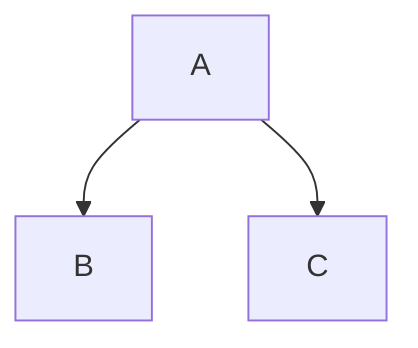

Trois backticks, un retour à la ligne, votre code, trois autres backticks. Voilà un bloc de code clôturé, et c’est le morceau de Markdown qui ressort le plus souvent d’un convertisseur sans aucun rapport avec ce que vous aviez tapé : une indication de langage qui n’a produit aucune couleur, un backtick que vous n’arrivez pas à imprimer, un bloc qui a perdu ses marques de clôture à l’intérieur d’une liste. Chacun de ces cas a une cause que l’on peut voir.

### En bref

Un convertisseur Markdown fait exactement une chose avec votre clôture : il émet `<pre><code class="language-x">` avec le contenu échappé sous forme de texte littéral. Il ne colore rien. La couleur est un second programme — Shiki, Pygments, Chroma ou Rouge pendant la construction du HTML, highlight.js ou Prism dans le navigateur du lecteur après le chargement — et si vous n’en avez jamais installé un, une indication de langage parfaitement correcte s’affichera tout de même en gris. Tout le reste de ce que vous pouvez écrire sur la ligne de clôture, numéros de ligne, noms de fichiers et plages surlignées, est l’invention d’un seul outil et du texte inerte dans tous les autres.

Dans la source, les échecs se ressemblent tous, et c’est pour cela que l’on accuse le convertisseur. Un bloc sorti tout gris, un bloc sorti sous forme de paragraphe plein de backticks et un bloc qui affiche `&lt;div&gt;` sont trois problèmes différents à trois couches différentes : votre indentation, l’analyseur du convertisseur, et ce qui a tourné ensuite.

Aucun n’est difficile une fois que vous savez sur quelle couche vous vous tenez. Ce qui suit est le chemin complet, dans l’ordre : comment une clôture est reconnue, où les listes et les citations changent les règles, ce que le convertisseur émet, qui le colore, ce que signifie le reste de la chaîne d’info, et ce que fait le bloc sur la page une fois tout cela réglé.

## Clôtures, indentation et le décompte des backticks

Markdown a deux façons de marquer du code comme étant du code. La plus ancienne indente chaque ligne de quatre espaces. La plus récente entoure les lignes d’une clôture — trois backticks ou plus, ou trois tildes ou plus, sur une ligne à eux seuls au-dessus et en dessous.

```js
const total = items.reduce((sum, item) => sum + item.price, 0);
```

Les blocs indentés fonctionnent toujours, mais ils n’ont aucun emplacement pour un langage et entrent sans arrêt en conflit avec l’indentation des listes. Le Markdown d’origine n’avait que cette forme, et c’est pourquoi un moteur de rendu très ancien peut imprimer vos trois backticks littéralement au lieu d’un `<pre>` — [quel dialecte parle un outil](/blog/commonmark-gfm-and-the-flavours) décide de bien plus de choses que cette seule fonctionnalité.

Quatre règles régissent la clôture elle-même, toutes les quatre tirées de la spécification (vérifié sur spec.commonmark.org, le 9 septembre 2026), et chacune d’elles est un échec que quelqu’un a signalé comme un bogue de convertisseur :

- **La clôture fermante doit être au moins aussi longue que l’ouvrante.** La spécification est catégorique : « La clôture de code fermante doit être au moins aussi longue que la clôture ouvrante. » Ouvrez avec quatre backticks, fermez avec trois, et le bloc ne se termine jamais.
- **La clôture fermante ne peut pas porter de chaîne d’info.** « Les clôtures de code fermantes ne peuvent pas avoir de chaîne d’info. » Un mot après les backticks fermants fait de cette ligne du contenu plutôt qu’une clôture.
- **La clôture ouvrante peut être indentée jusqu’à trois espaces, et cette indentation est retirée.** « Si la clôture ouvrante est indentée, les lignes de contenu se verront retirer une indentation initiale équivalente, si elle est présente. » Quatre espaces ne sont pas une clôture indentée : c’est un bloc de code indenté qui contient par hasard des backticks.
- **Une clôture non fermée court jusqu’à la fin de son conteneur.** Oubliez la clôture fermante et le reste du document est du code. C’est le cas qui fait virer au gris toute une page à partir du milieu.

Les clôtures en backticks et les clôtures en tildes diffèrent sur un point utile. « Les chaînes d’info des blocs de code en backticks ne peuvent pas contenir de backticks », tandis que « les chaînes d’info des blocs de code en tildes peuvent contenir des backticks et des tildes » (vérifié sur spec.commonmark.org, le 9 septembre 2026). C’est pourquoi chaque exemple de cet article qui contient lui-même une clôture est emballé dans des tildes.

### Le code en ligne, et comment imprimer un backtick

Un backtick de chaque côté vous donne du code en ligne : `npm run dev`. Les ennuis commencent quand le code contient lui-même un backtick.

Une barre oblique inverse n’aide pas. En dehors d’un segment de code, `` \` `` échappe un backtick ; à l’intérieur, les échappements par barre oblique inverse sont désactivés, et vous obtiendriez donc une barre oblique inverse littérale dans votre sortie. La vraie règle est une question de longueur : le délimiteur doit être une suite de backticks plus longue que toute suite présente dans le contenu.

~~~markdown
`code`        un backtick de chaque côté
``a ` b``     deux, parce que le contenu en contient un
`` ` ``       un backtick isolé, calé par des espaces
~~~

Ces espaces ne sont pas décoratifs. CommonMark retire d’un segment de code un espace au début et un espace à la fin lorsque les deux sont présents ; ils tiennent donc le contenu à l’écart des délimiteurs, puis disparaissent. Voilà la réponse à la question d’échapper un backtick en Markdown : vous ne l’échappez pas, vous le surpassez en nombre.

Deux petites choses découlent de la même règle. Un segment de code ne peut pas traverser une ligne vide, parce qu’une ligne vide termine le paragraphe dans lequel le segment vit — une longue commande shell a besoin d’une clôture, pas d’un segment. Et un segment de code ramène les retours à la ligne internes à de simples espaces : un segment est donc bel et bien fait pour un mot ou une expression, jamais pour un listing.

### Mettre une clôture dans une clôture

Même règle, un niveau plus haut. Une clôture fermante doit être au moins aussi longue que celle qui a ouvert le bloc, et une suite plus courte n’est que du contenu. Donc, pour montrer trois backticks — un extrait de Markdown dans une documentation sur Markdown, par exemple — ouvrez avec quatre.

~~~markdown
````markdown
```bash
npm install
```
````
~~~

Le décompte devient vite ridicule. Une clôture en tildes le contourne : `~~~` ouvre et ferme un bloc, et aucune quantité de backticks à l’intérieur ne peut le fermer. Chaque exemple ici qui contient une clôture est emballé dans l’une d’elles. Si vous écrivez régulièrement de la documentation sur Markdown, vous fixer sur les tildes pour la clôture extérieure et les backticks pour l’intérieure retire une catégorie entière d’erreurs du fichier.

## Listes, citations et la colonne qui décide

Voilà l’échec qui envoie les gens chercher un bogue de convertisseur. À l’intérieur d’un élément de liste, la colonne de contenu est fixée par la marque : `- ` la place à trois, `1. ` à quatre. Une clôture doit commencer à cette colonne, ou dans les trois espaces qui suivent. Quatre espaces plus loin et la clôture cesse d’être une clôture — elle devient un bloc de code indenté, et vos backticks apparaissent en texte littéral. Commencez-la à la colonne un et vous terminez l’élément de liste, coupant une liste en deux avec un bloc de code coincé au milieu.

Cassé, puis réparé :

~~~markdown
1. Run the install:

```bash
npm install
```

2. Then start it.
~~~

~~~markdown
1. Run the install:

   ```bash
   npm install
   ```

2. Then start it.
~~~

Trois espaces pour `1. `, deux pour `- `, et le bloc appartient à l’élément. Observez la seconde liste dans la version cassée : parce que le bloc de code a terminé la première liste, le `2.` en commence une nouvelle, et la plupart des moteurs de rendu repartent de un pour la numérotation. Le même calcul régit les listes imbriquées et les sauts de ligne forcés, ce qui est [un petit sujet à part entière](/blog/markdown-line-breaks-and-lists).

Les listes ordonnées de plus de neuf éléments gagnent une colonne à partir de dix, parce que `10. ` est un caractère plus large que `9. `. Un bloc indenté pour correspondre aux éléments précédents se retrouve un espace trop court à partir de l’élément dix. L’habitude sûre consiste à indenter tout ce qui se trouve dans un élément de liste de quatre espaces et à ne plus y penser : quatre est à moins de trois espaces de la colonne de contenu pour les deux marques, la clôture reste donc une clôture, et l’espace supplémentaire est retiré.

Les citations sont plus strictes. La marque `> ` doit figurer sur chaque ligne du bloc, y compris les lignes de clôture et toutes les lignes vides à l’intérieur. Oubliez-la sur une ligne et la citation s’arrête là, emportant avec elle le reste du bloc.

~~~markdown
> Run this first:
>
> ```bash
> npm install
> ```
>
> Then start it.
~~~

Combinez les deux — une clôture dans un élément de liste dans une citation — et les préfixes s’empilent : d’abord le `> `, puis l’indentation de l’élément, puis la clôture. Les éditeurs qui reformatent le Markdown à l’enregistrement se trompent assez souvent là-dessus pour qu’il vaille la peine de lire la sortie plutôt que de faire confiance au fichier.

## Ce que fait réellement l’indication de langage

Le mot qui suit la clôture ouvrante est la chaîne d’info. Un convertisseur en fait exactement une chose : il la pose sur la balise `<code>` sous forme de classe.

```html
<pre><code class="language-js">const total = items.reduce(...)
</code></pre>
```

C’est toute la fonctionnalité, et c’est une convention plutôt qu’une obligation : « Le premier mot de la chaîne d’info sert habituellement à spécifier le langage du bloc de code. Dans la sortie HTML, le langage est normalement indiqué par l’ajout, sur l’élément `code`, d’une classe composée de `language-` suivi du nom du langage » (vérifié sur spec.commonmark.org, le 9 septembre 2026). Rien n’analyse votre JavaScript, et rien ne vérifie que le mot est un vrai langage — écrivez `jvascript` et vous obtenez `class="language-jvascript"`, qu’aucun colorateur ne reconnaît : le bloc s’affiche donc sans couleur.

| Ce que vous écrivez | Ce que le convertisseur émet |
| --- | --- |
| Une clôture nue | `<pre><code>` |
| Une clôture marquée `json` | `<pre><code class="language-json">` |
| Quatre espaces d’indentation | `<pre><code>` |
| Une clôture en tildes marquée `bash` | `<pre><code class="language-bash">` |
| Une clôture marquée `jvascript` | `<pre><code class="language-jvascript">` |
| Une clôture marquée `js {1,3-4}` | `<pre><code class="language-js">`, le reste généralement abandonné |

Notez la dernière ligne. La classe est construite à partir du premier mot seulement. Ce qui arrive au reste n’est spécifié nulle part, et les outils le conservent, l’abandonnent ou agissent dessus, ce qui fait l’objet d’une section entière plus bas.

### Le problème des alias

Le nom du langage n’est pas normalisé. Chaque moteur de coloration livre sa propre liste de noms et d’alias, et les listes se recoupent sans coïncider. `js` et `javascript` fonctionnent presque partout. `sh`, `bash` et `shell` sont trois analyseurs distincts dans certains moteurs et des alias les uns des autres dans d’autres. `yml` et `yaml` veulent dire la même chose pour tout outil digne de ce nom. Et `console` désigne une sortie de shell avec les invites, plutôt qu’un script shell, ce qui explique qu’un bloc mêlant des commandes et leur sortie ait l’air faux quand vous le marquez `bash`.

| Langage | Alias que vous croiserez dans la nature |
| --- | --- |
| JavaScript | `js`, `javascript`, `node`, `jsx`, `mjs`, `cjs` |
| TypeScript | `ts`, `typescript`, `tsx` |
| Script shell | `sh`, `bash`, `zsh`, `shell` |
| Session shell, avec invites et sortie | `console`, `shell-session`, `shellsession` |
| YAML | `yml`, `yaml` |
| Python | `py`, `python`, `python3` |
| Ruby | `rb`, `ruby` |
| Markdown | `md`, `markdown`, `mdown` |
| HTML | `html`, `htm`, `xhtml` |
| C++ | `cpp`, `c++`, `cxx` |
| C# | `cs`, `csharp`, `c#` |
| Go | `go`, `golang` |
| Rust | `rs`, `rust` |
| PowerShell | `ps1`, `powershell`, `pwsh` |
| Aucune coloration souhaitée | `text`, `txt`, `plaintext`, `plain`, `none`, `nohighlight` |

La règle pratique est d’écrire le nom complet plutôt que le nom court — `javascript`, `python`, `yaml` — parce que ce sont les alias courts qui varient d’un moteur à l’autre. Se tromper ne coûte pas un message d’erreur. Dans la plupart des moteurs, une indication inconnue ne fait strictement rien.

| Moteur | Ce que fait un langage inconnu ou non chargé |
| --- | --- |
| highlight.js | Laisse le bloc sans coloration. `plaintext` le met en forme sans colorer, `nohighlight` le saute complètement (vérifié sur github.com/highlightjs/highlight.js, le 9 septembre 2026) |
| Prism | Pas de grammaire, donc pas de jetons : le bloc ressort sans couleur |
| Shiki | Lève une erreur. Depuis la v1.0, « il exige que tous les thèmes et langages soient chargés explicitement » (vérifié sur shiki.style, le 9 septembre 2026) |
| Pygments, Chroma, Rouge | Dépend de la façon dont le générateur les appelle : une erreur de construction, ou un repli silencieux vers du texte brut |

Cette différence compte plus qu’il n’y paraît. Un colorateur côté navigateur échoue en silence : une faute de frappe dans une clôture sur deux cents reste invisible jusqu’à ce qu’un lecteur la signale. Un colorateur de génération qui lève une erreur vous prévient à l’instant où vous introduisez la faute, et c’est le comportement que vous voulez sur un site de documentation contenant des centaines de blocs.

### L’échappement, et pourquoi la sortie affiche `&lt;`

Le contenu d’une clôture est « traité comme du texte littéral, et non analysé comme des éléments en ligne » (vérifié sur spec.commonmark.org, le 9 septembre 2026). Pour honorer cela en HTML, un convertisseur doit échapper au minimum `<` en `&lt;` et `&` en `&amp;` avant que le code n’atteigne la page ; la plupart échappent aussi `>` en `&gt;` et `"` en `&quot;`, ce qui est inutile dans un contenu textuel et sans danger. Sans cette étape, un bloc affichant une balise `<script>` cesserait d’afficher un script pour en devenir un.

La clôture est donc une frontière voulue, et uniquement parce que le convertisseur fait ce travail. Le HTML brut écrit *en dehors* d’une clôture est une tout autre affaire, et [savoir si votre convertisseur l’assainit](/blog/sanitising-markdown-safely) mérite d’être tranché avant de convertir un fichier que vous n’avez pas écrit.

Ce qui nous amène au symptôme que les gens cherchent réellement : un bloc qui affiche `&lt;div&gt;` en texte visible au lieu de montrer la balise. C’est un double échappement. Quelque chose a transformé `<` en `&lt;`, puis autre chose a transformé le `&` de `&lt;` en `&amp;lt;`, et le navigateur a fidèlement rendu le résultat. Les causes habituelles, à peu près par ordre de fréquence :

- Vous avez collé dans la clôture du HTML déjà échappé. La source contient réellement `&lt;div&gt;`, et le convertisseur a échappé l’esperluette exactement comme il le devait.
- Deux étapes d’échappement ont tourné. Un convertisseur a émis du HTML correct, et un moteur de gabarits a échappé cette sortie une seconde fois en l’insérant dans la page.
- On a passé du HTML à un colorateur au lieu du texte source. Certaines intégrations transmettent le contenu déjà échappé de `<code>` à un colorateur qui échappe de nouveau en sortie.

La correction consiste toujours à retirer l’une des deux étapes, jamais à ajouter une étape de déséchappement à la fin. Si vous construisez vous-même la chaîne de traitement, gardez le code sous forme de texte brut aussi longtemps que possible et échappez exactement une fois, au moment où il devient du HTML.

## Où la coloration se produit réellement

C’est la partie que presque rien n’explique. Le convertisseur émet `<pre><code class="language-x">` et s’arrête. Autre chose lit cette classe, découpe le code en jetons, enveloppe chaque jeton dans un `<span>` et lui donne une couleur. Ce second programme ne fait pas partie de Markdown, ne fait pas partie de votre convertisseur, et c’est à vous de le choisir.

Il n’y a que deux endroits où il peut tourner. **À la génération**, pendant que le HTML est produit : les couleurs sont cuites dans le fichier et le lecteur ne télécharge aucun code supplémentaire. **Dans le navigateur**, après le chargement de la page : le lecteur télécharge un script et une feuille de style, et le script parcourt chaque bloc de code de la page. Tout le reste est un détail du moteur que vous retenez.

| Moteur | Écrit en | Où il tourne | Ce dont la page a besoin | Ce qu’il coûte à la page | Licence |
| --- | --- | --- | --- | --- | --- |
| Shiki | TypeScript | À la génération | Rien : les couleurs sont déjà dans le HTML | Un attribut `style` en ligne sur chaque jeton, donc le HTML lui-même grossit | MIT |
| Pygments | Python | À la génération, ou dans n’importe quel processus Python | Une feuille de style, sauf si les styles sont mis en ligne | Un `<span class>` par jeton, plus la feuille de style | BSD 2 clauses |
| Chroma | Go | À la génération ; Hugo l’exécute pour vous | Une feuille de style, ou rien si les styles sont mis en ligne | La même forme que Pygments | MIT |
| Rouge | Ruby | À la génération ; le choix par défaut de Jekyll | Une feuille de style compatible Pygments | Des spans plus la feuille de style | MIT |
| highlight.js | JavaScript | Le navigateur du lecteur, après le chargement | Le script, une feuille de thème et un appel | Un téléchargement de script et un passage sur chaque bloc | BSD 3 clauses |
| Prism | JavaScript | Le navigateur du lecteur, après le chargement | Le noyau, chaque langage, un thème, les éventuels greffons | Noyau de 2 Ko minifié et gzippé, 0,3 à 0,5 Ko par langage, environ 1 Ko par thème | MIT |
| Rien du tout | — | Nulle part | Rien | Rien | — |

Chaque licence et chaque taille de ce tableau ont été vérifiées dans la documentation propre au projet le 9 septembre 2026. Les six moteurs sont libres et gratuits ; les différences qui trancheront pour vous sont dans les deux dernières colonnes.

### Shiki — les couleurs cuites, aucun script livré

Shiki est « un colorateur syntaxique aussi beau que puissant », « propulsé par les grammaires TextMate, le même moteur que votre VS Code », et sa propriété phare est « zéro exécution » : il « tourne à l’avance, livrez zéro JavaScript tout en obtenant une coloration syntaxique parfaite » (vérifié sur shiki.style, le 9 septembre 2026). Parce qu’il utilise les mêmes grammaires qu’un éditeur, un bloc coloré par Shiki ressemble au même fichier ouvert dans VS Code, ce qui est un avantage réel dans une documentation sur du code.

- La sortie porte la couleur dans des attributs `style` en ligne plutôt que dans des noms de classes : aucune feuille de style n’est donc nécessaire.
- Les doubles thèmes passent par des variables CSS : un jeton ressort sous la forme `style="color:#1976D2;--shiki-dark:#D8DEE9"`, et une règle sous `prefers-color-scheme: dark` lit la variable (vérifié sur shiki.style, le 9 septembre 2026).
- Un paquet de transformateurs ajoute la mise en évidence de lignes et de mots, la notation de différences, la mise au point, ainsi que des niveaux erreur, avertissement et information, tous écrits sous forme de commentaires dans le code (vérifié sur shiki.style, le 9 septembre 2026).
- Les langages et les thèmes doivent être chargés explicitement, ce que l’erreur décrite plus haut impose : une clôture que personne n’a configurée est un échec de construction, pas un bloc gris.

**Prix :** gratuit, sous licence MIT.

**Pour qui ?** Quiconque construit un site avec une chaîne d’outils JavaScript et veut des couleurs exactes sans coût côté client. La contrepartie est la taille du HTML, puisque la couleur de chaque jeton est écrite dans le fichier.

### Pygments — celui que tous les autres ont copié

Pygments est « un colorateur syntaxique générique adapté à l’hébergement de code, aux forums, aux wikis ou à toute autre application qui a besoin d’embellir du code source », prenant en charge « un large éventail de 602 langages et autres formats de texte » et écrivant « du HTML, du RTF, du LaTeX et des séquences ANSI » (vérifié sur pygments.org, le 9 septembre 2026). C’est à la fois une bibliothèque Python et un outil en ligne de commande, et il se trouve sous une grande partie de l’outillage de documentation — Material for MkDocs colore avec lui à la génération, sauf si vous désactivez cela au profit d’un colorateur côté navigateur (vérifié sur squidfunk.github.io, le 9 septembre 2026).

- Le formateur HTML émet des classes CSS par défaut, et `get_style_defs()` renvoie la feuille de style correspondante.
- `noclasses` met les styles en ligne à la place, ce que la documentation déconseille : « non recommandé pour de gros morceaux de code, car cela augmente considérablement la taille de la sortie » (vérifié sur pygments.org, le 9 septembre 2026).
- `linenos` affiche les numéros de ligne, soit dans le `<pre>`, soit dans un tableau à deux cellules.
- `hl_lines` prend une liste de lignes à mettre en évidence, numérotées depuis le début de l’entrée.

**Prix :** gratuit, sous licence BSD 2 clauses.

**Pour qui ?** Les chaînes de construction Python, les sites MkDocs, et quiconque a besoin d’un format de sortie autre que le HTML depuis le même colorateur.

### Chroma — Pygments, en Go, dans Hugo

Chroma est « un colorateur syntaxique généraliste en Go pur » qui « convertit du code source et d’autres textes structurés en HTML coloré syntaxiquement, en texte coloré ANSI, etc. ». Il est explicite sur son ascendance : « Chroma s’appuie fortement sur Pygments, et inclut des traducteurs pour les analyseurs et les styles de Pygments » (vérifié sur github.com/alecthomas/chroma, le 9 septembre 2026), ce qui signifie que les feuilles de style Pygments fonctionnent pour l’essentiel sans modification.

- Le formateur HTML peut émettre des classes via `WithClasses()`, ou des attributs de style en ligne à la place.
- La sortie terminal se fait « en 8 couleurs, 256 couleurs et couleurs vraies » (vérifié sur github.com/alecthomas/chroma, le 9 septembre 2026).
- Une interface en ligne de commande est livrée avec, et `chroma --list` imprime la liste faisant autorité des analyseurs.
- Hugo colore les blocs clôturés avec lui à la génération, dans sa configuration par défaut (vérifié sur gohugo.io, le 9 septembre 2026).

**Prix :** gratuit, sous licence MIT.

**Pour qui ?** Les programmes en Go, et tous les sites Hugo, que leur auteur sache ou non qu’il est là.

### Rouge — le choix par défaut de Jekyll

Rouge est « un colorateur syntaxique en Ruby pur » qui « peut colorer plus de 200 langages différents et produire du HTML ou du texte ANSI 256 couleurs ». Deux faits comptent à son sujet. « Sa sortie HTML est compatible avec les feuilles de style conçues pour Pygments », les thèmes sont donc portables entre les deux, et « Rouge est le colorateur syntaxique par défaut de Jekyll » (vérifié sur github.com/rouge-ruby/rouge, le 9 septembre 2026).

**Prix :** gratuit, sous licence MIT.

**Pour qui ?** Les sites Jekyll, c’est-à-dire une grande part de la documentation publiée directement depuis un dépôt. Si vos blocs sont déjà colorés et que vous n’avez jamais rien configuré, c’est généralement l’explication.

### highlight.js — le choix par défaut du navigateur, avec détection

highlight.js se décrit comme « le colorateur syntaxique JavaScript préféré d’Internet, prenant en charge Node.js et le web », revendiquant « 193 langages et 516 thèmes » et « zéro dépendance » (vérifié sur highlightjs.org, le 9 septembre 2026). Sa particularité est la détection automatique du langage : il va « trouver et colorer le code à l’intérieur des balises `<pre><code>` ; il essaie de détecter le langage automatiquement » (vérifié sur highlightjs.org, le 9 septembre 2026).

- Tourne dans le navigateur du lecteur ou dans Node ; la version navigateur est normalement chargée depuis un CDN.
- Lit `class="language-html"` quand vous voulez passer outre la détection.
- `plaintext` met un bloc en forme sans le colorer, et `nohighlight` le saute (vérifié sur github.com/highlightjs/highlight.js, le 9 septembre 2026).
- Sa propre documentation note qu’« importer tous nos langages augmentera la taille de votre paquet » (vérifié sur highlightjs.org, le 9 septembre 2026) : un déploiement réel n’en charge donc qu’un sous-ensemble.

**Prix :** gratuit, sous licence BSD 3 clauses.

**Pour qui ?** Les pages où vous ne maîtrisez pas les chaînes d’info — un système de commentaires, un wiki, un forum — parce que la détection est la seule chose ici qui s’accommode de blocs non étiquetés. Partout où vous maîtrisez la clôture, écrivez le langage dessus plutôt que de laisser deviner le script.

### Prism — un noyau réduit, tout le reste en greffon

Prism est « un colorateur syntaxique léger et extensible, conçu dans l’esprit des standards modernes du web ». Son affirmation sur la taille est inhabituellement précise : « Le noyau fait 2 Ko minifié et gzippé. Les langages ajoutent 0,3 à 0,5 Ko chacun, les thèmes tournent autour de 1 Ko » (vérifié sur prismjs.com, le 9 septembre 2026). Il lit `language-xxxx` et « prend aussi en charge une version plus courte : `lang-xxxx` ».

- Aucune détection automatique : un bloc non étiqueté reste sans couleur.
- Les greffons couvrent les numéros de ligne, la mise en évidence de lignes, l’affichage du langage et la copie dans le presse-papiers, chacun avec son script et sa feuille de style.
- Le greffon de mise en évidence de lignes se configure depuis le HTML plutôt que depuis la clôture : `data-line` sur le `<pre>`, acceptant des nombres isolés, des plages avec un trait d’union et des combinaisons séparées par des virgules (vérifié sur prismjs.com, le 9 septembre 2026).
- Tourne dans le navigateur, et « peut aussi être utilisé avec Node.js » si vous préférez pré-générer (vérifié sur prismjs.com, le 9 septembre 2026).

**Prix :** gratuit, sous licence MIT.

**Pour qui ?** Les sites qui veulent les comportements des greffons — un bouton de copie, des numéros de ligne, une étiquette de langage — sans les construire, et qui peuvent se permettre les requêtes supplémentaires.

### Rien du tout — un bloc simple, mis en forme

La quatrième option consiste à sauter le second programme. Le `<pre><code>` du convertisseur avec une police à chasse fixe, un fond, un peu de marge intérieure et une bordure est parfaitement lisible, et la différence entre cela et un bloc coloré est esthétique plutôt que fonctionnelle.

C’est le compromis que fait un fichier portable. TransformPipe convertit le code clôturé dans le cadre du GitHub Flavored Markdown, et le `.html` qu’il vous rend est autonome : styles en ligne, aucun script, aucune requête réseau. Le code arrive sous forme de texte à chasse fixe mis en forme dans un `<pre>` plutôt qu’en jetons colorés, parce qu’[il ne reste rien dans le fichier pour faire la coloration](/blog/self-contained-html-explained). Si la couleur est l’objectif, tournez-vous vers un générateur de site qui exécute Shiki ou Chroma à la génération, ou vers [Pandoc](/blog/pandoc-alternatives-for-markdown-to-html), qui colore en convertissant. Si l’objectif est un fichier portable que vous pouvez remettre à quelqu’un, le bloc simple est le meilleur compromis.

## Le reste de la chaîne d’info appartient à l’outil

Markdown spécifie le premier mot de la chaîne d’info et ne dit strictement rien du reste. Toutes les conventions que vous avez vues — `{1,3-4}`, `title="app.js"`, `showLineNumbers`, `linenums="1"` — ont été inventées par un outil, et aucun autre outil n’est tenu de les comprendre. C’est la plus grande source de signalements du type « ça s’affiche différemment sur GitHub ».

| Outil | Ce qu’il lit après le langage | Exemple de chaîne d’info |
| --- | --- | --- |
| Shiki, avec les transformateurs | Des plages de lignes et des mots à mettre en évidence | `js {1,3-4}`, `js /Hello/` |
| Hugo, via Chroma | Des attributs entre accolades | `go {linenos=inline hl_lines=[3,"6-8"]}` |
| Material for MkDocs, via Pygments | Des options nommées | `py title="bubble_sort.py" linenums="1" hl_lines="2 3"` |
| Docusaurus, via Prism React Renderer | Des plages, un titre, des numéros de ligne | `jsx {1,4-6} title="/src/App.js" showLineNumbers` |
| Prism dans la page | Rien : ses options sont des attributs HTML sur le `<pre>` | `js`, plus `data-line="1,4-6"` dans le HTML |
| GitHub | Rien au-delà du langage | `mermaid`, `geojson`, `topojson`, `stl` |
| Un simple convertisseur CommonMark | Rien : le reste est une métadonnée qu’il peut tout bonnement abandonner | `js {1,3-4}` |

Chaque ligne de ce tableau a été vérifiée dans la documentation propre à l’outil le 9 septembre 2026. Lisez ce tableau comme un avertissement plutôt que comme un menu. Une clôture écrite pour Docusaurus s’affiche dans Hugo comme un bloc de code dont le langage est `jsx` et dont les mots restants s’évaporent, et la même clôture sur GitHub est un bloc de JavaScript sans titre ni ligne mise en évidence. Rien ne signale d’erreur nulle part en chemin. Vous perdez simplement l’annotation, en silence, dans une différence que personne ne lit.

Certains outils ont déplacé l’annotation dans le code lui-même, sous forme de commentaires, ce qui voyage mieux à un égard et moins bien à un autre. Les transformateurs de Shiki lisent `// [!code highlight]`, `// [!code ++]` et `// [!code focus]` ; Docusaurus lit `// highlight-next-line` (vérifié sur shiki.style et docusaurus.io, le 9 septembre 2026). Collez l’un de ces blocs ailleurs et l’annotation est toujours présente — sous forme de commentaire visible au milieu de votre exemple, que les lecteurs copieront avec tout le reste.

### `diff` et `mermaid` ne sont pas de la coloration

Deux chaînes d’info se comportent autrement que toutes les autres, et les deux méritent d’être connues.

`diff` est un vrai langage pour un colorateur. Il colore en vert et en rouge les lignes commençant par `+` et `-`, et c’est pourquoi un correctif collé dans une clôture marquée `diff` a l’air d’une revue de code. Mais les caractères `+` et `-` font partie du code, donc quiconque copie le bloc les copie aussi. C’est le comportement correct pour un correctif que quelqu’un est censé appliquer, et le mauvais comportement pour un « voici la ligne à changer », où ce que vous vouliez vraiment est une plage de lignes mise en évidence.

~~~markdown
```diff
- const total = items.reduce((s, i) => s + i.price, 0);
+ const total = items.reduce((s, i) => s + i.price * i.qty, 0);
```
~~~

`mermaid` n’est pas du tout de la coloration. C’est un signal pour remplacer le bloc par une image. GitHub le fait pour quatre langages de clôture : « Vous pouvez créer des diagrammes en Markdown à l’aide de quatre syntaxes différentes : mermaid, geoJSON, topoJSON et ASCII STL » (vérifié sur docs.github.com, le 9 septembre 2026).

~~~markdown

~~~

Emportez ce même fichier quelque part sans moteur de rendu Mermaid et vous obtenez exactement ce que le Markdown annonce : un bloc de code contenant le texte `graph TD;`. Ce n’est pas cassé et il n’y a rien à réparer dans la source — le diagramme n’a jamais été dans le fichier, seulement les instructions pour en dessiner un.

## Côté sortie : débordement, tabulations et boutons de copie

Tout ce qui précède se produit avant que la page n’existe. La série de problèmes suivante arrive après, et aucun n’est le fait de Markdown.

**Les longues lignes débordent.** Un `<pre>` a pour valeur par défaut `white-space: pre`, ce qui signifie aucun retour à la ligne. Une ligne de 120 caractères dans une fenêtre de téléphone de 360 pixels pousse toute la page de côté à moins que quelque chose ne l’arrête. La correction appartient au bloc, pas au corps de la page :

```css
pre {
  overflow-x: auto;
}
```

`white-space: pre-wrap` est l’autre option, et c’est un véritable choix plutôt qu’une meilleure réponse. Le retour à la ligne garde tout visible et détruit l’alignement en colonnes qui rend le code lisible ; une ligne repliée ressemble aussi à deux lignes, ce qui prête à confusion dans un exemple où l’indentation porte du sens. Le repli souple n’insère aucun retour à la ligne : le code copié est donc correct dans les deux cas.

**Une tabulation n’est pas quatre espaces.** Un caractère de tabulation à l’intérieur d’un bloc de code reste un caractère de tabulation dans le HTML, et le CSS le rend à `tab-size`, dont la valeur initiale est 8 (vérifié sur developer.mozilla.org, le 9 septembre 2026). Un fichier source Go ou un Makefile indenté avec des tabulations paraît donc deux fois plus profond sur la page que dans votre éditeur. Réglez `tab-size` sur le `pre` pour correspondre au fichier, ou convertissez les tabulations en espaces avant la conversion et n’y pensez plus.

**Les espaces de fin survivent.** Les convertisseurs conservent le contenu d’un bloc octet pour octet : les espaces à la fin d’une ligne sont donc toujours là, et une ligne vide avant la clôture fermante devient une dernière ligne vide dans le `<pre>`. Ni l’un ni l’autre n’est visible avant que quelqu’un ne copie le bloc dans un terminal. Les analyseurs HTML suppriment un unique retour à la ligne immédiatement après la balise `<pre>`, et c’est pourquoi la première ligne semble correcte et la dernière non.

**Les boutons de copie ne font partie de rien de tout cela.** Aucun convertisseur n’en émet, parce qu’un bouton de copie est un script : il lui faut un gestionnaire de clic et l’API du presse-papiers. Prism a un greffon pour ça, la plupart des thèmes de documentation construisent le leur, et un fichier HTML autonome sans aucun script ne peut tout simplement pas en avoir un. Si un bouton de copie compte, c’est une exigence portant sur la page, pas sur la conversion.

**Les numéros de ligne sont un piège à la copie.** Rendus en vrai texte dans le bloc, ils sont sélectionnés et copiés avec le code, et le lecteur colle `1 npm install` dans un terminal. Les deux moyens de contourner cela sont les compteurs CSS, qui ne sont pas du texte, et un tableau à deux colonnes — ce qui est exactement ce que produit le mode tableau de Pygments, « un tableau à deux cellules, l’une contenant les numéros de ligne, l’autre tout le code » (vérifié sur pygments.org, le 9 septembre 2026).

**Le code dans une cellule de tableau se limite aux segments.** Une cellule de tableau GFM est un contexte en ligne : un segment de code fonctionne, un bloc clôturé non. Pire, un caractère barre verticale à l’intérieur de la cellule termine la cellule : une barre verticale dans un segment de code doit donc être échappée par une barre oblique inverse, alors même que les échappements par barre oblique inverse sont par ailleurs désactivés dans un segment. Si un exemple demande plus qu’une expression, mettez-le sous le tableau plutôt que dedans — [le problème plus vaste des tableaux qui survivent à la conversion](/blog/markdown-tables-that-survive-conversion) en contient d’autres du même genre.

## Ce que coûte la coloration syntaxique

La section honnête, parce que rien de tout cela n’apparaît sur la page d’accueil d’un colorateur.

**Elle coûte des octets, et le coût tombe à des endroits différents.** Dans le navigateur, vous payez en requêtes : un script noyau, un fichier pour chaque langage que vous chargez, un thème, et un script de plus pour chaque greffon, ce qui explique que highlight.js déconseille d’importer tous les langages qu’il livre. À la génération, vous payez en HTML à la place. Shiki écrit un attribut `style` sur chaque jeton, et un montage à deux thèmes écrit deux valeurs de couleur par jeton ; Pygments met en garde de la même façon contre la mise en ligne de ses styles au lieu de livrer une feuille de style. Une page portant une douzaine de gros blocs de code peut facilement contenir plus de balisage pour la couleur que pour la prose.

**Un colorateur de navigateur repeint sous les yeux du lecteur.** Il tourne après l’analyse du HTML : le bloc arrive donc sans couleur et devient coloré un instant plus tard. Sur une connexion rapide, c’est invisible. Sur une connexion lente, ou avec les scripts bloqués, le bloc sans couleur est ce que le lecteur obtient — ce qui est un bon argument pour que le bloc simple ait l’air délibéré plutôt qu’inachevé.

**Les thèmes à faible contraste échouent à une exigence d’accessibilité.** Le critère de succès 1.4.3 des WCAG est une exigence de niveau AA portant sur « un rapport de contraste d’au moins 4,5:1 » pour le texte normal, et de 3:1 pour le grand texte (vérifié sur w3.org, le 9 septembre 2026). Un très grand nombre de thèmes d’éditeur populaires ont été conçus pour un éditeur sombre à une taille de police confortable, pas pour une page web : les commentaires en gris moyen sur fond sombre et les chaînes en pastel peu saturé sont les deux cas qui échouent le plus souvent. Rien ne vous prévient. Le bloc a l’air très bien pour la personne qui a choisi le thème, et il est illisible pour un lecteur malvoyant ou sur un écran de portable en plein jour.

**La couleur ne porte aucune information que le texte ne porte pas.** C’est la circonstance atténuante, et aussi l’argument en faveur de la retenue : rien dans un bloc coloré n’est transmis par la couleur seule, un lecteur qui ne distingue pas les couleurs perd donc du confort et rien d’autre. Cela signifie aussi que le retour sur tous ces octets, c’est du confort — qui vaut la dépense sur un site de documentation que quelqu’un lit quotidiennement, et se justifie mal sur un document que vous envoyez une fois par courriel.

**La détection automatique se trompe sur les blocs courts.** Trois lignes de shell et trois lignes de Ruby se ressemblent pour un détecteur. Un bloc coloré comme le mauvais langage est pire qu’un bloc sans couleur, parce qu’il se trompe avec assurance : des mots-clés qui n’en sont pas, des chaînes qui n’en sont pas. Étiquetez vos clôtures et la détection n’a jamais à tourner.

**Et le coût le plus facile à manquer est la maintenance.** Un colorateur de navigateur chargé depuis un CDN est un script tiers sur chaque page de votre site, avec une version à tenir à jour et une chaîne d’approvisionnement à laquelle faire confiance. Un colorateur de génération est une dépendance de construction portant la même obligation. Ni l’un ni l’autre n’est gratuit. Le `<pre>` simple n’a aucune version du tout.

## Comment choisir, et comment vérifier

1. **Décidez si le fichier doit voyager avant de choisir un colorateur.** Un moteur côté navigateur transforme un document en une page qui a besoin de deux téléchargements de plus pour avoir l’air correcte : tout ce que vous envoyez par courriel ou archivez devrait donc être coloré à la génération, ou pas du tout.
2. **Choisissez la génération pour tout ce que vous publiez de façon répétée.** Le lecteur ne télécharge aucun code supplémentaire, les couleurs ne peuvent pas manquer d’arriver, et un nom de langage erroné devient une erreur de construction plutôt qu’un bloc gris silencieux que quelqu’un remarque six mois plus tard.
3. **Écrivez le nom complet du langage, pas l’alias.** `javascript` et `python` sont reconnus par tous les moteurs de cet article ; `js` presque toujours ; les formes courtes des langages moins courants sont exactement là où les listes divergent et où votre bloc perd discrètement sa couleur.
4. **Traitez tout ce qui suit le langage comme propre à un outil.** Si le contenu peut bouger — de Docusaurus vers Hugo, d’un wiki vers un dépôt — les plages de lignes et les titres ne bougeront pas avec lui, et vous relirez une différence de deux cents clôtures pour comprendre ce qui a été perdu.
5. **Vérifiez le contraste du thème contre le fond du bloc, pas contre du blanc.** Un thème qui échoue à 4,5:1 sur les commentaires rend la seule partie de votre exemple écrite pour des humains la plus difficile à lire, et rien dans votre chaîne de traitement ne le mentionnera.
6. **Testez votre plus longue ligne à la largeur d’un téléphone.** Le débordement est l’échec qui survit à toutes les relectures, parce que la personne qui relit a un grand écran et ne le voit jamais.
7. **Lisez le HTML, pas l’aperçu.** Chaque éditeur prévisualise le Markdown avec ses propres réglages : un bloc qui a l’air correct dans le vôtre ne prouve donc pas grand-chose sur le fichier que quelqu’un d’autre ouvre. Le HTML tranche : une clôture qui a fonctionné montre `<pre><code>`, et une qui n’a pas fonctionné montre un paragraphe avec des backticks dedans — c’est votre indentation ou la longueur de votre clôture.

## Conclusion

Un bloc de code, ce sont trois choses distinctes portant un seul nom : une règle d’analyse qui décide si vos backticks sont une clôture, un nom de classe que le convertisseur écrit sans rien faire de plus, et un programme de coloration que vous avez choisi ou non. Gardez les trois séparés dans votre tête et chaque symptôme devient diagnosticable — du texte sans couleur signifie aucun colorateur, des backticks littéraux signifient l’indentation, un `&lt;` à l’écran signifie deux étapes d’échappement là où il ne devrait y en avoir qu’une. Quand vous voulez voir quelle couche a lâché, convertissez le fichier et lisez la source : [la conversion Markdown vers HTML de TransformPipe](/) tourne dans le navigateur, vous montre le HTML qu’elle a produit et vous rend un fichier autonome où le bloc est mis en forme plutôt que coloré. L’API, la ligne de commande et l’action GitHub exécutent la même conversion, et [la documentation](/docs) couvre les trois.

## FAQ

### Pourquoi mon bloc de code Markdown n’est-il pas coloré ?

Parce qu’un convertisseur Markdown ne colore jamais rien : il écrit `class="language-x"` sur la balise `<code>` et s’arrête. Autre chose doit lire cette classe — Shiki ou Chroma pendant la construction de la page, highlight.js ou Prism dans le navigateur — et si rien ne le fait, le bloc s’affiche en texte à chasse fixe sans couleur, aussi correcte que soit la clôture.

### Markdown prend-il en charge la coloration syntaxique ?

Non. Markdown prend en charge une *indication* de langage, c’est-à-dire le premier mot après la clôture ouvrante, plus la convention qui en fait une classe `language-` dans le HTML. La coloration est un programme distinct, et lequel vous avez dépend de votre générateur de site, de votre thème ou du script que quelqu’un a chargé.

### Quels noms de langage puis-je utiliser après les backticks ?

Ceux que votre colorateur reconnaît, ce qui n’est pas normalisé. Les noms complets comme `javascript`, `python`, `yaml` et `bash` fonctionnent dans tous les moteurs cités ici ; les alias courts comme `js`, `py` et `yml` fonctionnent presque partout ; les abréviations inhabituelles sont là où les moteurs divergent. Dans la plupart des outils, un nom non reconnu n’est pas une erreur — le bloc ressort simplement sans couleur.

### Comment échapper un backtick en Markdown ?

Vous ne l’échappez pas, vous le surpassez en nombre. Une barre oblique inverse n’a aucun effet dans un segment de code : utilisez donc un délimiteur plus long que toute suite de backticks du contenu, deux backticks autour d’un contenu qui en contient un, et un espace de chaque côté si le contenu commence ou finit par un backtick. CommonMark retire un espace au début et un à la fin : le calage disparaît donc de la sortie.

### Comment ajouter des numéros de ligne à un bloc de code Markdown ?

Pas en Markdown — la syntaxe n’a aucune fonctionnalité de ce genre. Les numéros de ligne viennent de ce qui rend le bloc : `linenums="1"` dans Material for MkDocs, `linenos` dans Hugo, `showLineNumbers` dans Docusaurus, ou un greffon et une classe dans Prism. Déplacez le fichier vers un autre outil et les numéros disparaissent sans un mot.

### Pourquoi mon bloc de code affiche-t-il `&lt;` au lieu de `<` ?

Quelque chose a échappé le code deux fois. Soit la source contenait déjà des entités HTML, soit un gabarit a échappé une seconde fois la sortie du convertisseur en l’insérant dans la page. Corrigez cela en retirant une étape d’échappement plutôt qu’en déséchappant à la fin, et gardez le code sous forme de texte brut jusqu’au dernier moment possible.

### Pourquoi mon bloc de code casse-t-il dans une liste numérotée ?

Parce que la clôture doit commencer à la colonne de contenu de l’élément, ou dans les trois espaces qui suivent. `1. ` place cette colonne à quatre : une clôture à la colonne un termine donc la liste, et une clôture quatre espaces au-delà de la colonne devient un bloc de code indenté plein de backticks littéraux. Indentez la clôture et le code de la largeur de la marque, et le bloc appartient de nouveau à l’élément.
