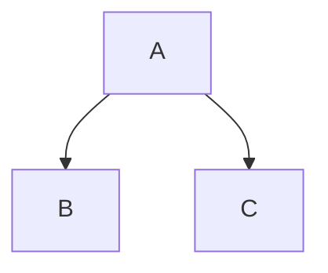

Tre backtick, un a capo, il tuo codice, altri tre backtick. Questo è un blocco di codice con fence, ed è il pezzo di Markdown che più spesso esce da un convertitore senza somigliare a quello che avevi scritto: un'indicazione di linguaggio che non ha prodotto nessun colore, un backtick che non riesci a stampare, un blocco che ha perso i suoi marcatori di fence dentro un elenco. Ognuno di questi ha una causa che si può vedere.

### In breve

Un convertitore Markdown fa esattamente una cosa con il tuo fence: emette `<pre><code class="language-x">` con il contenuto mascherato come testo letterale. Non colora niente. Il colore è un secondo programma — Shiki, Pygments, Chroma o Rouge mentre l'HTML viene costruito, highlight.js o Prism nel browser di chi legge dopo il caricamento — e se non ne hai configurato nessuno, un'indicazione di linguaggio perfettamente corretta si mostra comunque grigia. Tutto il resto che puoi scrivere sulla riga del fence, numeri di riga, nomi di file, intervalli evidenziati, è un'invenzione di un solo strumento e testo inerte in ogni altro.

I guasti si presentano tutti uguali nella fonte, ed è per questo che la gente incolpa il convertitore. Un blocco uscito piatto, un blocco uscito come paragrafo pieno di backtick, e un blocco che mostra `&lt;div&gt;` sono tre problemi diversi a tre livelli diversi: la tua indentazione, il parser del convertitore, e qualunque cosa sia girata dopo di esso.

Nessuno di questi è difficile una volta che sai su quale livello ti trovi. Quello che segue è il percorso completo, in ordine: come si riconosce un fence, dove elenchi e citazioni cambiano le regole, cosa emette il convertitore, chi lo colora, cosa significa il resto dell'info string, e cosa fa il blocco sulla pagina dopo che tutto questo si è sistemato.

## Fence, indentazione, e contare i backtick

Markdown ha due modi di segnare il codice come codice. Il più vecchio indenta ogni riga di quattro spazi. Il più nuovo avvolge le righe in un fence — tre o più backtick, o tre o più tilde, su una riga propria sopra e sotto.

```js
const total = items.reduce((sum, item) => sum + item.price, 0);
```

I blocchi indentati funzionano ancora, ma non hanno uno spazio per il linguaggio e litigano costantemente con l'indentazione degli elenchi. Il Markdown originale aveva solo quella forma, motivo per cui un renderer molto vecchio potrebbe stampare i tuoi tripli backtick letteralmente invece di un `<pre>` — [quale variante parla uno strumento](/blog/commonmark-gfm-and-the-flavours) decide più di questa singola funzione.

Quattro regole governano il fence stesso, tutte e quattro dalla specifica (verificato su spec.commonmark.org, il 9 settembre 2026), e ognuna un guasto che qualcuno ha segnalato come bug di un convertitore:

- **Il fence di chiusura deve essere almeno lungo quanto quello di apertura.** La specifica è netta su questo: "Il fence di chiusura deve essere almeno lungo quanto il fence di apertura." Apri con quattro backtick, chiudi con tre, e il blocco non finisce mai.
- **Il fence di chiusura non può portare un'info string.** "I fence di chiusura non possono avere info string." Una parola dopo i backtick di chiusura rende quella riga contenuto invece che un fence.
- **Il fence di apertura può essere indentato fino a tre spazi, e quell'indentazione viene rimossa.** "Se il fence di apertura è indentato, le righe di contenuto avranno la stessa indentazione rimossa, se presente." Quattro spazi non è un fence indentato: è un blocco di codice indentato che per caso contiene backtick.
- **Un fence non chiuso corre fino alla fine del suo contenitore.** Dimentica il fence di chiusura e il resto del documento diventa codice. È questo che rende grigia tutta una pagina a partire da metà.

I fence a backtick e quelli a tilde differiscono in un modo utile. "Le info string per i blocchi di codice a backtick non possono contenere backtick", mentre "le info string per i blocchi a tilde possono contenere backtick e tilde" (verificato su spec.commonmark.org, il 9 settembre 2026). Ecco perché ogni esempio in questo articolo che a sua volta contiene un fence è avvolto in tilde.

### Codice inline, e come stampare un backtick

Un backtick per lato ti dà codice inline: `npm run dev`. I problemi iniziano quando il codice stesso contiene un backtick.

Una barra rovesciata non aiuta. Fuori da uno span di codice, `` \` `` maschera un backtick; dentro uno, le maschere con barra rovesciata sono disattivate, quindi otterresti una barra rovesciata letterale nel tuo output. La vera regola riguarda la lunghezza: il delimitatore deve essere una sequenza di backtick più lunga di qualunque sequenza dentro il contenuto.

~~~markdown
`code`        un backtick per lato
``a ` b``     due, perché il contenuto ne contiene uno
`` ` ``       un backtick solitario, imbottito con spazi
~~~

Quegli spazi non sono decorazione. CommonMark rimuove uno spazio iniziale e uno finale da uno span di codice quando entrambi sono presenti, così che tengano il contenuto separato dai delimitatori e poi spariscano. Questa è la risposta a come mascherare un backtick in Markdown: non lo maschera, lo conti in eccesso.

Due cose più piccole seguono dalla stessa regola. Uno span di codice non può attraversare una riga vuota, perché una riga vuota chiude il paragrafo in cui vive lo span — un lungo comando di shell ha bisogno di un fence, non di uno span. E uno span di codice collassa gli a capo interni in singoli spazi, quindi uno span serve davvero per una parola o una frase e mai per un listato.

### Mettere un fence dentro un fence

Stessa regola, un livello più in alto. Un fence di chiusura deve essere almeno lungo quanto quello che ha aperto il blocco, e una sequenza più corta è solo contenuto. Quindi per mostrare tripli backtick — uno snippet Markdown dentro documentazione su Markdown, per esempio — apri con quattro.

~~~markdown
````markdown
```bash
npm install
```
````
~~~

Il conteggio diventa presto ridicolo. Un fence a tilde evita il problema: `~~~` apre e chiude un blocco, e nessun numero di backtick dentro può chiuderlo. Ogni esempio qui che contiene un fence è avvolto in uno. Se scrivi regolarmente documentazione su Markdown, standardizzare sulle tilde per il fence esterno e sui backtick per quello interno rimuove un'intera categoria di errore dal file.

## Elenchi, citazioni e la colonna che decide

Questo è il guasto che spinge la gente a cercare un bug del convertitore. Dentro un elemento di elenco la colonna del contenuto è impostata dal marcatore: `- ` la mette a tre, `1. ` a quattro. Un fence deve iniziare a quella colonna, o entro tre spazi da essa. Quattro spazi oltre e il fence smette di essere un fence — diventa un blocco di codice indentato, e i tuoi backtick appaiono come testo letterale. Iniziarlo alla colonna uno e finisci l'elemento dell'elenco, spezzando un elenco in due con un blocco di codice incastrato in mezzo.

Rotto, poi corretto:

~~~markdown
1. Run the install:

```bash
npm install
```

2. Then start it.
~~~

~~~markdown
1. Run the install:

   ```bash
   npm install
   ```

2. Then start it.
~~~

Tre spazi per `1. `, due per `- `, e il blocco appartiene all'elemento. Osserva il secondo elenco nella versione rotta: siccome il blocco di codice ha chiuso il primo elenco, il `2.` ne inizia uno nuovo, e la maggior parte dei renderer riparte a numerare da uno. La stessa aritmetica governa gli elenchi annidati e gli a capo forzati, che è [un argomento a parte](/blog/markdown-line-breaks-and-lists).

Gli elenchi ordinati più lunghi di nove elementi aggiungono una colonna a dieci, perché `10. ` è un carattere più largo di `9. `. Un blocco indentato per corrispondere agli elementi precedenti finisce uno spazio corto a partire dall'elemento dieci in poi. L'abitudine sicura è indentare tutto dentro un elemento di elenco di quattro spazi e smettere di pensarci: quattro rientra nei tre spazi della colonna del contenuto per entrambi i marcatori, quindi il fence resta un fence, e lo spazio extra viene rimosso.

Le citazioni sono più severe. Il marcatore `> ` deve apparire su ogni riga del blocco, incluse le righe del fence e ogni riga vuota al suo interno. Perdilo su una riga e la citazione finisce lì, portandosi via il resto del blocco.

~~~markdown
> Run this first:
>
> ```bash
> npm install
> ```
>
> Then start it.
~~~

Combina le due cose — un fence dentro un elemento di elenco dentro una citazione — e i prefissi si accumulano: prima il `> `, poi l'indentazione dell'elemento, poi il fence. Gli editor che riformattano Markdown al salvataggio sbagliano questo abbastanza spesso da valere la pena leggere l'output invece di fidarsi del file.

## Cosa fa davvero l'indicazione del linguaggio

La parola dopo il fence di apertura è l'info string. Un convertitore fa esattamente una cosa con essa: la metta sul tag `<code>` come classe.

```html
<pre><code class="language-js">const total = items.reduce(...)
</code></pre>
```

Questa è l'intera funzione, ed è una convenzione più che un obbligo: "La prima parola dell'info string viene tipicamente usata per specificare il linguaggio del blocco di codice. Nell'output HTML, il linguaggio è normalmente indicato aggiungendo una classe all'elemento `code` composta da `language-` seguito dal nome del linguaggio" (verificato su spec.commonmark.org, il 9 settembre 2026). Niente analizza il tuo JavaScript, e niente controlla che la parola sia un linguaggio reale — scrivi `jvascript` e ottieni `class="language-jvascript"`, che nessun highlighter riconosce, quindi il blocco si rende piatto.

| Cosa scrivi | Cosa emette il convertitore |
| --- | --- |
| Un fence nudo | `<pre><code>` |
| Un fence marcato `json` | `<pre><code class="language-json">` |
| Quattro spazi di indentazione | `<pre><code>` |
| Un fence a tilde marcato `bash` | `<pre><code class="language-bash">` |
| Un fence marcato `jvascript` | `<pre><code class="language-jvascript">` |
| Un fence marcato `js {1,3-4}` | `<pre><code class="language-js">`, il resto di solito eliminato |

Nota l'ultima riga. La classe è costruita solo dalla prima parola. Cosa succede al resto non è specificato da nessuna parte, e strumenti diversi lo tengono, lo eliminano o ci agiscono sopra, il che è una sezione a sé più avanti.

### Il problema degli alias

Il nome del linguaggio non è standardizzato. Ogni motore di highlighting porta la propria lista di nomi e alias, e le liste si sovrappongono senza coincidere. `js` e `javascript` funzionano quasi ovunque. `sh`, `bash` e `shell` sono tre lexer separati in alcuni motori e alias fra loro in altri. `yml` e `yaml` significano la stessa cosa per ogni strumento che vale qualcosa. E `console` significa output di shell completo di prompt, invece di uno script di shell, ed è per questo che un blocco di comandi mescolati con il loro output sembra sbagliato quando lo marchi `bash`.

| Linguaggio | Alias che vedrai in giro |
| --- | --- |
| JavaScript | `js`, `javascript`, `node`, `jsx`, `mjs`, `cjs` |
| TypeScript | `ts`, `typescript`, `tsx` |
| Script di shell | `sh`, `bash`, `zsh`, `shell` |
| Sessione di shell, con prompt e output | `console`, `shell-session`, `shellsession` |
| YAML | `yml`, `yaml` |
| Python | `py`, `python`, `python3` |
| Ruby | `rb`, `ruby` |
| Markdown | `md`, `markdown`, `mdown` |
| HTML | `html`, `htm`, `xhtml` |
| C++ | `cpp`, `c++`, `cxx` |
| C# | `cs`, `csharp`, `c#` |
| Go | `go`, `golang` |
| Rust | `rs`, `rust` |
| PowerShell | `ps1`, `powershell`, `pwsh` |
| Nessun highlighting voluto | `text`, `txt`, `plaintext`, `plain`, `none`, `nohighlight` |

La regola pratica è scrivere il nome completo invece della forma corta — `javascript`, `python`, `yaml` — perché gli alias corti sono quelli che variano fra i motori. Il costo di sbagliare non è un messaggio di errore. Nella maggior parte dei motori un'indicazione sconosciuta non fa proprio niente.

| Motore | Cosa fa un linguaggio sconosciuto o non caricato |
| --- | --- |
| highlight.js | Lascia il blocco senza highlighting. `plaintext` lo stila senza evidenziare, `nohighlight` lo salta del tutto (verificato su github.com/highlightjs/highlight.js, il 9 settembre 2026) |
| Prism | Nessuna grammatica significa nessun token, quindi il blocco esce piatto |
| Shiki | Lancia un errore. Dalla v1.0 "richiede che tutti i temi e i linguaggi siano caricati esplicitamente" (verificato su shiki.style, il 9 settembre 2026) |
| Pygments, Chroma, Rouge | Dipende da come il generatore li chiama: un errore di build, oppure una ricaduta silenziosa su testo semplice |

Questa differenza conta più di quanto suoni. Un highlighter da browser fallisce in silenzio, quindi un errore di battitura in un fence su duecento è invisibile finché un lettore non lo segnala. Un highlighter a tempo di build che lancia un errore te lo dice nel momento in cui introduci l'errore, che è il comportamento che vuoi su un sito di documentazione con centinaia di blocchi dentro.

### Mascheratura, e perché l'output dice `&lt;`

Il contenuto di un fence è "trattato come testo letterale, non analizzato come inline" (verificato su spec.commonmark.org, il 9 settembre 2026). Per rispettare questo in HTML, un convertitore deve mascherare almeno `<` come `&lt;` e `&` come `&amp;` prima che il codice raggiunga la pagina; la maggior parte maschera anche `>` come `&gt;` e `"` come `&quot;`, che è inutile nel contenuto testuale e innocuo. Senza questo passaggio, un blocco che mostra un tag `<script>` smetterebbe di mostrare uno script e comincerebbe a esserlo.

Quindi il fence è un confine apposta, e solo perché il convertitore fa quel lavoro. L'HTML grezzo scritto *fuori* da un fence è una questione completamente diversa, e [se il tuo convertitore lo sanitizza](/blog/sanitising-markdown-safely) vale la pena stabilirlo prima di convertire un file che non hai scritto tu.

Il che ci porta al sintomo che la gente cerca davvero: un blocco che si legge `&lt;div&gt;` come testo visibile invece di mostrare il tag. Quella è doppia mascheratura. Qualcosa ha trasformato `<` in `&lt;`, poi qualcos'altro ha trasformato la `&` di `&lt;` in `&amp;lt;`, e il browser ha reso il risultato fedelmente. Le cause solite, in ordine di frequenza approssimativo:

- Hai incollato HTML già mascherato dentro il fence. La fonte contiene davvero `&lt;div&gt;`, e il convertitore ha mascherato la ampersand esattamente come doveva.
- Sono girati due passaggi di mascheratura. Un convertitore ha emesso HTML corretto, e un motore di template ha mascherato di nuovo quell'output andando verso la pagina.
- Un highlighter ha ricevuto HTML invece di testo fonte. Alcune integrazioni passano il contenuto già mascherato di `<code>` a un highlighter che maschera di nuovo in uscita.

Il rimedio è sempre rimuovere uno dei due passaggi, mai aggiungerne uno di smascheratura alla fine. Se stai costruendo la pipeline tu stesso, tieni il codice come testo semplice per quanto più tempo possibile e maschera esattamente una volta, nel punto in cui diventa HTML.

## Dove avviene davvero il syntax highlighting

Questa è la parte che quasi niente spiega. Il convertitore emette `<pre><code class="language-x">` e si ferma. Qualcos'altro legge quella classe, divide il codice in token, avvolge ogni token in uno `<span>` e gli dà un colore. Quel secondo programma non fa parte di Markdown, non fa parte del tuo convertitore, e devi scegliertelo tu.

Ci sono solo due posti dove può girare. **A tempo di build**, mentre l'HTML viene generato: i colori sono cotti dentro il file e chi legge non scarica codice extra. **Nel browser**, dopo il caricamento della pagina: chi legge scarica uno script e un foglio di stile, e lo script percorre ogni blocco di codice sulla pagina. Tutto il resto è un dettaglio di quale motore scegli.

| Motore | Scritto in | Dove gira | Cosa serve alla pagina | Cosa costa alla pagina | Licenza |
| --- | --- | --- | --- | --- | --- |
| Shiki | TypeScript | A tempo di build | Niente: i colori sono già nell'HTML | Un attributo `style` inline su ogni token, quindi l'HTML stesso cresce | MIT |
| Pygments | Python | A tempo di build, o qualunque processo Python | Un foglio di stile, a meno che gli stili non siano inseriti in linea | Uno `<span class>` per token, più il foglio di stile | BSD 2-clause |
| Chroma | Go | A tempo di build; Hugo lo gira per te | Un foglio di stile, o niente se gli stili sono inseriti in linea | La stessa forma di Pygments | MIT |
| Rouge | Ruby | A tempo di build; il default di Jekyll | Un foglio di stile compatibile con Pygments | Span più il foglio di stile | MIT |
| highlight.js | JavaScript | Il browser di chi legge, dopo il caricamento | Lo script, un foglio di stile del tema, e una chiamata | Il download di uno script e un passaggio su ogni blocco | BSD 3-clause |
| Prism | JavaScript | Il browser di chi legge, dopo il caricamento | Il core, ogni linguaggio, un tema, eventuali plugin | Core 2KB minificato e compresso, 0.3-0.5KB per linguaggio, circa 1KB per tema | MIT |
| Nessuno | — | Da nessuna parte | Niente | Niente | — |

Ogni licenza e dimensione in quella tabella è stata verificata contro la documentazione propria del progetto il 9 settembre 2026. Tutti e sei i motori sono liberi e open source; le differenze che decideranno per te stanno nelle ultime due colonne.

### Shiki — colori cotti dentro, nessuno script spedito

Shiki è "un syntax highlighter bello e potente" che è "alimentato da grammatiche TextMate, lo stesso motore del tuo VS Code", e la sua proprietà principale è "Zero Runtime": "gira in anticipo, spedisce zero JavaScript ottenendo il syntax highlighting perfetto" (verificato su shiki.style, il 9 settembre 2026). Perché usa le stesse grammatiche di un editor, un blocco colorato da Shiki sembra lo stesso file aperto in VS Code, che è un vantaggio reale nella documentazione sul codice.

- L'output porta il colore in attributi `style` inline invece che in nomi di classe, quindi non serve nessun foglio di stile affatto.
- I temi doppi funzionano tramite variabili CSS: un token esce come `style="color:#1976D2;--shiki-dark:#D8DEE9"`, e una regola sotto `prefers-color-scheme: dark` legge la variabile (verificato su shiki.style, il 9 settembre 2026).
- Un pacchetto di transformer aggiunge evidenziazione di righe e parole, notazione diff, focus, e livelli errore, avviso e info, tutti scritti come commenti nel codice (verificato su shiki.style, il 9 settembre 2026).
- I linguaggi e i temi devono essere caricati esplicitamente, che è quello che l'errore descritto prima impone: un fence che nessuno ha configurato è un fallimento di build, non un blocco grigio.

**Prezzo:** gratis, licenza MIT.

**Per chi conviene?** Per chiunque costruisca un sito con una catena di strumenti JavaScript e voglia colori esatti senza costo lato client. Il compromesso è la dimensione dell'HTML, perché il colore di ogni token viene scritto dentro il file.

### Pygments — quello che tutto il resto ha copiato

Pygments è "un syntax highlighter generico adatto a hosting di codice, forum, wiki o altre applicazioni che devono impaginare bene il codice fonte", che supporta "una vasta gamma di 602 linguaggi e altri formati di testo" e scrive "HTML, RTF, LaTeX e sequenze ANSI" (verificato su pygments.org, il 9 settembre 2026). È una libreria Python e uno strumento da riga di comando insieme, e sta sotto una grande quantità di strumenti di documentazione — Material for MkDocs evidenzia con esso a tempo di build a meno che tu non lo disattivi a favore di un highlighter da browser (verificato su squidfunk.github.io, il 9 settembre 2026).

- Il formattatore HTML emette classi CSS di default, e `get_style_defs()` restituisce il foglio di stile corrispondente.
- `noclasses` inserisce gli stili in linea invece, cosa che la documentazione avvisa "non è raccomandata per pezzi di codice più grandi dato che aumenta la dimensione dell'output di parecchio" (verificato su pygments.org, il 9 settembre 2026).
- `linenos` rende i numeri di riga, dentro il `<pre>` oppure come tabella a due celle.
- `hl_lines` prende una lista di righe da enfatizzare, numerate dall'inizio dell'input.

**Prezzo:** gratis, licenza BSD 2-clause.

**Per chi conviene?** Pipeline di build Python, siti MkDocs, e chiunque abbia bisogno di un formato di output diverso da HTML dallo stesso highlighter.

### Chroma — Pygments, in Go, dentro Hugo

Chroma è "un syntax highlighter generico in puro Go" che "convertere codice fonte e altro testo strutturato in HTML con syntax highlighting, testo colorato ANSI, ecc." È esplicito sulla sua discendenza: "Chroma si basa pesantemente su Pygments, e include traduttori per i lexer e gli stili di Pygments" (verificato su github.com/alecthomas/chroma, l'8 settembre 2026), il che significa che i foglio di stile di Pygments funzionano perlopiù senza modifiche.

- Il formattatore HTML può emettere classi tramite `WithClasses()`, oppure attributi di stile inline invece.
- L'output da terminale arriva "in 8 colori, 256 colori, e true-color" (verificato su github.com/alecthomas/chroma, l'8 settembre 2026).
- Un'interfaccia da riga di comando viene con esso, e `chroma --list` stampa la lista autorevole dei lexer.
- Hugo evidenzia i blocchi con fence usandolo a tempo di build, nella sua configurazione di default (verificato su gohugo.io, l'8 settembre 2026).

**Prezzo:** gratis, licenza MIT.

**Per chi conviene?** Programmi Go, e ogni sito Hugo, che il suo autore ne sia consapevole o no.

### Rouge — il default di Jekyll

Rouge è "un syntax highlighter in puro Ruby" che "può evidenziare più di 200 linguaggi diversi, e produrre HTML o testo ANSI a 256 colori". Due fatti su di esso contano. "Il suo output HTML è compatibile con i foglio di stile pensati per Pygments", quindi i temi sono portabili fra i due, e "Rouge è il syntax highlighter di default di Jekyll" (verificato su github.com/rouge-ruby/rouge, il 9 settembre 2026).

**Prezzo:** gratis, licenza MIT.

**Per chi conviene?** I siti Jekyll, il che vuol dire una grande fetta della documentazione pubblicata direttamente da un repository. Se i tuoi blocchi sono già colorati e non hai mai configurato niente, di solito è questo il motivo.

### highlight.js — il default da browser, con rilevamento

highlight.js si descrive come "il syntax highlighter JavaScript preferito da Internet, con supporto per Node.js e il web", dichiarando "193 linguaggi e 516 temi" e "zero dipendenze" (verificato su highlightjs.org, il 9 settembre 2026). La sua caratteristica distintiva è il rilevamento automatico del linguaggio: "trova ed evidenzia il codice dentro i tag `<pre><code>`; prova a rilevare il linguaggio automaticamente" (verificato su highlightjs.org, il 9 settembre 2026).

- Gira nel browser di chi legge o in Node; la build da browser viene di solito caricata da una CDN.
- Legge `class="language-html"` quando vuoi bypassare il rilevamento.
- `plaintext` stila un blocco senza evidenziarlo, e `nohighlight` lo salta (verificato su github.com/highlightjs/highlight.js, il 9 settembre 2026).
- La sua stessa documentazione nota che "importare tutti i nostri linguaggi aumenterà la dimensione del tuo bundle" (verificato su highlightjs.org, il 9 settembre 2026), quindi un vero deployment carica un sottoinsieme.

**Prezzo:** gratis, licenza BSD 3-clause.

**Per chi conviene?** Pagine dove non controlli le info string — un sistema di commenti, un wiki, un forum — perché il rilevamento è la sola cosa qui che gestisce blocchi senza etichetta. Ovunque tu controlli il fence, scrivici sopra il linguaggio invece di lasciare l'indovinello allo script.

### Prism — un core piccolo, il resto un plugin

Prism è "un syntax highlighter leggero ed estensibile, costruito pensando agli standard web moderni". La sua dichiarazione di dimensione è insolitamente precisa: "Il core è 2KB minificato e compresso. I linguaggi aggiungono 0.3-0.5KB ciascuno, i temi sono circa 1KB" (verificato su prismjs.com, il 9 settembre 2026). Legge `language-xxxx` e "supporta anche una versione più corta: `lang-xxxx`".

- Nessun rilevamento automatico: un blocco senza etichetta resta piatto.
- I plugin coprono numeri di riga, evidenziazione di righe, mostrare il linguaggio e copiare negli appunti, ognuno con il suo script e foglio di stile.
- Il plugin di evidenziazione delle righe si configura dall'HTML invece che dal fence: `data-line` sul `<pre>`, accettando numeri singoli, intervalli con un trattino, e combinazioni separate da virgola (verificato su prismjs.com, il 9 settembre 2026).
- Gira nel browser, e "può essere usato anche con Node.js" se preferisci pre-renderizzare (verificato su prismjs.com, il 9 settembre 2026).

**Prezzo:** gratis, licenza MIT.

**Per chi conviene?** Siti che vogliono i comportamenti dei plugin — un bottone di copia, i numeri di riga, un'etichetta di linguaggio — senza costruirseli, e che possono permettersi le richieste extra.

### Niente affatto — un blocco semplice, ma stilato

La quarta opzione è saltare il secondo programma. Il `<pre><code>` del convertitore con un font monospaziato, uno sfondo, un po' di padding e un bordo è perfettamente leggibile, e la differenza tra questo e un blocco colorato è estetica più che funzionale.

Questo è il compromesso che fa un file portabile. TransformPipe converte il codice con fence come parte di GitHub Flavored Markdown, e l'`.html` che restituisce è autonomo: stili inline, nessuno script, nessuna richiesta di rete. Il codice arriva come testo monospaziato stilato in un `<pre>` invece di token colorati, perché [non resta niente nel file per fare la colorazione](/blog/self-contained-html-explained). Se il colore è il punto, cerca un generatore di siti che fa girare Shiki o Chroma a tempo di build, oppure [Pandoc](/blog/pandoc-alternatives-for-markdown-to-html), che evidenzia mentre converte. Se il punto è un file portabile che puoi consegnare a qualcuno, il blocco semplice è il compromesso migliore.

## Il resto dell'info string appartiene allo strumento

Markdown specifica la prima parola dell'info string e non dice assolutamente niente sul resto. Ogni convenzione che hai visto — `{1,3-4}`, `title="app.js"`, `showLineNumbers`, `linenums="1"` — è stata inventata da uno strumento, e nessun altro strumento è obbligato a capirla. Questa è la fonte più grande di segnalazioni "si rende diversamente su GitHub".

| Strumento | Cosa legge dopo il linguaggio | Info string di esempio |
| --- | --- | --- |
| Shiki, con transformer | Intervalli di righe e parole da evidenziare | `js {1,3-4}`, `js /Hello/` |
| Hugo, via Chroma | Attributi tra parentesi graffe | `go {linenos=inline hl_lines=[3,"6-8"]}` |
| Material for MkDocs, via Pygments | Opzioni con nome | `py title="bubble_sort.py" linenums="1" hl_lines="2 3"` |
| Docusaurus, via Prism React Renderer | Intervalli, un titolo, numeri di riga | `jsx {1,4-6} title="/src/App.js" showLineNumbers` |
| Prism nella pagina | Niente: le sue opzioni sono attributi HTML sul `<pre>` | `js`, più `data-line="1,4-6"` nell'HTML |
| GitHub | Niente oltre al linguaggio | `mermaid`, `geojson`, `topojson`, `stl` |
| Un convertitore CommonMark semplice | Niente: il resto è metadato che può semplicemente eliminare | `js {1,3-4}` |

Ogni riga lì è stata verificata contro la documentazione propria dello strumento il 9 settembre 2026. Leggi la tabella come un avviso più che come un menu. Un fence scritto per Docusaurus si rende in Hugo come un blocco di codice il cui linguaggio è `jsx` e le cui parole restanti svaniscono, e lo stesso fence su GitHub è un blocco di JavaScript senza titolo e senza righe evidenziate. Niente genera un errore da nessuna parte lungo il percorso. Perdi semplicemente l'annotazione, in silenzio, in un diff che nessuno legge.

Alcuni strumenti hanno spostato l'annotazione dentro il codice stesso, come commenti, il che viaggia meglio per un aspetto e peggio per un altro. I transformer di Shiki leggono `// [!code highlight]`, `// [!code ++]` e `// [!code focus]`; Docusaurus legge `// highlight-next-line` (verificato su shiki.style e docusaurus.io, il 9 settembre 2026). Incolla uno di quei blocchi altrove e l'annotazione è ancora presente — come un commento visibile in mezzo al tuo esempio, che i lettori copieranno insieme a tutto il resto.

### `diff` e `mermaid` non sono highlighting

Due info string si comportano diversamente da tutte le altre, ed entrambe valgono la pena conoscerle.

`diff` è un linguaggio vero per un highlighter. Colora di verde e rosso le righe che iniziano con `+` e `-`, motivo per cui una patch incollata in un fence marcato `diff` sembra una code review. Ma i caratteri `+` e `-` fanno parte del codice, quindi chiunque copi il blocco li copia anche lui. Questo è il comportamento corretto per una patch che qualcuno deve applicare, e il comportamento sbagliato per "ecco la riga da cambiare", dove un intervallo di righe evidenziato era quello che volevi davvero.

~~~markdown
```diff
- const total = items.reduce((s, i) => s + i.price, 0);
+ const total = items.reduce((s, i) => s + i.price * i.qty, 0);
```
~~~

`mermaid` non è highlighting affatto. È un segnale di sostituire il blocco con un'immagine. GitHub lo fa per quattro linguaggi di fence: "Puoi creare diagrammi in Markdown usando quattro sintassi diverse: mermaid, geoJSON, topoJSON, e ASCII STL" (verificato su docs.github.com, il 9 settembre 2026).

~~~markdown

~~~

Prendi lo stesso file ovunque senza un renderer Mermaid e ottieni esattamente quello che il Markdown dice che dovresti ottenere: un blocco di codice contenente il testo `graph TD;`. Non è rotto e non c'è niente da correggere nella fonte — il diagramma non era mai nel file, solo le istruzioni per disegnarne uno.

## Il lato dell'output: overflow, tab e bottoni di copia

Tutto quanto sopra succede prima che la pagina esista. Il prossimo insieme di problemi arriva dopo, e nessuno di essi è opera di Markdown.

**Le righe lunghe traboccano.** Un `<pre>` di default ha `white-space: pre`, il che significa nessun a capo automatico. Una riga di 120 caratteri dentro un viewport di telefono di 360 pixel spinge tutta la pagina di lato a meno che qualcosa non lo fermi. Il rimedio appartiene al blocco, non al corpo:

```css
pre {
  overflow-x: auto;
}
```

`white-space: pre-wrap` è l'altra opzione, ed è una scelta vera più che una risposta migliore. Andare a capo tiene tutto visibile e distrugge l'allineamento delle colonne che rende il codice leggibile; una riga andata a capo sembra anche due righe, il che è confuso in un esempio dove l'indentazione porta significato. L'a capo automatico non inserisce nessun a capo vero, quindi il codice copiato è corretto in entrambi i casi.

**Le tabulazioni non sono quattro spazi.** Un carattere di tabulazione dentro un blocco di codice resta un carattere di tabulazione nell'HTML, e CSS lo rende con `tab-size`, il cui valore iniziale è 8 (verificato su developer.mozilla.org, il 9 settembre 2026). Un file fonte Go o un Makefile indentato con tabulazioni quindi sembra il doppio più profondo sulla pagina di quanto sia nel tuo editor. Imposta `tab-size` sul `pre` per farlo corrispondere al file, oppure convertire le tabulazioni in spazi prima della conversione e smetti di pensarci.

**Gli spazi finali sopravvivono.** I convertitori tengono il contenuto di un blocco byte per byte, quindi gli spazi finali alla fine di una riga sono ancora lì, e una riga vuota prima del fence di chiusura diventa un'ultima riga vuota dentro il `<pre>`. Nessuna delle due è visibile finché qualcuno non copia il blocco in un terminale. I parser HTML eliminano un singolo a capo immediatamente dopo il tag `<pre>`, motivo per cui la prima riga sembra giusta e l'ultima no.

**I bottoni di copia non fanno parte di niente di tutto ciò.** Nessun convertitore ne emette uno, perché un bottone di copia è uno script: ha bisogno di un gestore di clic e dell'API della clipboard. Prism ha un plugin per questo, la maggior parte dei temi di documentazione se ne costruisce uno proprio, e un file HTML autonomo senza script non può averne uno affatto. Se un bottone di copia conta, è un requisito sulla pagina, non sulla conversione.

**I numeri di riga sono un rischio per la copia.** Resi come testo vero dentro il blocco, vengono selezionati e copiati insieme al codice, e chi legge incolla `1 npm install` in un terminale. I due modi per evitarlo sono i contatori CSS, che non sono testo, e una tabella a due colonne — che è esattamente quello che produce la modalità tabella di Pygments, "una tabella con due celle, una contenente i numeri di riga, l'altra tutto il codice" (verificato su pygments.org, il 9 settembre 2026).

**Il codice dentro una cella di tabella è limitato agli span.** Una cella di tabella GFM è un contesto inline: uno span di codice funziona, un blocco con fence no. Peggio, un carattere pipe dentro la cella chiude la cella, quindi una pipe dentro uno span di codice va mascherata con una barra rovesciata anche se le maschere con barra rovesciata sono altrimenti disattivate dentro uno span. Se un esempio ha bisogno di più di una frase, metti sotto la tabella invece che dentro — [il problema più ampio delle tabelle che sopravvivono alla conversione](/blog/markdown-tables-that-survive-conversion) ne ha altri.

## Cosa costa il syntax highlighting

La sezione onesta, perché niente di tutto ciò appare sulla homepage di un highlighter.

**Costa byte, e il costo finisce in posti diversi.** Nel browser paghi in richieste: uno script core, un file per ogni linguaggio che carichi, un tema, e un altro script per ogni plugin, motivo per cui highlight.js avvisa contro l'importare ogni linguaggio che offre. A tempo di build paghi invece in HTML. Shiki scrive un attributo `style` su ogni token, e una configurazione a doppio tema scrive due valori di colore per token; Pygments avvisa allo stesso modo contro l'inserire in linea i suoi stili invece di spedire un foglio di stile. Una pagina che porta una dozzina di grandi blocchi di codice può facilmente contenere più marcatura per il colore che per la prosa.

**Un highlighter da browser ridipinge davanti a chi legge.** Gira dopo che l'HTML è stato analizzato, quindi il blocco arriva piatto e diventa colorato un momento dopo. Su una connessione veloce questo è invisibile. Su una lenta, o con gli script bloccati, il blocco piatto è quello che chi legge ottiene — il che è un argomento onesto per rendere il blocco piatto deliberato invece che incompiuto.

**I temi a basso contrasto falliscono un requisito di accessibilità.** Il criterio di successo WCAG 1.4.3 è un requisito di Livello AA per "un rapporto di contrasto di almeno 4.5:1" per il testo normale, e 3:1 per il testo grande (verificato su w3.org, il 9 settembre 2026). Un gran numero di temi popolari da editor sono stati progettati per un editor scuro a una dimensione di font comoda, non per una pagina web: i commenti in grigio medio contro uno sfondo scuro e le stringhe in pastello a bassa saturazione sono i due che falliscono più spesso. Niente ti avvisa. Il blocco sembra a posto a chi ha scelto il tema, ed è illeggibile per chi legge con vista debole o con uno schermo da laptop in piena luce del giorno.

**Il colore non porta nessuna informazione che il testo non porti già.** Questo è la grazia salvifica, e anche l'argomento per la moderazione: niente in un blocco evidenziato è comunicato dal colore da solo, quindi chi non distingue i colori perde comfort e niente altro. Vuol dire anche che il ritorno di tutti quei byte è il comfort — che vale la pena pagare su un sito di documentazione letto ogni giorno, difficile da giustificare su un documento che invii per email una volta.

**Il rilevamento automatico indovina sbagliato sui blocchi corti.** Tre righe di shell e tre righe di Ruby si assomigliano a un rilevatore. Un blocco colorato come il linguaggio sbagliato è peggio di uno piatto, perché è sbagliato con sicurezza: parole chiave che non sono parole chiave, stringhe che non sono stringhe. Etichetta i tuoi fence e il rilevamento non deve mai girare.

**E il costo più facile da perdere è la manutenzione.** Un highlighter da browser caricato da una CDN è uno script di terze parti su ogni pagina del tuo sito, con una versione da mantenere aggiornata e una supply chain di cui fidarsi. Un highlighter a tempo di build è una dipendenza di build che porta lo stesso obbligo. Nessuno dei due è gratuito. Il `<pre>` semplice non ha nessuna versione.

## Come scegliere, e come verificare

1. **Decidi se il file deve viaggiare prima di scegliere un highlighter.** Un motore lato browser trasforma un documento in una pagina che ha bisogno di altri due download per sembrare giusta, quindi qualunque cosa mandi per email o archivi dovrebbe essere evidenziata a tempo di build oppure per niente.
2. **Scegli il tempo di build per qualunque cosa pubblichi ripetutamente.** Chi legge non scarica codice extra, i colori non possono fallire ad arrivare, e un nome di linguaggio rotto diventa un errore di build invece di un blocco grigio silenzioso che qualcuno nota sei mesi dopo.
3. **Scrivi il nome completo del linguaggio, non l'alias.** `javascript` e `python` sono riconosciuti da ogni motore in questo articolo; `js` quasi sempre lo è; le forme corte dei linguaggi meno comuni sono esattamente dove le liste divergono e il tuo blocco perde il colore in silenzio.
4. **Tratta tutto quello dopo il linguaggio come specifico dello strumento.** Se il contenuto potrebbe spostarsi — da Docusaurus a Hugo, da un wiki in un repository — gli intervalli di righe e i titoli non si sposteranno con esso, e ti ritroverai a leggere il diff di duecento fence per capire cosa è andato perso.
5. **Controlla il contrasto del tema contro lo sfondo del blocco, non contro il bianco.** Un tema che fallisce 4.5:1 sui commenti rende l'unica parte del tuo esempio scritta per gli umani la parte più difficile da leggere, e niente nella tua pipeline lo segnalerà.
6. **Testa la riga più lunga che hai alla larghezza di un telefono.** L'overflow è il guasto che sopravvive a ogni revisione, perché chi revisiona ha uno schermo largo e non lo vede mai.
7. **Leggi l'HTML, non l'anteprima.** Ogni editor mostra un'anteprima di Markdown con le sue impostazioni, quindi un blocco che sembra giusto nel tuo dimostra poco sul file che qualcun altro apre. L'HTML lo stabilisce: un fence che ha funzionato mostra `<pre><code>`, e uno che non ha funzionato mostra un paragrafo con dei backtick dentro — è la tua indentazione, o la lunghezza del tuo fence.

## Conclusione

Un blocco di codice è tre cose separate che portano un solo nome: una regola di parsing che decide se i tuoi backtick sono un fence, un nome di classe che il convertitore scrive e nient'altro, e un programma di colorazione che hai scelto oppure no. Tieni le tre cose separate nella tua testa e ogni sintomo diventa diagnosticabile — testo piatto vuol dire nessun highlighter, backtick letterali vogliono dire indentazione, `&lt;` sullo schermo vuol dire due passaggi di mascheratura dove ne dovrebbe essere uno. Quando vuoi vedere quale livello ha fallito, converti il file e leggi la fonte: [la conversione da Markdown a HTML di TransformPipe](/) gira nel browser, ti mostra l'HTML che ha prodotto, e ti restituisce un file autonomo con il blocco stilato invece che colorato. L'API, la CLI e la GitHub Action fanno girare la stessa conversione, e [la documentazione](/docs) copre tutte e tre.

## Domande frequenti

### Perché il mio blocco di codice Markdown non ha il syntax highlighting?

Perché un convertitore Markdown non evidenzia mai niente: scrive `class="language-x"` sul tag `<code>` e si ferma. Qualcosa d'altro deve leggere quella classe — Shiki o Chroma mentre la pagina viene costruita, highlight.js o Prism nel browser — e se niente lo fa, il blocco si rende come testo monospaziato piatto per quanto corretto sia il fence.

### Markdown supporta il syntax highlighting?

No. Markdown supporta un'indicazione di linguaggio, che è la prima parola dopo il fence di apertura, più la convenzione che diventa una classe `language-` nell'HTML. L'highlighting è un programma separato, e quale hai dipende dal tuo generatore di sito, dal tuo tema, o dallo script che qualcuno ha caricato.

### Che nomi di linguaggio posso usare dopo i backtick?

Qualunque tuo highlighter riconosca, il che non è standardizzato. I nomi completi come `javascript`, `python`, `yaml` e `bash` funzionano in ogni motore qui; gli alias corti come `js`, `py` e `yml` funzionano quasi ovunque; le abbreviazioni insolite sono dove i motori divergono. Un nome non riconosciuto non è un errore nella maggior parte degli strumenti — il blocco esce semplicemente piatto.

### Come maschero un backtick in Markdown?

Non lo maschero, lo conti in eccesso. Una barra rovesciata non ha effetto dentro uno span di codice, quindi usa un delimitatore più lungo di qualunque sequenza di backtick nel contenuto: due backtick attorno a un contenuto che ne contiene uno, e uno spazio per lato se il contenuto inizia o finisce con un backtick. CommonMark rimuove uno spazio iniziale e uno finale, quindi l'imbottitura sparisce dall'output.

### Come aggiungo i numeri di riga a un blocco di codice Markdown?

Non in Markdown — la sintassi non ha questa funzione. I numeri di riga vengono da qualunque cosa renda il blocco: `linenums="1"` in Material for MkDocs, `linenos` in Hugo, `showLineNumbers` in Docusaurus, o un plugin e una classe in Prism. Sposta il file in uno strumento diverso e i numeri se ne vanno senza avvisare.

### Perché il mio blocco di codice mostra `&lt;` invece di `<`?

Qualcosa ha mascherato il codice due volte. O la fonte conteneva già entità HTML, oppure un template ha mascherato l'output del convertitore una seconda volta andando verso la pagina. Correggilo rimuovendo uno dei due passaggi di mascheratura invece che smascherando alla fine, e tieni il codice come testo semplice fino all'ultimo momento possibile.

### Perché il mio blocco di codice si rompe dentro un elenco numerato?

Perché il fence deve iniziare alla colonna del contenuto dell'elemento, o entro tre spazi da essa. `1. ` mette quella colonna a quattro, quindi un fence alla colonna uno finisce l'elenco, e un fence quattro spazi oltre la colonna diventa un blocco di codice indentato pieno di backtick letterali. Indenta il fence e il codice della larghezza del marcatore e il blocco appartiene di nuovo all'elemento.
